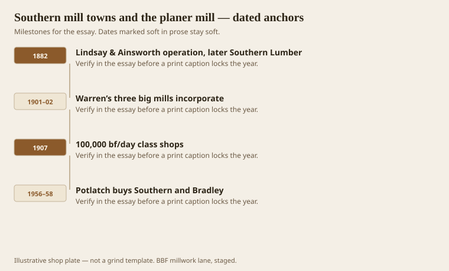
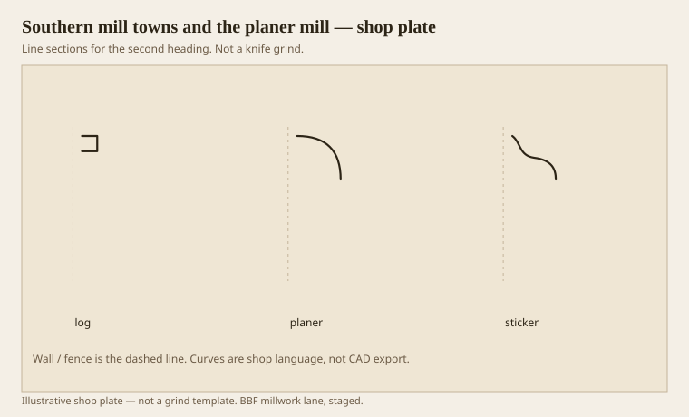

**Disclaimer.** Educational history and shop practice for the BBF millwork lane. Not a construction specification, not a bid, and not architectural or engineering advice. A measured opening and the local code beat a magazine essay.

A mill town is a daily cut with houses around it. In south Arkansas the cut was yellow pine and, in Warren’s case, a serious hardwood trade as well. The Encyclopedia of Arkansas and Rex Nelson’s later telling agree on the shape: out-of-state money, three big Warren mills by the first decade of the century, a doubled population between 1900 and 1910. Southern Lumber grew from an 1882 Lindsay & Ainsworth start; Weyerhaeuser and Denkman show up in the principals. Bradley Lumber was Samuel H. Fullerton of St. Louis, September 1901. Arkansas Lumber was Rittenhouse and Embree of Chicago, March 1901. By 1907 the advertised class is 100,000 to 150,000 board feet a day and hundreds of men.

The planer mill is where lumber becomes a product a carpenter will touch. Rough from the saw is not millwork. Surfaced, patterned, maybe moulded — that is the shed this essay cares about. Flooring, furniture stock, pine millwork, mixed cars. A postcard from Bradley Lumber says those words in that order. We did not invent them for a brand.

## A town built on a daily cut

<!-- graphics-pack:v1 -->

*Figure 1. An 1880s start, the 1901–02 incorporations, the 1907 class of cut, and Potlatch’s 1950s buy.*

Southern and Arkansas jointly built the Warren & Ouachita Valley to Banks to meet the Rock Island. Logs came by rail and by animal. Commissaries paid in scrip. The AHPP walk through downtown Warren still points at the Bradley Store building (1920) and the hole where a commissary sat. That is not nostalgia. It is how a linear foot of pine trim was financed: a town that ate, slept, and bought flour in the same ledger as the cut.

Arkansas Lumber clear-cut its 85,000 acres and was gone after 1928. Southern burned in 1939 and modernized. Potlatch Forests bought Southern in 1956 and Bradley in 1958. `[VERIFY]` those two buy years against a county file if you need them on a plaque; the published local histories agree, and they are the dates we use here. The point for millwork is continuity. A planer mill can change letterhead and still run pattern. The knives do not care who owns the land.

Depression-era Bradley County, the encyclopedia says, kept cutting because the country still needed lumber. Banks in Warren did not fail. That is a civic fact with a shop echo: the sticker did not go silent. A lot of American millwork towns did.

Figure 1 stops at Potlatch because that is when the big-town mill story becomes a corporate timber story. The later hardwood strain — 2008 closings in the state — belongs to the next essay. This one is the planer as an urban machine. Urban, here, means a few thousand people and a whistle.

## From log deck to sticker shed

<!-- graphics-pack:v1 -->

*Figure 2. Three thoughts in a line: log, planer, sticker. Millwork is the last shed, not the first.*

Figure 2 is a flow, not a measured plant. Log deck, planer, sticker. A furniture shop that still has access to a planer mill — this lane has talked that way when the footage is real, 500 units and up — is standing in that flow. Most custom shops now buy kiln-dried S4S and pretend the first two sheds never existed. They existed. They set the moisture, the grain, the length, the waste. If your oak is mild-textured, someone at a head rig decided which log you got. Bradley’s postcard bragged on that texture. Brag or not, texture is a knife problem. Mild oak is a gift. Wild oak is a Monday.

Pine millwork from those sheds was often the cheap interior of a nation: casing, base, a sprung cove. Hardwood left as flooring and furniture stock. A shop that does both — linear pine or poplar, and oak casework — is still living the split the mill town invented. Do not price them as one species.

Chipbreakers, kilns, line shafts, later electric motors: the planer mill is why a country joiner’s plane became a weekend tool. Tompkins already saw it in 1889 up north. The South ran the same movie with different trees and a hotter EMC. Acclimate. That word belongs here more than in New England. A stick that left a kiln at 7 percent and sat in an Arkansas August on a jobsite is not the stick you moulded. The town knew that. The town also shipped anyway. We still do. Write the moisture on the ticket or the joints will write it for you.

Southern mill towns are not a branding exercise. They are the reason this lane’s English sounds like machines and weather. The orders came by book. The footage came by rail.
