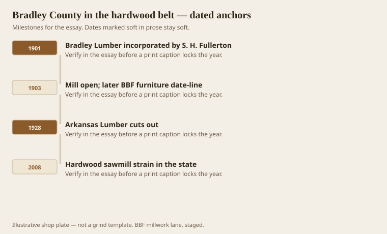
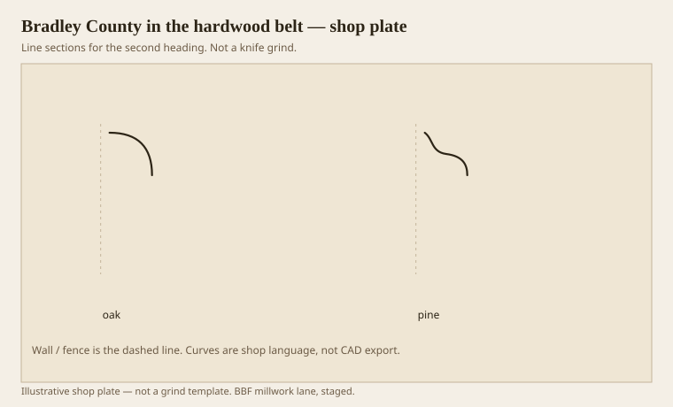

**Disclaimer.** Educational history and shop practice for the BBF millwork lane. Not a construction specification, not a bid, and not architectural or engineering advice. A measured opening and the local code beat a magazine essay.

Bradley County sits where the south Arkansas pine belt and a hardwood habit share a courthouse. Warren’s three mills are in the last essay. This one is the species split and the long tail: furniture stock, flooring, a shop language that still says oak when it means a stain-grade door, and pine when it means a painted stick. BBF — Bradley Brand Furniture — took its letters from that county name and from a furniture date-line that says 1903. 1903 is also the year the hardwood mill is said to have opened. We are not going to braid those into one myth. We are going to keep them in the same county, which is already enough.

Fullerton incorporated Bradley Lumber in 1901. By 1907 it is in the 100,000 bf/day, 350-man class, and the local histories call it one of the world’s large hardwood dealers. The postcard text is the honest product list: Arkansas soft pine, mild-textured oak and other native hardwoods, hardwood flooring, furniture stock, pine millwork, construction materials, mixed cars. That is a millwork lane in one sentence.

## Three mills and a doubled town

<!-- graphics-pack:v1 -->

*Figure 1. Incorporation, the 1903 open, Arkansas Lumber’s 1928 exit, and the 2008 hardwood strain.*

Arkansas Lumber’s 1928 exit is the caution. A mill that owns 85,000 acres can still cut itself out of a county. Southern and Bradley lasted longer, then became Potlatch, then the later hardwood story got thinner. In November 2008 the *Democrat-Gazette* reported statewide strain and noted the Bradley Lumber hardwood sawmill in Warren among the shuttered — opened 1903, later owned outside the old Fullerton/Potlatch line. `[VERIFY]` any modern ownership sentence against the paper if you need it in a caption; this essay is not a corporate history. It is a species history.

A doubled town (1900–1910) means housing, churches, a store that took scrip, and a lot of pine trim nailed into new rooms. Some of those rooms are still there. Matching them is matching mill-town stock, not matching Benjamin. Mild oak flooring from those sheds is a different file from a Greek Revival mantel in Virginia. Do not grind the same iron for both and call it Southern.

Tomatoes are the other Bradley County crop in the public mind. Nelson’s 2026 column still pairs pine trees and pink tomatoes. A millwork essay mentions them once, to say the county was never only a shed. The shed still matters more to a knife.

Figure 1’s last hook is 2008 because that is when a lot of people learned that a hardwood mill is not a permanent civic machine. Shops that still run oak in this belt are running a scarcer stick. Price it like it is scarce. Do not price it like 1907.

## Oak, pine, and what a shop still buys

<!-- graphics-pack:v1 -->

*Figure 2. Two belts in one county: an oak thought and a pine thought. Different knives, different tickets.*

Figure 2 is the buy list. Oak: stain-grade, a shear head if you have it, lower hook, watch the ray fleck on quartersawn if the designer asked for it and then flinched. Pine: paint-grade or a clear that will still dent, old “Arkansas soft pine” as a mild interior wood, new SYP as a harder, resinous cousin that will gum a knife if you let it. Poplar, which the mountains grow better than the Delta, is the paint-grade we actually want for a quirk. We buy it. We do not pretend it grew behind the courthouse.

Furniture stock in the postcard is the ancestor of a shop that still quotes casework and a table in the same week as a linear crown. The joint is the border, as the first essay said. The kiln is shared. The finish room is shared. The drawing is not. A nurse-station top is not a dining table even if both are hardwood. Healthcare specs will say so.

What a BBF-lane shop should not do is turn this county into a brochure paragraph and then run MDF base in a wet corridor because it was cheaper. The county taught footage and species. It did not teach you to lie about material. If the job is MDF, say MDF. If the job is oak from this belt, say oak, and say the moisture, and say whether the knife is a custom grind or a catalog cousin.

1903, as a furniture date-line, is a reminder that a century is a long time to keep a shed’s habits. Habits worth keeping: mixed cars (more than one product on a ticket), mild texture when you can get it, pine millwork as a real product, not an afterthought. Habits worth dropping: scrip, smoke, and pretending the forest is endless. The grammar of mouldings came from books. The lumber came from here. The pack needs both.
