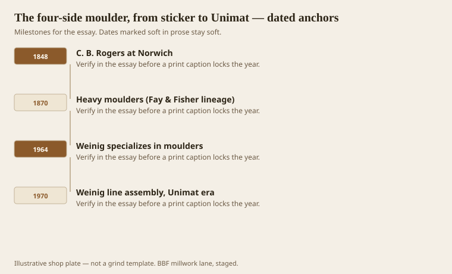
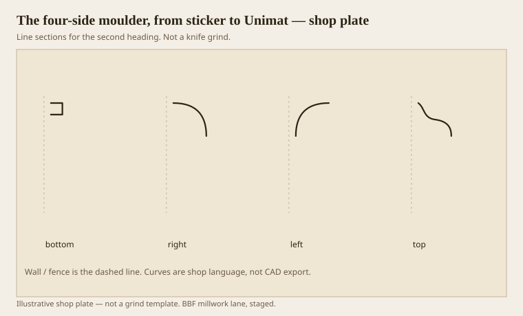

**Disclaimer.** Educational history and shop practice for the BBF millwork lane. Not a construction specification, not a bid, and not architectural or engineering advice. A measured opening and the local code beat a magazine essay.

A four-side moulder is a tunnel with knives. Bottom, right, left, top — the usual order — and then extra spindles if you are rich or German. The stick goes in as a rectangular blank and comes out as a sentence. Americans called the early ones stickers because they stuck mouldings. The word stuck. So did the machine.

C. B. Rogers of Norwich is making woodworking machinery by 1848; the first successful sticker is credited there in the usual short histories. Fay, Fisher, H. B. Smith (iron frames, dovetail slides), S. A. Woods, C. R. Tompkins: that is the American 19th century. French Guilliet is cited for an 1898 multi-side machine. Wadkin owned a lot of the English 1930s. Weinig, a 1905 trading firm, gets into woodworking after 1945, specializes in moulders in 1964, and starts the line-assembly Unimat world in 1970. By the 1980s the German name is what a lot of American shops mean when they say “the moulder.”

None of that replaces the knife. A Unimat with a bad grind is a very expensive way to make fuzzy oak.

## American stickers, then German series

<!-- graphics-pack:v1 -->

<figure class="millwork-figure">

<figcaption>Figure 1. C. B. Rogers at Norwich through Weinig line assembly, Unimat era — see “American stickers, then German series.”</figcaption>
</figure>

Tompkins and the VintageMachinery short history are the American shelf. They will argue details — who built the first inside moulder, whether Lee’s old machines still run, who invented the side-head chipbreaker (J. B. Tarr of Chicago is in that chorus). `[VERIFY]` a patent name before you put it on a wall. The shop lesson is earlier: once you have side heads, you can pattern a stick without walking it around a shaper. That is the birth of linear millwork as a product.

Weinig’s story is organization as much as iron. Series assembly in 1970, hydraulic clamping and jointing in the mid-1970s on Unimat/Hydromat 23-class machines, later Powermat. They have celebrated a 35,000th moulder. The number moves; the point does not. A moulder became a standard machine, not a local invention. American shops bought them because the feed was honest and the spare parts existed.

A shop in this lane may run a used German four-side and a CNC in the same building. That is not a contradiction. The four-side is the footage machine. The CNC is the each machine. History is how you remember which is which when a salesperson tries to sell you a router as a moulder.

Figure 1 is a relay. If you skip the American sticker and start at 1964, you will think millwork began in Bavaria. It did not. If you skip Weinig, you will not understand the shop you are standing in.

## Four heads around one stick

<!-- graphics-pack:v1 -->

<figure class="millwork-figure">

<figcaption>Figure 2. Profile plate for “Four heads around one stick.” Line sections, not a grind.</figcaption>
</figure>

Figure 2 is the tunnel. Bottom usually cleans and may cut a back. Right and left take the edges. Top takes the face. Crown, bed, and picture-frame work often need both a top and a bottom profile — two passes, or two dedicated knives, because the stick is shaped on opposite faces. Woodmaster’s catalog language still says this in the hobby-industrial world: T knives and B knives, same gibs. Industrial shops know it in their sleep. New estimators forget it and wonder why the first crown run looks like a boat.

Order of heads matters. You want a reference face early. You want the profile that will tear to see a chipbreaker. You want the last head to be the one you will look at in the room. Books and old men will fight about sequence. Fight on a test stick, not on 400 feet.

Jointing two knives to a few ten-thousandths is how both knives share the cut. Rankin and the older balance manuals are tedious and right. A knife that is 0.001 long does most of the work, heats, and dies. The finish goes wavy. People blame the wood. The wood is innocent.

Hook and shear belong to the next essay. History belongs here: the four-side is the reason a profile became a SKU, the reason a mill town could load mixed cars of trim, and the reason a custom shop can still make a living on footage if it does not pretend every stick is a CNC sculpture. Treat the tunnel with the respect Tompkins asked for. It is not a dumb box. It is four arguments in a row.
