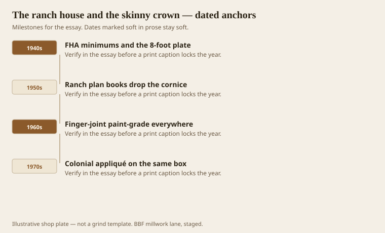
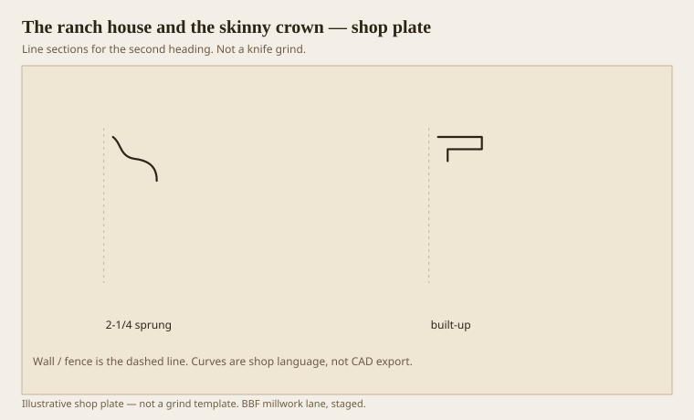

**Disclaimer.** Educational history and shop practice for the BBF millwork lane. Not a construction specification, not a bid, and not architectural or engineering advice. A measured opening and the local code beat a magazine essay.

The ranch house did more damage to American cornices than any French theorist. Eight-foot plate, a long eave, a picture window, and a 2-1/4 or 3-1/4 sprung crown — if any — taught a generation that the wall-ceiling joint was a place to smear caulk. FHA minimums and tract plan books did not forbid a cornice. They made a cornice look like a luxury on a box that was already selling speed. Speed won.

Chambers, in the 18th century, said a simple interior cornice ought never to exceed 1/15 of the height nor be less than 1/20. An 8-foot room is 96 inches. One-twentieth is about 4-3/4. One-fifteenth is about 6-3/8. A 2-1/4 sprung crown is 1/43. It is a line, not a hat. People still buy it because the yard has it and because they are afraid of “too much.” Too little is also a look. It is the look of a lid.

## A ceiling that refused an order

<!-- graphics-pack:v1 -->

<figure class="millwork-figure">

<figcaption>Figure 1. FHA minimums and the 8-foot plate through Colonial appliqué on the same box — see “A ceiling that refused an order.”</figcaption>
</figure>

Figure 1 is a decline with a little costume at the end. 1970s Colonial appliqué on a ranch is a fanlight sticker and the same skinny crown. The order did not come back. A memory of an order came back, in plastic and in 3-inch casing.

I am not sneering at people who grew up in those rooms. I grew up around sheds that sold the sticks for them. The ranch was a decent machine for a young family and a bad machine for shade. If you are remodeling one now, you do not have to pretend it is Drayton Hall. You do have to pick a fraction. A 5-1/2 to 6-1/2 built-up in an 8-foot room is already bold. It will work if you keep the corona and land the ceiling edge, not the whole soffit, on a wavy drywall joint. A 9-inch monster will crush the room. Chambers’s ceiling still applies.

`[VERIFY]` the FHA plate-height sentence against the year of the tract if you need it in a local-history caption. Shop memory is that 8-foot interiors became the default. Some ran 7-8. Some later tracts went 9 and still bought 3-inch crown. Height of plate and height of cornice did not travel together.

Finger-joint paint-grade is the material of this era. It is not a moral failure. It is a moisture and finish conversation. The next essay takes it. Here, know that a skinny FJ crown will telegraph every joint in raking light if you stain it. Nobody should stain it. People do.

## Skinny sprung crown against a built-up

<!-- graphics-pack:v1 -->

<figure class="millwork-figure">

<figcaption>Figure 2. Profile plate for “Skinny sprung crown against a built-up.” Line sections, not a grind.</figcaption>
</figure>

Figure 2 is the remodel choice. Left, the yard stick, sprung, no soffit, a cove pretending to be an entablature. Right, a short built-up: cyma, a thin corona, a bed. Same room. Different shadow. The built-up can be three paint-grade sticks you already stock. It does not require a Greek Revival conversion. It requires a decision.

Spring angle on a skinny crown is often 45 because the stick is small and the saw likes 45. Landing is still the issue. If the whole back kisses a bad ceiling, every hump shows. Katz’s finish-carpentry advice holds: a well-designed crown touches the ceiling on an outer edge. Ranch ceilings are not well designed. You may have to scribe or you may have to run a ceiling fascia first. A 1x that becomes a corona can hide a multitude of drywall sins and give you the soffit the 1950s stole.

Do not “fix” a ranch with dentils. Dentils on a 3-inch crown look like a grin. Fix the fraction, then stop. If the owner wants more, add a picture rail at the right height or a decent base. Hierarchy can come back in pieces. It does not have to come back as a costume party.

The ranch is still most of the American interior. If this pack only talked about 1831 mantels, it would be a museum. The skinny crown is the living problem. Treat it as a proportion job, not as a nostalgia job, and you can leave the house looking like itself — just a self that remembered it has a hat.
