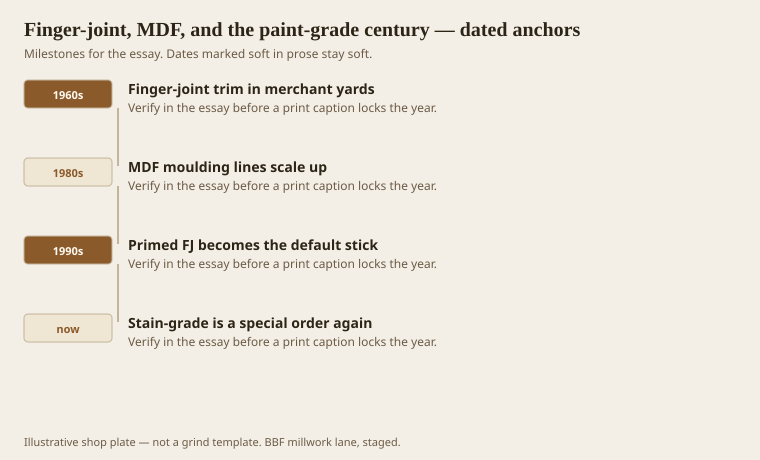
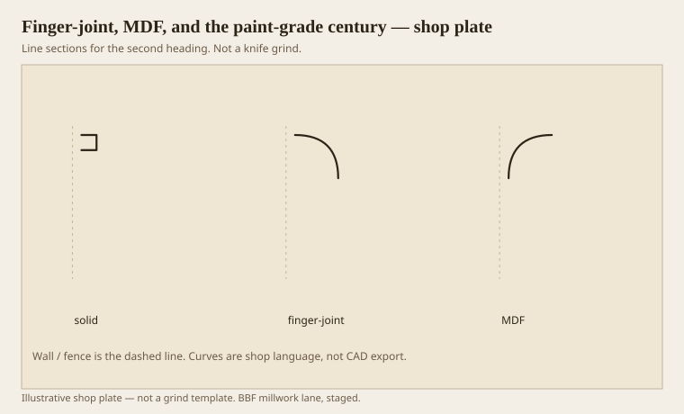

**Disclaimer.** Educational history and shop practice for the BBF millwork lane. Not a construction specification, not a bid, and not architectural or engineering advice. A measured opening and the local code beat a magazine essay.

Paint-grade used to mean “good enough to paint”: poplar, clear pine, a few knots if the primer was sincere. Then it meant a material that exists to be painted: finger-joint (FJ) pine, later MDF, primed in a factory so the yard can sell a white stick. AWI still treats paint-grade and stain-grade as finish decisions with material consequences. The yard treats them as two aisles. The aisle won.

This is not a sermon against FJ. A 16-foot primed FJ casing that stays straight is a gift in a long hall. The sermon is against staining it, against using MDF as a mopboard in a wet healthcare corridor, and against calling either one “solid hardwood millwork.” Words scuff.

## Why the joint disappeared under primer

<!-- graphics-pack:v1 -->

*Figure 1. FJ in the yards, MDF lines, primed default sticks, and stain-grade as a special again.*

Finger joints exist to make short clear pine into long sticks. The glue line is stronger than the wood if the plant is honest. Primer hides the fingers until raking light or a dark paint. Dark paint is how people discover they bought FJ. Tell them on the quote. If they want no fingers, they want solid, and they will pay for shorts and more joints in the room.

MDF moulding is a profile pressed or machined in a fiberboard that paints like a dream and drinks water like a sponge. In a dry closet it is fine. In a Southern bathroom, a SNF corridor, or anywhere a mop hits the base, it swells at the joints and at every nail if you were too proud to glue. I have seen MDF base look pregnant by September. The owner blames the painter. The painter blames the shop. The material is doing material things.

Figure 1’s last hook is real in custom shops: stain-grade became a special order. That is not only fashion. It is the cost of clear oak and the death of the habit. When someone in this lane wants stain-grade, we treat it as a species and moisture conversation, not as a paint aisle with a different can.

Healthcare specs will often name a finish system and a cleanability test. They may still allow FJ if the film is right. They may forbid MDF at the floor. Read the spec. Do not assume “paint-grade” means your cheapest stick.

## Solid, finger-joint, and a painted MDF

<!-- graphics-pack:v1 -->

*Figure 2. Three paint-grade lives: solid, finger-joint, MDF. Same cyma, three weathers.*

Figure 2 is one profile in three materials. Solid poplar: the honest paint-grade, takes a quirk, takes a little ding, moves with the seasons as wood. FJ pine: long, straight, fingers under the film, will still move a little, ends can drink. MDF: stable until it is not, crisp profile, heavy, edges need sealing like you mean it.

On the moulder, MDF is dusty and kind to knives in the short run, hard on lungs, and it will round a quirk if you sand as if it were pine. FJ pine can blow a finger if the glue line hits a thin fin. Solid poplar is the one I want for Greek Revival match work that will be painted. I will use FJ for long ranch casings. I will use MDF for a dry, painted built-up crown in a commercial box if the spec allows and the landing is not a wet wall.

Primed stock from a factory is a finish. It is not *the* finish. Scuff, fill, and a real topcoat still exist. If you install primed FJ and call it done, every dent is a raw glue line waiting. Shop-prime after the moulder if you ran raw. Factory-prime if you bought it. Either way, the last coat should happen in a world that has already cut the copes, or you are painting end grain in the air.

Paint-grade is a century-long decision to hide wood. That can be a good decision. Hide it on purpose. Do not hide a bad material behind a good profile and then act surprised when August arrives. August always arrives. In this county it arrives early.
