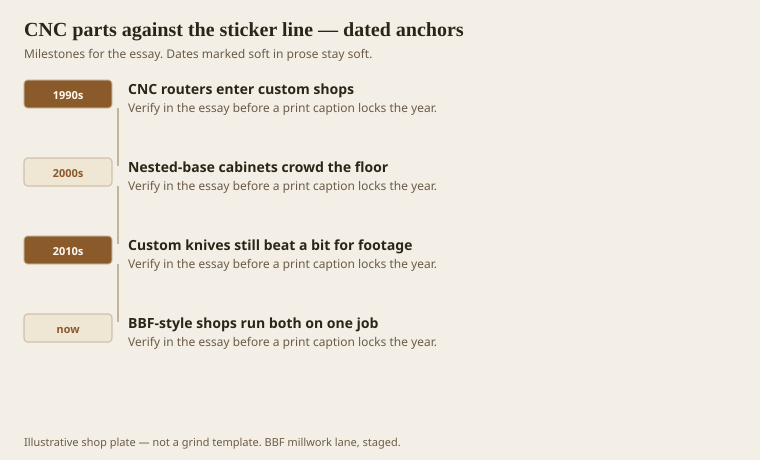
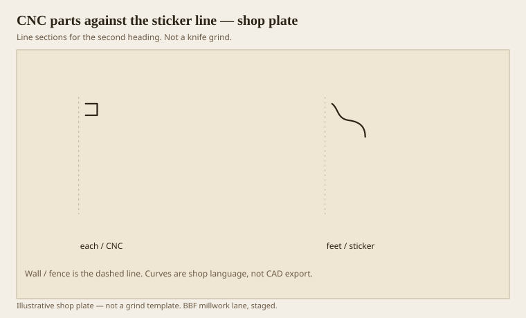

**Disclaimer.** Educational history and shop practice for the BBF millwork lane. Not a construction specification, not a bid, and not architectural or engineering advice. A measured opening and the local code beat a magazine essay.

A CNC router is a patient sculptor. A moulder is a gossip: it tells the same story at 30, 60, 80 feet a minute until you stop the feed. Both belong in a shop that does buildings and furniture. They do not belong on the same line of an estimate unless you like losing money in public.

The 1990s put CNC in custom shops. The 2000s nested cabinets on a sheet. The 2010s sold the idea that a 1/2-inch ball nose could replace a knife. It can, for a newel, a radius casing head, a carved rosette, a one-off capital. It cannot, for 400 feet of base, unless your customer is a museum and your calendar is empty.

BBF-lane work has always had this split: linear millwork for the wall, each-parts for the thing you bump into. Design-to-spec at an hourly rate, and a planer mill when the count is real, is the old sentence. CNC is a new hand on the each side. It is not a new sticker.

## Two machines, two kinds of money

<!-- graphics-pack:v1 -->

*Figure 1. Routers arrive, cabinets nest, knives still win footage, and a shop that runs both on one job.*

Setup is the tell. A moulder setup is a grind (or a pulled knife from the cabinet), a joint, a test stick, a first-stick waste. That cost wants footage. A CNC setup is a program, a fixture, a tool list, a first-part waste. That cost wants repeats of a *part*, not a *foot*. If you have 12 identical newels, CNC. If you have 12 feet of newel-shaped moulding, you probably do not have a product.

Salespeople will say the CNC can run the moulding “while you sleep.” Sleep is not a feed rate. A 3/8 bit taking light passes on a 16-foot base is a way to make a very accurate stick tomorrow. The moulder already made it this afternoon.

Figure 1 ends on the mixed job because that is the real ticket: a hotel corridor with 800 feet of painted base (moulder) and 14 reception desks with radiused ends (CNC). If the estimator averages the hours, one of those numbers is a fantasy. Write two lines.

AWI’s split between custom architectural woodwork and stock millwork is a paper split. The machine split is clearer. Stock is often already moulded. Custom linear is still a sticker. Custom each is a CNC, a shaper, or a bench.

## A part versus a stick

<!-- graphics-pack:v1 -->

*Figure 2. Each-thinking on the left, footage-thinking on the right. Do not invoice them as cousins.*

Figure 2 is the invoice. Left, a part: bounded, nested, maybe a newel or a bracket. Right, a stick: a profile that wants a tunnel. If you find yourself drawing a 16-foot base as a 3D solid with a toolpath, stop and ask whether a knife exists. If it does not, ask whether the footage will pay to grind one. If the footage is 40 feet, maybe CNC. If the footage is 400, grind.

Crown backs are the usual CNC tragedy. Someone models a sprung crown and tries to cut the whole section with a ball nose. The surface is faceted, the dust is biblical, and the spring flats are not flat. A moulder cuts those flats as lands. Lands matter when the stick hits a wall.

There is a third machine people forget: the shaper with a stacked cutter, or a spindle moulder in the English sense. For a short run of a fat profile, a shaper can beat both. It is not romantic. It is fast. Keep one.

The shop rule we use: the drawing gets a machine name before it gets a price. “Millwork” is not a machine name. Sticker, CNC, shaper, bench. If you cannot pick one, you do not yet understand the part. Understanding is cheaper than a week of toolpaths on a baseboard.
