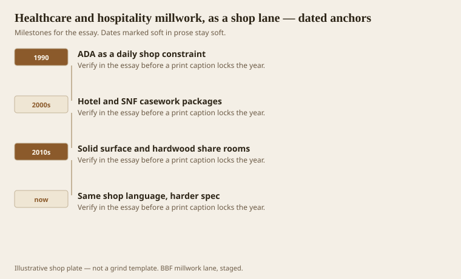
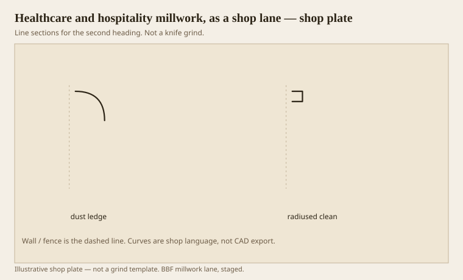

**Disclaimer.** Educational history and shop practice for the BBF millwork lane. Not a construction specification, not a bid, and not architectural or engineering advice. A measured opening and the local code beat a magazine essay.

A SNF corridor is a millwork job that gets hit by a gurney. A hotel desk is a millwork job that gets hit by a suitcase and a night auditor’s keys. This lane learned those rooms as FF&E — furniture, fixtures, equipment — on purchase orders that still wanted hardwood, a cleanable edge, and a drawing that would survive an accessibility review. The first essay’s border still holds: if it answers a building, it is millwork. If it answers only a body, it is furniture. A nurse station answers both. Price both.

We are not going to name client buildings here. The CV list exists elsewhere. The shop lesson does not need a marquee. It needs an edge that does not collect bleach, a toe-kick that a wheelchair can live with, and a finish film that does not die at the first alcohol wipe.

## FF&E that has to take a gurney

<!-- graphics-pack:v1 -->

*Figure 1. ADA as a daily constraint, package work, mixed materials, and a harder spec on the same grammar.*

ADA (the 2010 Standards are the desk copy; the 1990 Act is the civic one) moves casework even when the designer is thinking about stain. Knee clearances, protruding objects, cane detection, door clearances: these change the box before you pick an ogee. A beautiful bolection on a transaction counter that eats the clear floor space is a failed beautiful bolection. `[VERIFY]` the section that applies to the piece in front of you. This essay is not a code review.

Hospitality is kinder on paper and rougher at 2 a.m. Luggage scuffs a base that would have lived a quiet life in a dining room. We use a taller, tougher base, or a wall rail, or a finish that can be repaired in a hallway without a booth. Shop-finish what you can. Leave a touch-up kit that is the actual finish, not a cousin from the hardware store.

Figure 1’s last hook is the spec getting harder while the grammar stays. You still have bases, casings, crowns, edges. You also have infection-control language, no dust ledges, radiused corners, and a ban on certain MDF uses. The eight regular mouldings did not retire. Some of them got a radius.

Solid surface and hardwood sharing a room is a joint problem. Different movement, different cleaners. A reveal between them is better than a hopeful caulk fillet. Reveals are millwork. Caulk is a confession. Healthcare likes confessions even less than a parlor does.

## A cleanable edge against a dust ledge

<!-- graphics-pack:v1 -->

*Figure 2. A dust-catching ovolo ledge beside a radiused clean edge. Same height, different mop.*

Figure 2 is the argument with the designer who wants a Greek Revival cliff on a med-surg corridor. The cliff is a dust ledge. The radiused edge is a maintenance profile. You can still have shade: a shallow scotia that goes dark without a shelf, a small quirk that does not hold a swab. You cannot have a stacked arris that needs a toothbrush.

On the machine, a cleanable edge is often a larger-radius ovolo or a softened fillet. That is Roman-circle thinking, ironically. Greek quirks are dirt traps. Say so. If the owner wants the quirk in a chapel or a dining room inside the same complex, good — different room, different mop.

Linear footage in these jobs is huge and boring: chair rail that is actually a crash rail, corner guards that want to look like wood, door casings that take a bed. Boring footage is how a shop stays alive. The each-parts — desks, headwalls, window stools that must shed water — are how a shop stays awake. Split the ticket.

I will not pretend this work is more noble than a kitchen table. I will say it taught us to read a spec like a pattern book. Benjamin assigned jobs to members. A healthcare spec assigns jobs to edges. Both are grammars. A shop that can hear both can work in this century without forgetting the last five.
