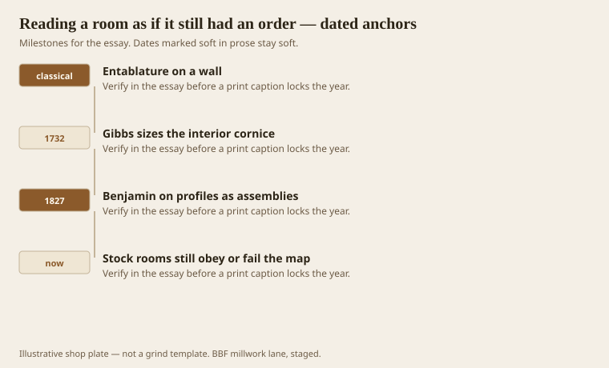
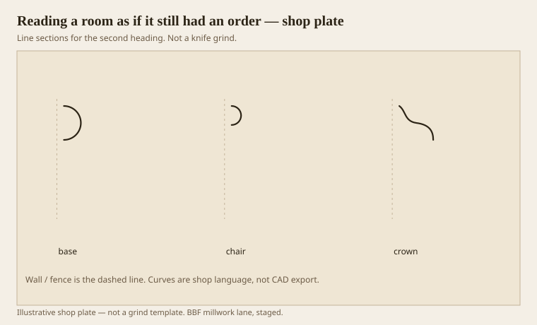

**Disclaimer.** Educational history and shop practice for the BBF millwork lane. Not a construction specification, not a bid, and not architectural or engineering advice. A measured opening and the local code beat a magazine essay.

A drywall box still has an order if you let it. The wall is a pedestal (base, dado, cap), then a shaft (the field of paint or paper), then an entablature (architrave at the doors, a frieze if you are brave, a cornice at the ceiling). ICAA teaching and the better moulding houses still draw it that way. Most tickets skip the drawing and pick sticks by aisle. The sticks then fight. A fat crown and a skinny base is a hat on a bare foot. A Greek door in a ranch field with a clamshell casing is a fight in three languages.

This essay is the map we use before we grind. It is not a demand that every bedroom become a temple. It is a demand that the members agree.

## The wall is still a temple, cheaply

<!-- graphics-pack:v1 -->

*Figure 1. The wall-as-order idea, Gibbs’s interior math, Benjamin’s assemblies, and stock rooms that still pass or fail.*

Gibbs gives you the cornice fraction once you invent a column. Method 1 (pedestal + column + entablature) makes a smaller cornice. Method 3 (column on the floor) makes a larger one. That invention is the cheap temple. You do not build the column. You use it as a ruler. A 9-foot room can take a bigger hat than an 8-foot room. A parlor can take a bigger hat than a hall if you want hierarchy. Or the reverse, if you want the hall to announce and the parlor to refine. The old men did both. Pick one on purpose.

Benjamin’s assemblies are the other half. A profile is not a sticker. It is a set of members doing jobs. If the base cap is a covering cavetto, it will look like it is melting off the die. If the crown’s bed is a covering cyma, it will not look like it holds the corona. The map and the jobs meet at the corner.

Figure 1’s last hook is the stock room. You can pass the map with stock if you size and assign. You can fail it with custom if you buy four pretty knives and ignore height. Custom is not a virtue. Agreement is.

Doors are the architrave. That is why a header should be a little more serious than the legs, or at least as serious. A ranch clamshell that runs over the head with a plywood key is an architrave that forgot it was a beam. We still do it. We should not brag about it.

## Pedestal, column, entablature on drywall

<!-- graphics-pack:v1 -->

*Figure 2. Three marks on a wall: base as pedestal, chair as dado, crown as cornice.*

Figure 2 is the cheap temple in three marks. Base (and plinth, and shoe). Chair rail if the dado exists; skip it if you do not have a dado, unless you want a stick at chair height for scars. Crown. The field between is the shaft. Picture rail, if you have it, is a hanging device, not a dado cap — different essay, different height.

A useful walk: stand in the door and see whether the base and the crown are cousins. Cousins share a family of members (Roman or Greek) and a ratio that does not look accidental. Then look at the casing. If the casing is louder than both, the door is shouting. Sometimes you want that (a parlor door). Sometimes you have a bathroom shouting.

Healthcare corridors invert the walk. Crash rails and corner guards are the loud members. The cornice, if any, should shut up. The map still helps: you are looking at a dado that became armor. Armor can be handsome if it is a cap and a die, not a bolted extrusion pretending to be an afterthought.

When a designer sends “traditional package A” as a pile of SKUs, we redraw the wall as an order and send it back with heights. That is not precious. That is how you keep from installing a 5-inch base and an 8-inch crown in an 8-foot room and then wondering why it feels like a bunker. The temple was always a measuring trick. Drywall did not cancel the trick. It only hid the column.
