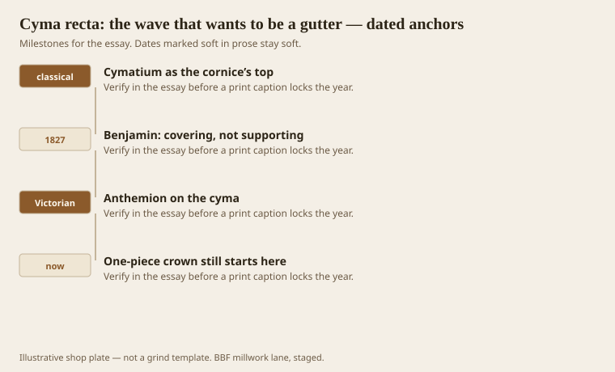
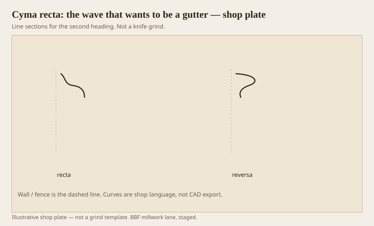

**Disclaimer.** Educational history and shop practice for the BBF millwork lane. Not a construction specification, not a bid, and not architectural or engineering advice. A measured opening and the local code beat a magazine essay.

Cyma means wave. Recta means the wave that goes hollow first as it falls, then belly. On a building that hollow was a gutter thought: water runs, then drops. On a ceiling it is a covering member. Benjamin said it ends in a point and is unfit to support. The 1911 Britannica calls it the usual upper member of a cornice, often carved with anthemion when someone had money. In a shop it is the top stick of a built-up crown, or the whole of a cheap one-piece crown that forgot the rest of the sentence.

If you flip it you have cyma reversa, the ogee, a different job. People call both “the S.” The S is not the job. The order of hollow and belly is the job.

## A wave with a weather job

<!-- graphics-pack:v1 -->

*Figure 1. Cymatium as a lid, Benjamin’s covering rule, Victorian carving, and the one-piece crown that still starts here.*

An exterior cyma that still works as a gutter has a drip. An interior cyma has a shadow. Same outline, different weather. If you use a recta as a bedmould under a corona, the corona will look like it is sitting on a slide. Your eye knows. Designers who “just like the shape” put it there anyway. Then they ask why the crown looks like it is melting.

Greek and Roman versions exist. Roman: two single-radius arcs. Greek: more centers, maybe a quirk at the lip. Stock one-piece crowns are usually Roman-ish blobs. A little quirk at the top of a recta, against the ceiling flat, will make a cheap stick look like someone thought. It is a small grind. It is worth it.

Figure 1’s Victorian hook is carving. Anthemion on a cymatium is a decoration on a covering member, not a new member. If you CNC an anthemion on a 3-inch sprung crown, you have decorated a timid lid. Size first. Flowers later.

One-piece crowns still start as a recta because the saw and the yard understand a wave. We run them. We do not pretend they are a Tuscan cornice. If the ticket says Tuscan, we add a corona.

## Recta against reversa

<!-- graphics-pack:v1 -->

*Figure 2. Covering wave (recta) beside supporting wave (reversa). Hollow-first versus belly-first.*

Figure 2 is the only diagram you need in a fight with a drawing. Recta: hollow, then belly, as you descend. Reversa: belly, then hollow. Recta covers. Reversa supports. Put reversa on top and it will look like a rolled lip trying to hold the ceiling up. Sometimes that is a look (certain bedmoulds at a shelf). On a cornice lid it is a mistake.

On the moulder, a cyma is a grind that wants side clearance in the hollow. Oak will burn in the tight inside. A shear head helps. So does a shallower first pass. Paint-grade poplar is how most American rectas survive. Stain-grade walnut rectas are furniture-cousin work: short runs, careful feed, no heroics.

Springing a one-piece recta crown puts the wave on a bias. The back flats are the wall and ceiling. If those flats are not flat, the wave twists down the hall. Check the lands on the test stick with a straightedge, not with a glance. A cyma can look fair and still rock.

The gutter memory is useful in a wet porch soffit and useless in a bedroom except as a way to remember the verb. Cover. Shed. End in a point. If your top member cannot say that sentence, it is not a cymatium. It is a doodle at the ceiling. Doodles can be pretty. They should not be named after a wave that knew how to throw rain.
