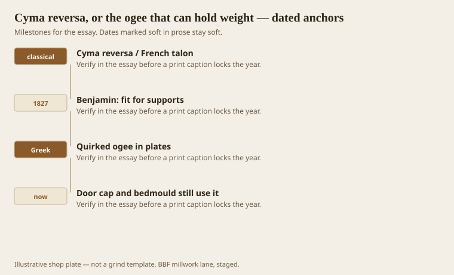
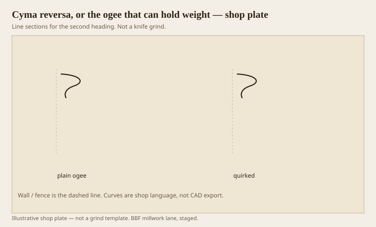

**Disclaimer.** Educational history and shop practice for the BBF millwork lane. Not a construction specification, not a bid, and not architectural or engineering advice. A measured opening and the local code beat a magazine essay.

Ogee is the English shop word. Cyma reversa is the book word. French talon shows up in the old plates. All three mean belly first as you fall, then hollow. Strong at the extremities, Benjamin said, and so fit for supports. That is why an ogee sits under a corona, under a mantel shelf, on a door cap, on a base cap. It looks like it can hold something because the section arrives with a shoulder.

A quirked ogee tucks at the end and throws a hairline. Greek plates love it. A plain Roman ogee is two arcs and a restful door. Both are legal. They are not twins.

## The support wave

<!-- graphics-pack:v1 -->

*Figure 1. The reversa as a support, Benjamin’s rule, the Greek quirk, and the door cap that still uses it.*

Radocchia, reading Benjamin, liked that he made you feel whether a moulding supports or shelters, and that he remembered rain. An ogee on the outside can hold a drip in the hollow if you are careless; on the inside that hollow is a dust line under a shelf. Either way the member is a shoulder. A cavetto in the same seat will look like a shrug.

Door caps and backbands are where American shops still speak ogee without knowing the Latin. A Federal casing often wants a small reversa as the outer member. A ranch clamshell is an ovolo that lost its nerve. If a remodel wants “a little more door” without going Greek Revival cliff, a backband ogee is the cheapest honest upgrade.

Figure 1’s last hook is that door cap. We grind more ogees for doors than for cornices. Cornices get the recta. Doors get the reversa. When a designer swaps them because the S looked the same in the thumbnail, the door looks like it is wearing a gutter.

## Quirked ogee and a plain talon

<!-- graphics-pack:v1 -->

*Figure 2. A plain supporting ogee beside a quirked cousin. Same verb, different hairline.*

Figure 2 is the grind choice. Plain talon: restful, Roman, easy paint. Quirked: a dark thread, more grind, more sanding risk. On stain-grade oak the quirk is a pride if it lives and a brown burn if the side clearance was a wish. On paint-grade poplar it is almost free once the knife exists.

Bedmoulds under a corona can be ogee + fillet, or ovolo + cavetto (Roman Tuscan), or a stack of quirked ovolos (Greek Revival country). The ogee is the one I reach for when the corona is thin and needs a shoulder without a lot of height. It supports in a short vertical.

Router ogee bits are a trap. They are a fixed S with a pilot. They are not handed. They do not know if they are covering or supporting. They also leave a flat that is not a fillet. Fine for a table edge. Weak for a door that wanted a member. If the run is short, use the bit and admit it. If the run is a house, grind.

Coping an ogee inside corner is a pleasure if the knife was fair. The cope follows the belly into the hollow and lands. If the knife was a doodle, the cope is a fight. That is a reason to keep ogees in the regular eight and not invent a new S every job. The carpenter on site is part of the millwork. A famous profile that cannot be coped is not a famous profile. It is a shop toy.

## A shoulder you can price

An ogee on a base cap is the cheapest place to teach a client the difference between support and cover. Hold two samples at the floor: a reversa cap on a die, and a cove cap on the same die. The cove looks like it is sliding off. The ogee looks like it arrived with a job. That five-minute corner sells more millwork than a mood board.

Outside corners on an ogee door cap are miters. Inside, if the cap turns a closet return, cope. A return that is caulked into an ogee hollow will always read as a third species. Cut the return long and sneak up. If the profile is small, a biscuit of the same species in the miter keeps the shoulder from opening in a dry January.

We grind more reversas than rectas in this shop because doors outnumber cornices on a ticket. That is not a theory. It is a count. Keep the ogee knife sharp and labeled. A drawer full of unlabeled S-curves is how a supporting member ends up on a gutter seat. Label the verb on the steel, not only the WM number.
