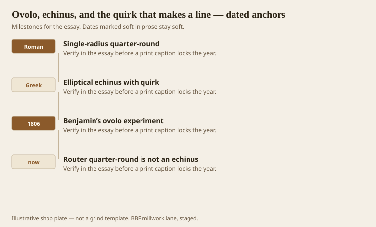
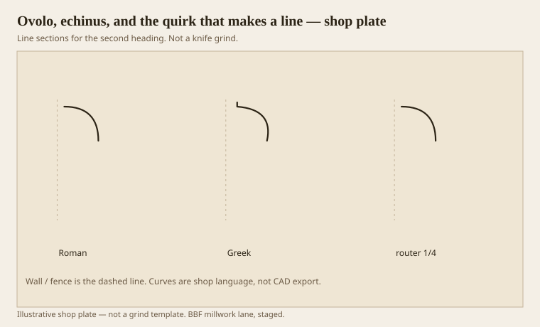

**Disclaimer.** Educational history and shop practice for the BBF millwork lane. Not a construction specification, not a bid, and not architectural or engineering advice. A measured opening and the local code beat a magazine essay.

Ovolo means little egg. Echinus is the Greek cushion under a Doric abacus, often carved with eggs when someone had time. In a woodshop both words mean the convex quarter — Roman as a circle, Greek as a leaning ellipse with a quirk. The quirk is a small inward turn that leaves a notch of dark between the curve and the member above. Loth’s definition is the one we use: elliptical, several radii, a space at the top. Benjamin’s 1806 plate is the sales pitch: more apparent size, better line of distinction in reflected light.

A router 1/4-round is an ovolo the way a paper plate is a dish. It will get you through a closet. It will not get you through a match on an 1840 mantel.

## Egg, quarter-round, and a hairline

<!-- graphics-pack:v1 -->

*Figure 1. Roman circle, Greek echinus, Benjamin’s experiment, and the router bit that flattened the argument.*

Eggs-and-darts are an enrichment on an ovolo, not a different member. CNC likes them. So did Roman stone. On a 16-foot painted casing they are noise. On a mantel they can be the point. Do not put them on a healthcare edge. Dirt lives in darts.

Benjamin’s experiment is worth repeating in the sample room. Two blocks, same height: quarter-round vs quirked. Walk to forty-five degrees. The quirked one will look more like a member. Clients who say they do not want “busy” often mean they do not want carving. They still want the line. Show the line without the eggs.

Figure 1 ends on the router because that is the living enemy of this member. The bit is always available. The hairline is not. If the drawing says ovolo and the shop uses the bit, write “Roman quarter-round, router” on the ticket so the next man is not confused.

## Three ovolos in one height

<!-- graphics-pack:v1 -->

*Figure 2. Roman, Greek, and a router quarter-round. Same height, three tempers.*

Figure 2 is a lineup. Roman: calm, even light. Greek: bright lip, black quirk. Router: a radius that dies into a fillet the bit happened to leave. On a moulder the Greek one is the grind that scares apprentices. The fin is thin. The oak is mean. Shear, hook, test stick. If the quirk chips, you went too thin or too fast, not “the style is impossible.” The style was cut in pine with planes for twenty years in every county that owned Lafever.

Stacked ovolos as a bedmould — the Glen Maury habit — are this member used as a drumbeat. Each needs its own quirk or the stack smears. Sanding between coats will smear it anyway if the painter is heavy. Tell the painter.

A Doric echinus in wood is usually a larger, flatter Greek ovolo under a slab abacus. If you Romanize it, the capital looks like a bucket. If you over-quirk it, the capital looks like a claw. Full-size the thing. Capitals are each-parts. CNC or shaper, not 400 feet of sticker, unless you are doing a colonnade for a fool.

The hairline is the whole point. I will say it until the pack ends. Millwork is lighting. An ovolo without a plan for the light is a bump on a board. Bumps are cheap. Lines cost a grind. Pay for the line or do not use the word echinus.

## Where the hairline goes to die

Painters, sanders, and safety radii are the three deaths of a quirk. A painter who films like a bumper will fill the notch. A sander who “breaks the edge” will erase it. A spec that wants a 1/8-inch radius on every arris will eat it. Write the survival plan on the drawing: tape the quirk, or start the grind deep enough that a 1/16 radius still leaves a dark thread.

Raking light is the inspection. Overhead cans lie. A work light at 20 degrees off the wall will tell you if the hairline lived. If it did not, do not ship 200 feet and hope the stain saves you. Stain makes a dead quirk look like a dirty quarter-round.

On a match job, measure the quirk with a leaf of paper, not with optimism. If the historic iron left a 1/16 notch and you grind 1/8, the new stick will look louder, not “more Greek.” Louder is a different vote than the house made.
