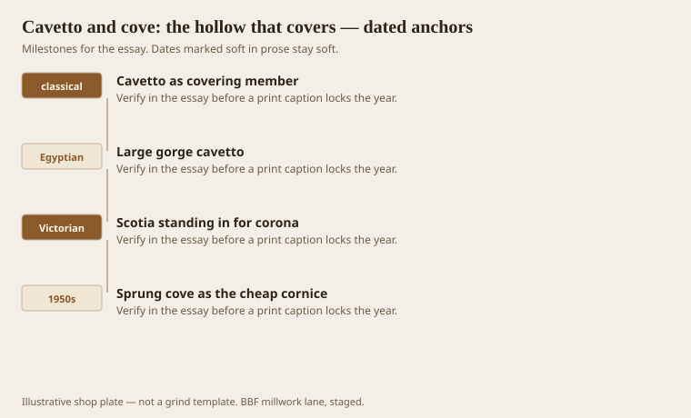
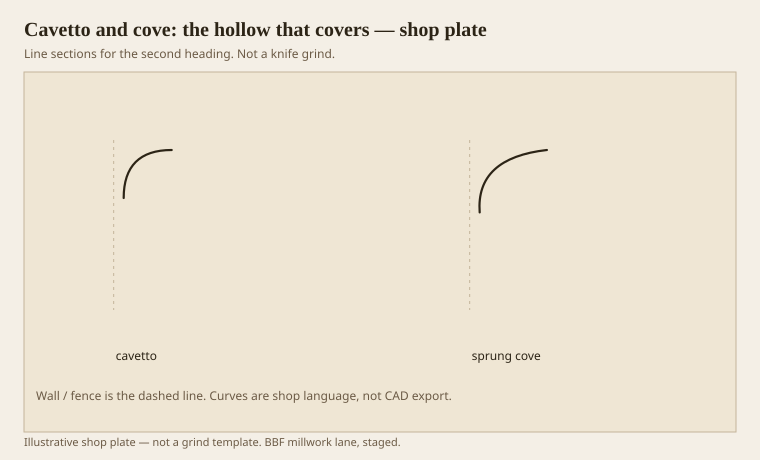

**Disclaimer.** Educational history and shop practice for the BBF millwork lane. Not a construction specification, not a bid, and not architectural or engineering advice. A measured opening and the local code beat a magazine essay.

Cavetto is a quarter hollow, the opposite of an ovolo. It ends in a point. It covers. It sheds. It will not look like it is holding a corona, because it is not. Cove is the shop word, and the shop word got stretched to mean any hollow, including a sprung ranch stick that replaced a whole cornice. The stretch is how rooms lost their hats.

A large Egyptian gorge is a cavetto at architectural volume. A scotia is a deeper, darker hollow with a different job (separate, make night). Do not grind them as cousins just because both go in. Jobs first.

## A point that must not carry

<!-- graphics-pack:v1 -->

*Figure 1. Covering hollow, the Egyptian cousin, a Victorian stand-in, and the sprung cove as a cheap cornice.*

Victorian designers sometimes replaced a corona with a big scotia to lighten a cornice and lift a ceiling. That is a dialect. The hollow is then sitting where a flat soffit was. It can work if the other members stay in their seats. It does not work if you delete everything and leave the hollow. That leftover is the 1950s sprung cove.

Benjamin’s covering rule is the one I recite when a drawing puts a cove under a mantel shelf as the only bedmould. The shelf will look abandoned. Add an ogee or an ovolo as the actual support, then a small cavetto as a lid if you want. Two verbs. One stick if you must, two if you are kind.

Figure 1 is a descent in scale. Temple, book, dialect, remnant. The remnant still sells by the foot. We still run it when the ticket says so. We name it cove crown, not cavetto cornice.

## Cove sprung, cove built

<!-- graphics-pack:v1 -->

*Figure 2. A proper small cavetto beside a sprung hollow asked to do a whole hat.*

Figure 2 is the ranch problem in the hollow family. A small cavetto is a member. A sprung cove is a member asked to be an order. If you must use the sprung stick, give it a ceiling fascia so a soffit appears, and a bed so a shoulder appears. Now you have a built-up that happens to use a cove as the cyma. Fine. That is a decision.

On the moulder a cove is easy until it is wide. Wide hollows cup. Wide hollows burn. Wide hollows in MDF are dust. I would rather build a large cove from staves or from two shallow grinds than from one heroic knife in solid oak. Heroic knives are how Mondays go long.

Inside corners on a sprung cove are coped if you are a carpenter and caulked if you are in a hurry. A cope on a simple cove is a beginner cope. There is no excuse for a caulk fillet there except a wavy wall. Even then, scribe.

Healthcare likes coves because rags follow them. Good. Use a cove as a cove: a covering or a cleanable transition, not a dust shelf. A cove that is too timid becomes a dirt line. A cove that is too big becomes a gorge that holds dust at the lip. Pick a radius the rag and the shadow can share.

The hollow is older than the orders and younger than bad remodeling. Keep the verb. Cover. Do not ask a point to carry a building, even a wooden one.

## When a hollow is a transition, not a hat

A cove between a cabinet box and a soffit is a covering transition. That is a legal cavetto job. A cove asked to replace base, dado, and cornice in one timid arc is not. The first we run without a speech. The second we name on the quote so nobody is surprised when the room still looks like a lid.

Wide coves in solid wood want staves or a built-up, not a 6-inch flat-sawn blank. The blank will cup toward the hollow as it dries, and the lip will leave the wall. Finger-joint paint-grade is a common cheat and an honest one if you say it. MDF is a dry-room cheat. Do not put a 6-inch MDF cove in a shower hall and then call August a mystery.

A sprung cove on a saw wants the same nested respect as a crown. Fence is the wall. Cope the inside. The cope is easy, which is why a sloppy one is unforgivable. If a new carpenter can only learn one inside corner this month, give them a cove. Then give them an ogee. Then give them a built-up hat. The hollow is the primer course.
