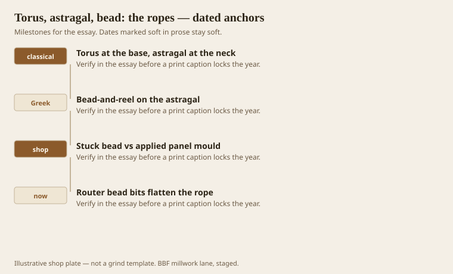
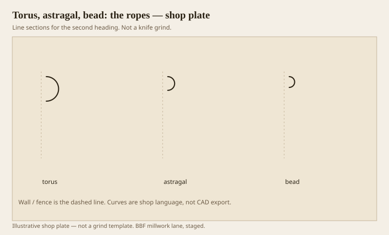

**Disclaimer.** Educational history and shop practice for the BBF millwork lane. Not a construction specification, not a bid, and not architectural or engineering advice. A measured opening and the local code beat a magazine essay.

A half-round is a rope. Benjamin said torus and astragal are meant to bind and strengthen the parts they sit on. They do not actually clamp anything. They look like they do. That look is the job. A column base without a torus looks like a stick in a puddle. A neck without an astragal looks like a shaft that forgot to finish.

Bead is the small shop cousin. Stuck on a rail, applied as a panel mould, run as a door edge. Bead-and-reel is the carved Greek habit on an astragal. CNC loves it. Dust loves it more. Use it where a rag is not the boss.

## Ropes that pretend to hold the work together

<!-- graphics-pack:v1 -->

*Figure 1. Fat rope, thin rope, carved reel, and the router bead that flattened the rope.*

Roman torus is a bold half-round. Greek can flatten or tighten it. Either way it wants a scotia next to it so the rope has a night to sit against. A torus next to a torus is a sausage. Fillet or scotia. Always.

Astragal at the neck of an Ionic is a binding thought under the echinus. On a wood pilaster we often reduce it to a stuck bead because the scale died. Fine, if you still let it read as a bind and not as a scratch.

Figure 1’s last hook is the router bead bit: a half-round with a pilot and no conviction. It will put a rope on a plywood edge. It will not put a torus under a base die. Scale is the difference. A 3/8 bead on a 5-inch base is a scratch. A 3/4 torus is a bind.

## Torus, astragal, and a stuck bead

<!-- graphics-pack:v1 -->

*Figure 2. Three ropes: base-scale, neck-scale, cabinet-scale. Same family, three jobs.*

Figure 2 is scale. If you grind one half-round and use it everywhere, the room will look like it owns one idea. That can be a style. It is usually laziness.

On the moulder a half-round is a grind that wants to be jointed well. Any wobble becomes a snake down the hall. People blame humidity. Look at the jointing first. A torus that snakes is a one-knife torus.

Shoe mould is a small torus or a quarter that pretends to be a scribe. It is allowed to be humble. It is not allowed to be the only base profile in a room that wanted a pedestal. We will get to shoes. Here, know that a shoe is a rope at the floor, not a die.

Furniture cousins: a table apron with a bead is millwork language on a body object. Fine. A bed that uses a column torus at human scale can look like it is wearing boots. Full-size the rope against a person before you grind 8 inches of torus for a footboard.

Binding is a fiction. It is a useful fiction. When a designer says a piece “needs to feel tied together,” they are asking for an astragal or a bead, not for more stain. Give them a rope. Then stop. Two ropes in a short vertical is a knot.

## Scale, or how a rope becomes a scratch

A 1/4-inch bead on a 7-inch base is a scratch. A 1-inch torus on a kitchen door is a sausage. Scale is the whole rope problem. I hold the blank against the opening before I grind a half-round, because the drawing’s “bead” is often a number that belonged to a different height.

Column bases in wood — porch, pilaster, a stair newel that wants to be Ionic — need a torus that can sit next to a scotia and still be wiped. If the torus is too fat, the scotia disappears and you have two sausages. If it is too thin, the base looks like a stick in a cup. Full-size both.

Bead-and-reel on an astragal is a CNC each-part, not a 400-foot sticker job, unless you like buying bits. Hotel corridors do not want reel. A chapel door might. Put the carving on the ticket as each, and put the plain rope on the ticket as feet. Mixed on one line is how the carving funds itself by starving the footage, or the other way around.
