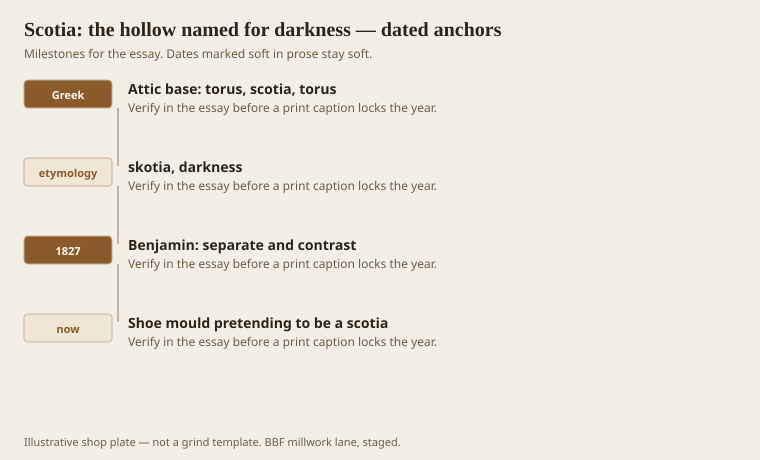
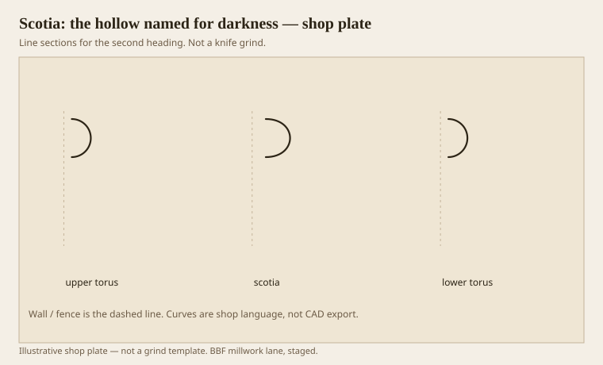

**Disclaimer.** Educational history and shop practice for the BBF millwork lane. Not a construction specification, not a bid, and not architectural or engineering advice. A measured opening and the local code beat a magazine essay.

Scotia comes from *skotia*, darkness. The old men named it for what it does, not for its geometry. It is a hollow, deeper and more scooped than a polite cavetto, set where you need a black line — classically between the tori of an Attic base. Benjamin said fillet and scotia separate, contrast, and keep convex members from smearing. If your base looks gray and confused, you are missing a night.

A shoe is not a scotia. A timid cove is not a scotia. A shadow-gap in modern cabinetry is a scotia that went to design school and dropped Latin.

## Why the hollow is supposed to go black

<!-- graphics-pack:v1 -->

*Figure 1. Attic base, the Greek word, Benjamin’s separator, and a shoe pretending to be a hollow.*

Set a sample under raking light. If you can still see the back of the hollow easily, it is too shy. Paint will make it shyer. Stain will sometimes help if the hollow goes darker, but stain will not invent depth. Depth is the grind.

Victorian cornices that swapped a corona for a big scotia were stealing this darkness and putting it at the ceiling to lift the room. It can work. It can also look like a cave. Full-size it.

Figure 1’s last hook is the shoe, because that is the living insult. A quarter-round at the floor is a scribe. It does not separate two tori. If the base is a one-piece ranch stick, there are no two tori. Do not call the shoe a scotia on the quote. Call it a shoe.

## Attic base in three moves

<!-- graphics-pack:v1 -->

*Figure 2. Upper torus, scotia, lower torus. The middle is supposed to disappear.*

Figure 2 is the Attic sentence. You can build it in wood as three sticks. You should, if the scale is a room base and not a dollhouse. One wide grind will cup and the darkness will move with the weather. Three sticks let the hollow stay hollow.

On the moulder the scotia is a side-clearance problem like any deep hollow. Oak burns. MDF dusts. Poplar fuzzes if the knife is dull. A dull scotia is a gray cove. Sharpen.

Healthcare will sometimes forbid a deep hollow at a floor because mops and infection-control language do not love night. Then you lose the Attic base. You can keep a hint: a shallow recess, a reveal, a dark paint in a small channel. You cannot keep a true scotia and a bleach rag in the same sentence without a fight. Pick the client.

A picture-rail hollow and a dado cap hollow are cousins. They still need to go dark or they are just dips. Darkness is the name. If you are afraid of it, you are afraid of the member. Use a fillet and an ovolo and stay in the light. That is an honest choice. A gray scoop is not.

## Night at two scales

A scotia on a column base and a scotia on a 5-inch room base are the same verb at different volumes. The column can take a hollow you could put a thumb in. The room base often wants a thinner night or it will collect the mop. Do not copy a Vignola plate at full module onto a drywall pedestal and then act surprised when the vacuum eats the hollow.

Paint color changes darkness. A white scotia needs more depth than a black one to read as night. If the designer insists on white-on-white Attic bases, grind deeper or add a tiny fillet at the lips so the hollow has edges to go black between. Edges make night. A fair scoop with no lips is a gray smile.

I will not fight a clinic for a true Attic base. I will fight a parlor that was promised darkness and then received a quarter-round shoe. The word is the job. If we cannot do the job, we change the word on the quote before we change the wall.
