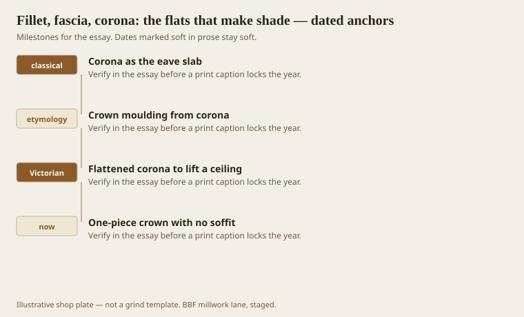
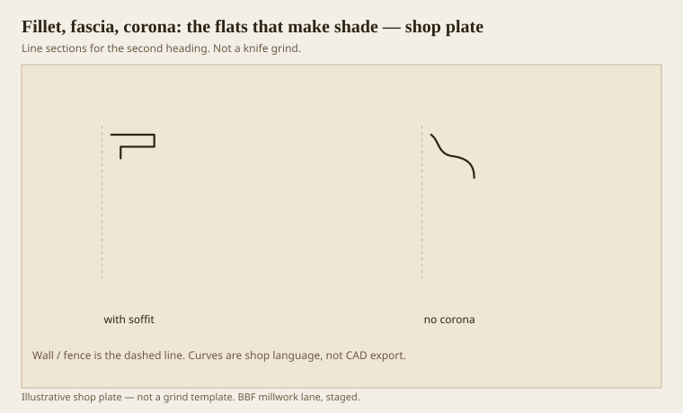

**Disclaimer.** Educational history and shop practice for the BBF millwork lane. Not a construction specification, not a bid, and not architectural or engineering advice. A measured opening and the local code beat a magazine essay.

Curves get the poetry. Flats do the shading. A fillet is a small plane that keeps two members from marrying. A fascia is a larger plane, a band. A corona is the eave slab whose underside — the soffit — is the dark that makes a cornice a crown. The English word *crown moulding* lives in that slab. Cheap crown forgot the slab and kept the nickname. That is theft.

Benjamin’s fillet is a separator. It can be a sixteenth. It can be a half-inch. If it disappears in paint, it was too small or the painter was too kind. Kind painters kill fillets.

## The members nobody puts on a T-shirt

<!-- graphics-pack:v1 -->

*Figure 1. The eave slab, the word crown, the Victorian flatten, and the one-piece stick with no soffit.*

Victorian designers flattened the corona to throw more of the cornice onto the ceiling and lift the wall. The soffit stayed. That is the test. If the underside still exists, you still have a crown. If the underside is a painted wave kissing drywall, you have a sticker.

Gibbs’s Tuscan shows the slab without apology. We still rip corona from 5/4 and rabbet the back. It is not glamorous. It is the difference between a hat and a noodle.

Figure 1 ends on the one-piece because that is the daily fight. You can grind a tiny soffit into a single stick. Do it. Even 3/8 of a flat underside will throw a line. If the stick cannot spare 3/8, the stick is too small for the room.

## Corona with a soffit, and without

<!-- graphics-pack:v1 -->

*Figure 2. A corona that still has an underside beside a wave that spent the word crown.*

Figure 2 is the punch list we send without sending it. Left, a flat with a return — soffit. Right, a cyma trying to be the whole hat. Clients see this in a sample corner and go quiet. Quiet is good.

Fillets on casings are how Federal work stays Federal. Step, fillet, ovolo, fillet. If you skip the flats, you have a roll. Rolls are beads. Beads are ropes. Different job.

On the moulder a flat is a jointing test. A corona that waves is a one-knife corona or a bed that is not true. Check the bed. Check the joint. Then blame the wood.

Fascia as a wall band — above a shop window, under a porch — is millwork at building scale. The same shop language applies. A fascia without a drip on the outside is a water problem. A fascia without a fillet at the edges is a blob. We are not a roofing shop. We still know a drip.

The flats are where you hide fasteners, too. A nail in a fillet can be puttied and forgotten. A nail on the belly of a cyma is a pimple in raking light. Design the flats as working parts, not as leftovers after the curves took the budget. The curves are cheaper than you think. The flats are what you are paying for.

## Nails, putty, and the working flat

A fillet is where a finish carpenter is allowed to put a nail. That is not a joke. Bellies show putty. Flats hide it. When we grind a casing with no fillet, we have forced every fastener onto a curve. The painter then becomes a sculptor of pimples. Design the flats as a fastener schedule, not as leftovers.

A corona ripped from 5/4 can be a better flat than a ground one if your jointing is tired. Rip, rabbet, sand the soffit, stop. The soffit does not need a wave. It needs to be dark and true. A wavy soffit is a one-knife problem or a bed problem. Fix those before you invent a new cyma.

Outside, a fascia without a drip is how paint fails at the bottom edge. We are not a roofing shop, but we know a kerf. A small drip kerf on an exterior fascia is millwork that remembers weather. Interior coronas do not need a kerf. They need a soffit. Do not mix the two sentences on one stick and then wonder why the porch lid peels.
