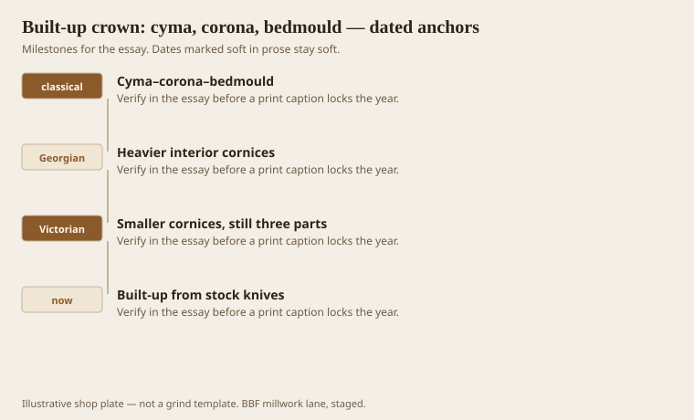
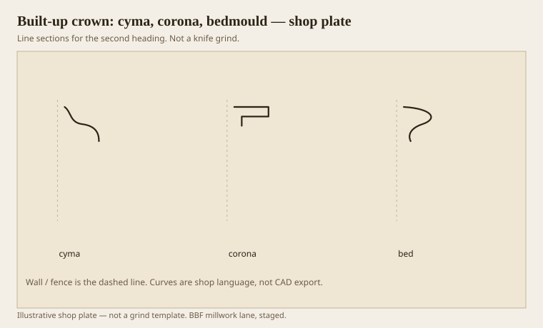

**Disclaimer.** Educational history and shop practice for the BBF millwork lane. Not a construction specification, not a bid, and not architectural or engineering advice. A measured opening and the local code beat a magazine essay.

If this pack has a shop commandment, it is this: keep the order of cyma, corona, bedmould even when you cheapen the sticks. Covering wave, flat with a soffit, supporting members. Enrich the ends as the order climbs. Do not promote the corona out of the stack unless you are speaking Victorian dialect on purpose and you still leave an underside.

A one-piece crown can include a little of all three. Most do not. Most are a sprung wave. We build up from stock knives more often than we grind a 7-inch monster, because monsters cup and because a damaged cyma should not force you to replace the bed.

## Keep the order even when you cheapen the sticks

<!-- graphics-pack:v1 -->

*Figure 1. The three-part sentence, Georgian weight, Victorian shrink, and a built-up from stock knives.*

Georgians, especially Palladians, liked heavier interior cornices. Victorians often used smaller ones and spent the money elsewhere. Both still stacked jobs. The ranch deleted the stack. We are putting it back with paint-grade poplar and a ripped fascia.

Dentils and modillions live in the bed. They are not a fourth job. They are an enrichment of the third. If the cornice is already short, skip them. Teeth on a thin face is a grin.

Figure 1’s last hook is the working method. I would rather pull three knives we own than invent a fourth. The room cannot see the catalog numbers. It can see the soffit.

## Three sticks, one shadow

<!-- graphics-pack:v1 -->

*Figure 2. Cyma, corona, bed — three sticks, one hat. The dashed line is still the wall.*

Figure 2 is the assembly. Nail or glue the bed to the wall first if the site likes it that way, or build a ladder on the bench. Site conditions win. The corona must land so its soffit is a dark. The cyma must sit so its covering point does not get sanded into a radius by a helpful painter.

Spring angles multiply when you build up. Each stick may have its own back. A drawing that shows one spring for a three-stick hat is a wish. Full-size the stack against the actual ceiling height. Then cut a 2-foot sample and hold it up. Samples end arguments. Arguments end in change orders.

On the moulder, run the longest runs first while the setup is hot. Cut extras. Built-ups eat length in copes and in the first-stick waste times three. Estimators who price a built-up like a one-piece will meet God on Friday.

Healthcare: a built-up can create dust ledges at every step. If the spec hates ledges, simplify the bed and keep the soffit. The soffit is a ledge too, but it is a ledge that faces down and can be wiped. A step that faces up is a shelf. Do not build shelves in a corridor and call them classical.

Three parts. That is the whole essay. When a designer sends a 14-member cornice for an 8-foot room, we count jobs, not members. If there are still three jobs, we thin the choir. If there are not, we send the map back. The hat has a grammar. Choirs are optional.

## Sample corners before footage

A 2-foot sample of a three-stick hat, held in the actual room, ends more fights than a rendered section. The render does not have a wavy ceiling. The sample does. If the corona’s soffit dies into a hump, you will add a ceiling fascia or you will scribe. Better to know before the grind is cold.

Paint-grade built-ups can be nailed as a ladder on the bench and hung as one unit if the runs are short. Stain-grade usually wants site assembly so the joints can be colored. Healthcare often wants shop assembly and a sealed back so the corridor does not collect raw wood dust. Write the assembly on the ticket. “Built-up” is not an assembly method. It is a grammar.

If the owner loves dentils, put them on the bed after the fraction is right. Dentils on a 4-inch hat in an 8-foot room are a grin. Dentils on a 6-1/2-inch hat can be a quiet rhythm. Rhythm is an enrichment. Fraction is the job. We sell the job first.
