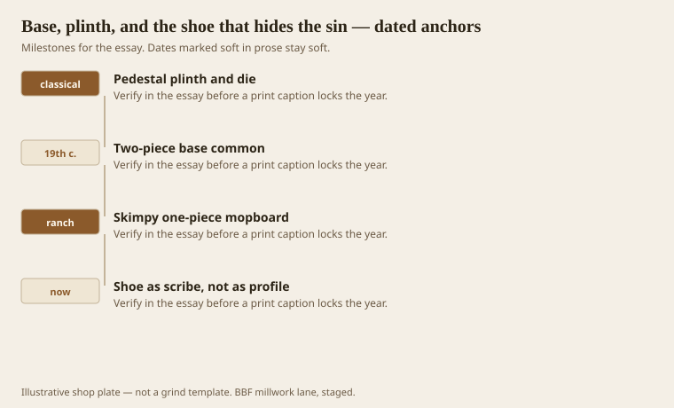
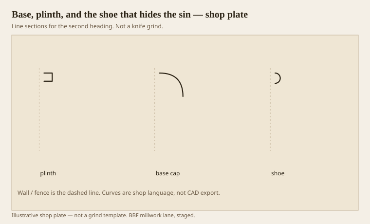

**Disclaimer.** Educational history and shop practice for the BBF millwork lane. Not a construction specification, not a bid, and not architectural or engineering advice. A measured opening and the local code beat a magazine essay.

A wall that remembers an order wants a pedestal at the floor. The plinth is the block. The die is the tall flat. The cap is a supporting member — ogee or ovolo, not a melting cavetto. A one-piece ranch mopboard is all three jobs mashed into a 3-1/4 stick. It can be fine in a ranch. It looks like a mistake in a room that bought a 6-inch crown.

The shoe is a scribe. It follows a floor that was never flat. It is not a profile you fall in love with. If you fall in love with a shoe, the base is too shy.

## What the floor is allowed to do

<!-- graphics-pack:v1 -->

*Figure 1. Pedestal language, the two-piece habit, the skinny mopboard, and the shoe as a scribe.*

Two-piece base — a die plus a cap, sometimes a separate plinth — is 19th-century common and still the best custom answer. You can run long flats and short fancy caps. You can replace a damaged cap without ripping the hall. You can scribe the die or the shoe and leave the cap calm.

MDF as a base in a wet Southern corridor is a seasonal event. We have had that fight. Solid or FJ pine, sealed at the bottom, is kinder. A vinyl cove is honest in a mop room. Honest is better than a swollen ogee.

Figure 1’s last hook is the shoe. I would rather see a small shoe and a proud die than a large shoe trying to be a torus course. Large shoes look like the floor is eating the wall.

## Two-piece base against a one-piece

<!-- graphics-pack:v1 -->

*Figure 2. Plinth, cap, and shoe as three thoughts. A one-piece mash is a different, thinner sentence.*

Figure 2 names the parts. If the ticket says “base,” we ask which parts. Height of die, profile of cap, yes/no shoe, yes/no plinth block at doors. Plinth blocks are a casing conversation that saves the base from dying into a thin door mould. We will get there. Here, know that a base that is thicker than the casing wants a plinth or a return, not a hope.

On the moulder, a base cap is a short, often supporting grind. The die may be a straight rip with a tiny bevel. Do not grind a 5-inch ogee into a one-piece if the room wanted a pedestal. You will waste knives and still not have a die.

Nail the die into backing, not into drywall dreams. The shoe can float a little. The cap should not. A cap that waves is a jointing issue or a wall that needed shims. Shim. Caulk is not a shim.

Healthcare: a radiused cap and a sealed bottom matter more than a Greek torus. The pedestal can survive a radius. It cannot survive a mop that wicks into MDF. Specify the bottom 1/2 inch as if it were exterior. It is.

The floor is allowed to be crooked. That is why shoes exist. The wall is not allowed to pretend the floor was the design. Hide the sin. Do not promote the sin to a feature unless you are doing a shadow-gap on purpose, with a plywood or metal channel, and a drawing. Shadow-gaps are scotia’s grandchildren. They still need darkness, not a dusty slot.

## Thickness at the door

A base that is thicker than the casing, with no plinth, makes a step at every door. The eye reads it as a mistake even when the profiles are cousins. Either thin the base, fatten the casing with a backband, or plant a plinth. Those are the three legal exits. Caulk is not a fourth.

Outside corners on a two-piece base are two miters that must land. If the cap miter opens and the die miter holds, you will stare at a smiling cap all winter. Glue the cap miter and pin it from the top into a flat if you can. Pinning a cap through an ogee belly is how you make a row of moons.

In a wet mop room I would rather see a vinyl cove and an honest painted die above it than a swollen oak torus at the floor. The pedestal can start after the water. That is still a pedestal. It is also still millwork. Pride about species at the mop line is how shops buy call-backs.
