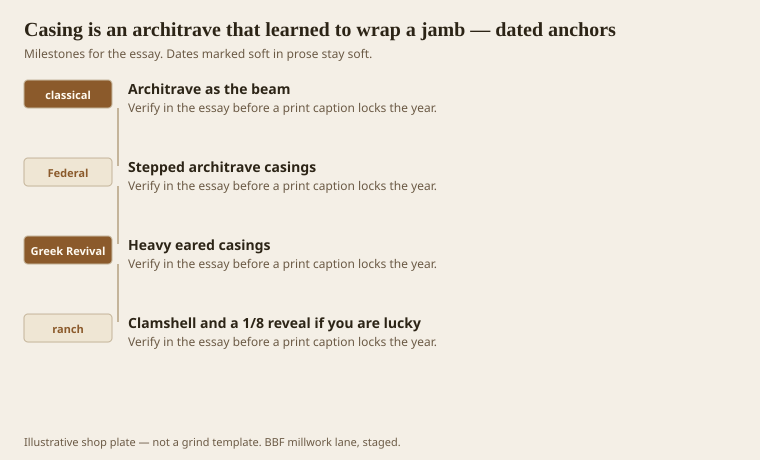
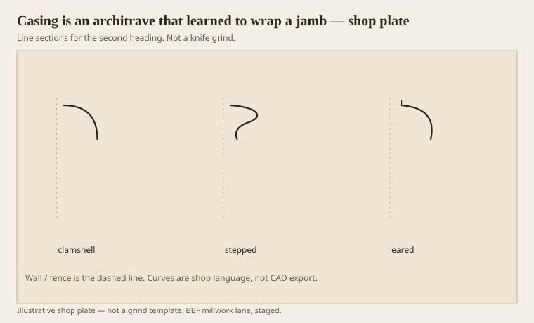

**Disclaimer.** Educational history and shop practice for the BBF millwork lane. Not a construction specification, not a bid, and not architectural or engineering advice. A measured opening and the local code beat a magazine essay.

An architrave is a beam. A door casing is that beam wrapped around a hole. The header can be a little prouder than the legs. The legs die on a plinth so the base has a place to stop. A reveal — 1/8, 3/16, 1/4, pick one and keep it — is the dark line between jamb and casing that makes the hole look intended. A ranch clamshell with no reveal and no plinth is an architrave that mumbles.

Benjamin and Lafever both drew doors as if they still believed in beams. We still do, even when the beam is 11/16 poplar.

## A door that remembers a beam

<!-- graphics-pack:v1 -->

<figure class="millwork-figure">

<figcaption>Figure 1. Architrave as the beam through Clamshell and a 1/8 reveal if you are lucky — see “A door that remembers a beam.”</figcaption>
</figure>

Federal stepped casings are fillets and a small ovolo — Roman, calm. Greek Revival likes ears (crossettes) and a heavier cap. Ranch likes a single clamshell and a hope. All three can be cut well. The mumble happens when you mix a Greek ear, a Federal step, and a ranch reveal that wanders from 1/16 to 3/8 down the hall.

Figure 1’s last hook is that lucky reveal. I have seen good carpenters save a cheap stick with a steady 3/16. I have seen custom knives murdered by a reveal that drifts. The reveal is free. Use it.

## Three casings and a reveal

<!-- graphics-pack:v1 -->

<figure class="millwork-figure">

<figcaption>Figure 2. Profile plate for “Three casings and a reveal.” Line sections, not a grind.</figcaption>
</figure>

Figure 2 is a lineup. Pick a family and stay. Backband is how a thin inner casing grows: a second stick, often an ogee, that makes a cheap architrave look like it ate dinner. We use it when the owner wants more door without a full Greek conversion.

Plinth blocks are thicker than the casing and taller than the base. If they are not, they are decorations. Decorations that are thinner than the base make a step backward at the floor. The eye hates a backward step.

On the moulder, casing is footage. Long, boring, profitable if the setup is clean. A clamshell is a short grind. A stepped Federal is more lands to joint. Joint them. A wavy casing next to a door is a daily insult.

Miter the head if the profile is simple. Some shops still cope. Most heads are mitered and the legs are butted to a plinth. Inside corners of an eared head are a bench problem, not a sticker problem. CNC or a clever saw. Do not invent a 16-foot ear.

Healthcare doors take beds and carts. The architrave can be simple and still be a beam: a square edge with a small ovolo, a serious plinth, a reveal that does not catch a glove. Fancy ears in a corridor are a liability and a dust farm. Save the ears for the chapel.

Wrap a hole like you mean it. That is the whole architrave lesson. Meaning it is a reveal, a plinth, and a header that knows it is a beam. The knife is secondary. The mumbling is optional.

## Headers that remember they are beams

A header that is the same stick as the legs is legal. A header that is a little taller, or backbanded, or eared, is a beam that still speaks. A header that is a scrap of plywood with casing legs dying into it is a shrug. We still do shrugs on closets. We do not do them on a front door and then use the word traditional.

Hinge-side reveals shrink if the jamb is proud. Proud jambs are a hanging problem. Do not sneak the casing over the proud and call it a 1/16 reveal. Plane the jamb or pull the unit. A lying reveal is a daily insult next to a door a person uses with their hand.

Split jambs and wrap-around casings in remodel work are each-parts pretending to be footage. Price the wraps as each. Price the long halls as feet. If you average them, the wraps will be late or the halls will be expensive. The architrave can survive a split ticket. It cannot survive a ticket that cannot be built.
