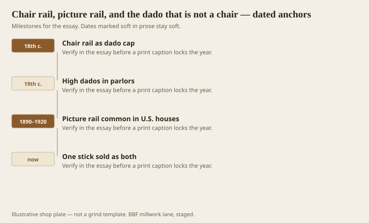
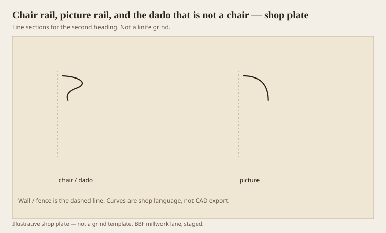

**Disclaimer.** Educational history and shop practice for the BBF millwork lane. Not a construction specification, not a bid, and not architectural or engineering advice. A measured opening and the local code beat a magazine essay.

Chair rail is a dado cap. The dado is the pedestal die on a wall. Chairs, pushed back, used to scar the paper; the cap also did that ordinary work. Picture rail is a later American habit, roughly 1890–1930 in a lot of houses, a hanging stick near the ceiling so you did not drive nails through plaster every time the print changed. They are not the same height. A catalog that sells one profile as both is selling a stick, not a job.

If you do not have a dado — no change of field, no wainscot, no armor — a chair rail is a stripe. Stripes can be handsome. Call them stripes.

## Two rails, two centuries

<!-- graphics-pack:v1 -->

<figure class="millwork-figure">

<figcaption>Figure 1. Chair rail as dado cap through One stick sold as both — see “Two rails, two centuries.”</figcaption>
</figure>

High dados in 19th-century parlors can sit well above a modern chair. Do not set a historic cap at 32 inches because a website said “chair height.” Cookie the scars and the paper line. `[VERIFY]` a specific house before you publish a number as law. 32–36 is a common modern chair stripe. Historic dados wander.

Picture rail wants to be near the ceiling, often with a small hollow that a hook can grab. If you set it at chair height, you have a chair rail with a hook, which is a good way to catch a shoulder.

Figure 1’s last hook is the catalog mash. We will cut one profile for both if the owner insists. We will not put them at the same height and call it traditional.

## Dado cap against a picture mould

<!-- graphics-pack:v1 -->

<figure class="millwork-figure">

<figcaption>Figure 2. Profile plate for “Dado cap against a picture mould.” Line sections, not a grind.</figcaption>
</figure>

Figure 2 is the verb split. Dado cap: often an ogee or a small cornice thought, a shoulder. Picture mould: a hookable hollow or a small crown-ish stick. If you use a crown knife at dado height, the wall will look like it has a second, lower sky. Sometimes that is a look (a plate rail in a dining room is a cousin). Usually it is a mistake.

Wainscot is the dado made of wood. The cap then has a real job: it covers the joint between panel and field. A applied cap on drywall with no panel is a stripe again. Fine. Do not build a 5-inch cap for a stripe unless the room can take a belt.

Healthcare crash rails are dado caps that learned to fight. Height is set by the spec and by the cart, not by a chair. The grammar still helps: a cap and a die, no dust shelf, a radius the rag can follow.

On the moulder both rails are easy footage. The site is where they fail: wandering height, no story pole, a corner that steps 3/8. Use a story pole. Use a laser if you must. Do not trust the floor to be level. The rail is a waterline. Waterlines that tilt make people slightly seasick. They will not know why they hate the room. You will.

Two rails, two jobs, two heights. If the owner wants only one stick in the budget, pick the job the room actually has. A dining room with pictures may want the high rail. A hall with chairs may want the low one. A SNF corridor wants armor. The Latin can wait.

## Story poles and the waterline

A chair rail that climbs 3/8 from one end of a hall to the other will make people slightly sick. They will blame the paint. Use a story pole from a marked benchmark, not from the floor at each door. Floors wander. Rails should not.

Plate rails in dining rooms are a third cousin: a dado-ish height with a small ledge. Ledges hold plates and dust. Healthcare forbids them. A house that wants them should get a real ledge, not a crown knife on its side. A crown on its side is how you cut a hand.

If the budget allows only one rail, pick the job the room already has. Pictures without a rail will make new nail holes. Chairs without a rail will scar the paint. A corridor without armor will scar the drywall. The Latin names wait. The scars do not.
