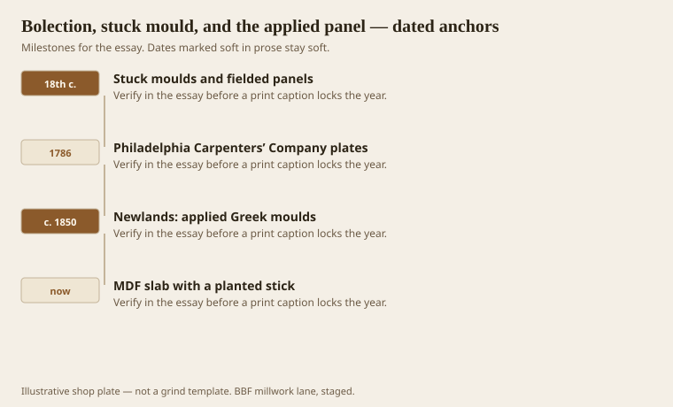
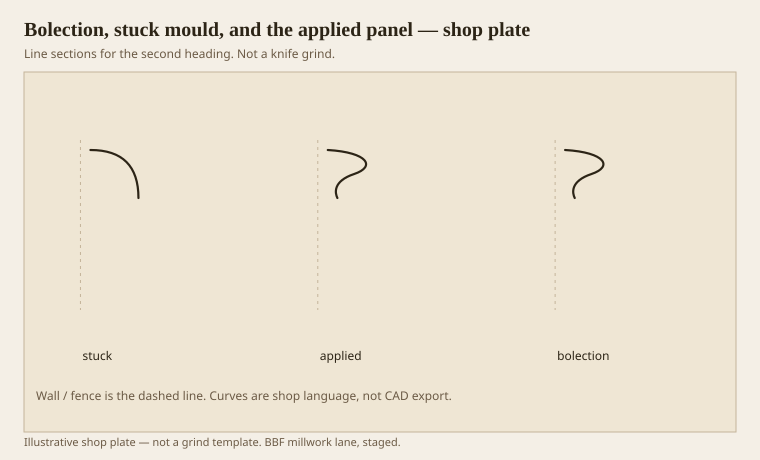

**Disclaimer.** Educational history and shop practice for the BBF millwork lane. Not a construction specification, not a bid, and not architectural or engineering advice. A measured opening and the local code beat a magazine essay.

A panel meets a rail in three main ways. Stuck: the mould is cut on the rail and stile, the panel is often fielded (beveled). Applied: a third stick covers the joint, the panel may be flat. Bolection: a mould that steps over both frame and panel, proud of both, a little bridge. Loth, comparing the 1786 Philadelphia Carpenters’ Company plates with Newlands mid-century, shows the switch: 18th-century stuck and fielded, 19th-century applied Greek quirks and flat panels. The switch is almost national after that.

An MDF slab with a planted stick is the 21st-century grandchild. It can look fine. It is not a fielded door. Do not sell it as one.

## How a panel meets a rail

<!-- graphics-pack:v1 -->

<figure class="millwork-figure">

<figcaption>Figure 1. Stuck moulds and fielded panels through MDF slab with a planted stick — see “How a panel meets a rail.”</figcaption>
</figure>

Fielding a panel is millwork that thinks like a door shop: bevels, a raise, a flat field. It moves with the seasons if the panel is solid. Applied moulds on a plywood panel are how hotels get 200 doors that stay flat. Both are honest if named.

Bolection is the proud one. It shows up on fireplaces and on doors that want a shadow box. It is a dust ledge if you put it in a clinic. It is a joy in a parlor. The section is often an ogee that steps. Strong at the ends, Benjamin would say. He would be right.

Figure 1 is a technology story as much as a style story. Applied moulds are easier to machine as a separate stick. Stuck moulds want a shaper or a spindle and a coping of the rail ends. Shops picked easy. Easy became the 19th century.

## Stuck, applied, bolection

<!-- graphics-pack:v1 -->

<figure class="millwork-figure">

<figcaption>Figure 2. Profile plate for “Stuck, applied, bolection.” Line sections, not a grind.</figcaption>
</figure>

Figure 2 is the punch-list picture. If you are matching 1780, look for fielding and a stuck ovolo. If you are matching 1850, look for a planted quirked mould and a flat panel. If you average them, you get a door from nowhere.

On the moulder, applied panel mould is footage — small, annoying, profitable. Stuck work is each-parts on a shaper. Bolection can be either, but the step means a thicker blank and a back that must sit on two levels. Fit a sample on a mock joint before you run 300 feet.

CNC can carve a fake field on MDF. It looks like a field until you touch it. Touch is allowed. If the client will only see photos, the fake will pass. If the client is this lane, we say so on the ticket: “machined raise, not a floating panel.”

Doors in healthcare often want flush or nearly flush meetings — no bolection, no deep stuck hollow. A small applied radius is the leftover. The grammar still names it. Naming keeps you from promising a 1786 door in a 2010 corridor.

Three meetings. Pick the year. Cut that meeting. The panel is not a rectangle you decorate. It is a surface that has to live next to a frame through August. August is why floating panels were invented. MDF does not float. It swells. Choose.

## Movement at the meeting

A stuck mould on a solid rail and a floating solid panel is a 18th-century machine for August. The panel shrinks; the mould stays; the field does not split the frame. An applied mould on a plywood panel is a 19th- and 21st-century machine for flatness. A bolection on either still has to allow the panel to move if the panel is solid. Pin the bolection to the frame, not to the panel, unless you want a split.

MDF slabs do not float. They swell at the edges if they drink. An applied mould on MDF is a painted picture of a door. Fine in a hotel if the film is right. Not fine as a “solid hardwood raised-panel” line on an invoice.

Match the meeting to the year, then match the movement to the material. Those are two sentences. Shops that smash them into one get a winter call-back and a door that suddenly has a new hairline crack along a rail. The crack is the panel telling the truth.
