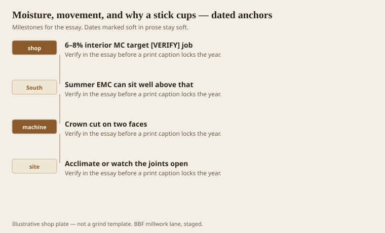
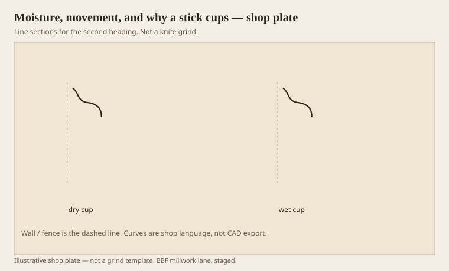

**Disclaimer.** Educational history and shop practice for the BBF millwork lane. Not a construction specification, not a bid, and not architectural or engineering advice. A measured opening and the local code beat a magazine essay.

A profile is a weather report. You cut away one face more than the other, you cut across rings, you send the stick from a 7-percent kiln into an Arkansas jobsite that is thinking about 12. The stick cups toward the dry side or the wet side depending on who you ask and what the rings were doing. The FPL *Wood Handbook* is the desk science. Wengert’s EMC talk is the shop science. Our county is the weather.

Interior target moisture is often talked as 6–8 percent. `[VERIFY]` against the job’s HVAC and the time of year. A June corridor with no air on is not 6–8. If you install to a winter kiln number in that corridor, winter will open the joints or summer will hump the long runs. Acclimate in the room, not in the truck.

## The kiln ticket is part of the profile

<!-- graphics-pack:v1 -->

<figure class="millwork-figure">

<figcaption>Figure 1. 6–8% interior MC target [VERIFY] job through Acclimate or watch the joints open — see “The kiln ticket is part of the profile.”</figcaption>
</figure>

Crown is the worst offender because it is cut on two faces and then sprung. The back flats are thin. The face is a landscape of hollows. Moisture leaves the thin flats first. The stick tries to become a smile or a frown. Either way the copes open.

MDF does not cup like wood. It swells like a sponge at the ends. FJ pine cups less than solid and still moves at the fingers if the glue lines were thirsty. Solid oak cups like it means it. Quartersawn cups less across the width and still shrinks. There is no free species. There are kinder cuts.

Figure 1 is a process, not a style. Write MC on the ticket. Write the date the sticks entered the room. If the GC wants them up tomorrow, say what will happen in October. October always comes.

## How a sprung crown wants to cup

<!-- graphics-pack:v1 -->

<figure class="millwork-figure">

<figcaption>Figure 2. Profile plate for “How a sprung crown wants to cup.” Line sections, not a grind.</figcaption>
</figure>

Figure 2 is a cartoon of a fact. You cannot grind a cup out of a finished stick on site. You can hold it with nails and glue and still watch it crawl. Better: let it live in the room, then cut. Better still: do not run 16-foot solid crowns in July for a house that is not conditioned. Run shorter, or run FJ paint-grade, or wait.

Rings: a flat-sawn stick with the bark face toward the room will move differently than the reverse. Old men have rules. The rules fight each other. I look at the rings on the test stick and I do not run all the pith-side faces the same way down a hall if I can help it. Variation is less of a wave than a chorus.

Finish slows movement. It does not stop it. A shop-sealed stick still opens at an unsealed cope. Seal the end grain. People forget. The joint reminds them.

Healthcare HVAC is a blessing and a knife. Over-dry air in winter will open every miter you were proud of. Leave a little extra length and a plan for a winter call-back if the building is new and the slab is still wet. New buildings lie about their EMC. They are drying around your trim.

Moisture is not a special chapter at the end of a job. It is the first chapter. A perfect Greek quirk in the wrong MC is a perfect Greek quirk on the floor. I would rather a shy Roman circle that stays on the wall. The orders can wait. The weather cannot.

## Conditioning is a date, not a vibe

Write the date the sticks entered the room and the date they went on the wall. If those dates are the same afternoon, you have not acclimated, you have unloaded. A kiln ticket from last month is not the room’s EMC today. A cheap pin meter is not perfect. It is better than a feeling.

Solid crowns stored on a concrete slab will pick up the slab. Sticks stored in a closed truck in August will cook. Both will move when they meet the HVAC. Store them on sticks, off the floor, in the zone they will live in. This is boring. Boring is how joints stay shut.

If the GC’s schedule forbids waiting, change the material, not the physics. FJ paint-grade, shorter lengths, a two-piece base instead of a 7-inch solid. Physics will not sign a waiver. We can sign a ticket that admits what we ran.
