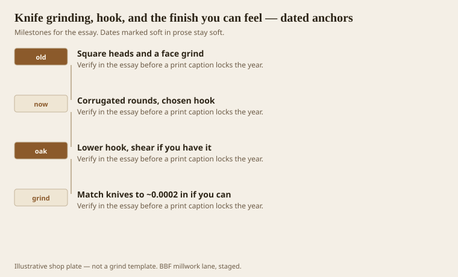
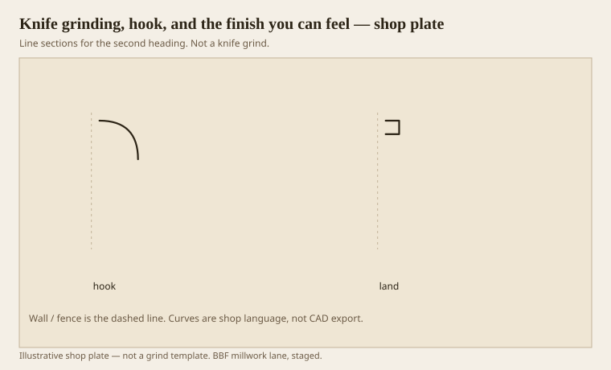

**Disclaimer.** Educational history and shop practice for the BBF millwork lane. Not a construction specification, not a bid, and not architectural or engineering advice. A measured opening and the local code beat a magazine essay.

A profile is only as true as the pair of knives that cut it. If they differ by 0.001 inch, the long one does the finish cut, heats, and dies, and the short one rides along like a tourist. Rankin and the older jointing manuals want something closer to 0.0002. That is not jewelry. That is how both knives share oak.

Hook (rake) is the attack. Softer wood likes more slice. Harder wood likes more scrape. Corrugated round heads let you pick a hook; the old square heads made people grind a face bevel to fake one. Shear is a sideways tilt that makes red oak look like you care. Side clearance is how a deep hollow avoids rubbing and burning. Duve’s 23–25 degree talk is the grind-angle neighborhood we live in; `[VERIFY]` against the steel and the head you actually own.

## Balance is not a personality trait

<!-- graphics-pack:v1 -->

<figure class="millwork-figure">

<figcaption>Figure 1. Square heads and a face grind through Match knives to ~0.0002 in if you can — see “Balance is not a personality trait.”</figcaption>
</figure>

The old balance stories are still true in spirit: a little extra weight at speed becomes a lot of force. You will not run 6,000 rpm with sloppy bits and call it a finish. You will shake the spindle and wave the land.

People blame wood for tearout that is a hook problem. People blame knives for waves that are a jointing problem. People blame feed for burns that are a side-clearance problem. Walk the list before you recut a 400-foot run.

Figure 1 is a shop-history of the head. We are in the corrugated-round world. If you still have square heads, you still have face-grind decisions. Do not mix the advice.

## Hook, clearance, and a profile land

<!-- graphics-pack:v1 -->

<figure class="millwork-figure">

<figcaption>Figure 2. Profile plate for “Hook, clearance, and a profile land.” Line sections, not a grind.</figcaption>
</figure>

Figure 2 is not a grind template. It is a reminder that the land — the little flat after jointing — is the finish surface. Too much land and you have no clearance, heat, glaze. Too little and the knife is a needle. Needles chip in oak.

HSS vs carbide is a money conversation. Carbide holds in MDF and in dirty pine. HSS takes a keener edge in clean hardwood if you keep it. We keep both. We do not put a dull carbide in a quirk and wonder why the hairline died.

A test stick in the same species, same MC, is not optional. A poplar test of an oak job is a lie. The lie looks good on Monday and fuzzy on Tuesday.

Safety is not a slogan here. A moulder is a tunnel of knives. Guards on, feed in the right direction, no heroics in a jammed stick. The old men who lost pieces of themselves are not folklore. They are why we do not reach.

The finish you can feel is a thumbnail across the land. If you can feel a ridge at the quirk, the painter will feel it in raking light. Grind again. The orders can wait. The thumbnail cannot.

## A cabinet of labeled steel

A knife that is not labeled is a rumor. Write the profile name, the hook, the date, and the job. When you pull it in two years for a match, you will thank yourself. When you pull the wrong S-curve, you will not.

Jointing after a grind is not optional on a two-knife head if you care about the land. A pretty grind that is 0.002 long on one knife is a one-knife head at speed. The finish will tell on you in oak. In poplar it may hide until the painter’s raking light.

Keep a scrap of the last run with the knives. That scrap is a cookie for the next time someone wants “the same ogee.” Memory is not a section. The scrap is. Hang it with the steel.
