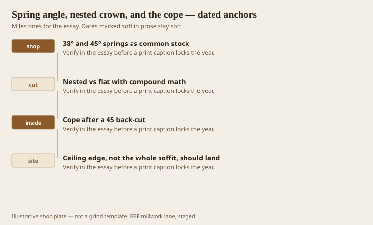
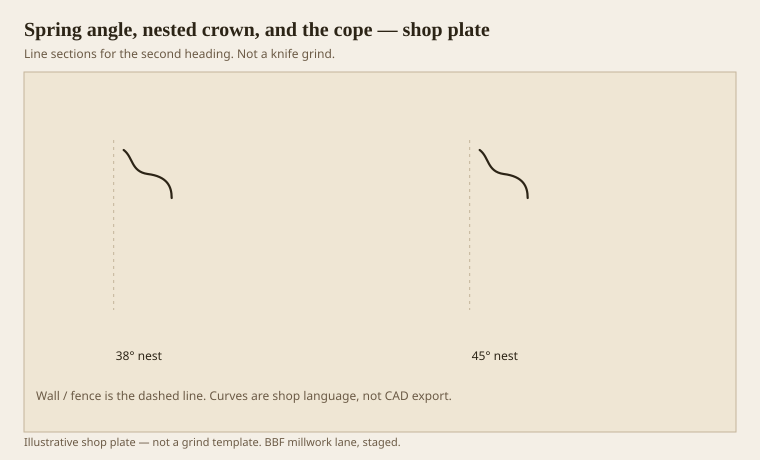

**Disclaimer.** Educational history and shop practice for the BBF millwork lane. Not a construction specification, not a bid, and not architectural or engineering advice. A measured opening and the local code beat a magazine essay.

Crown does not live flat on a saw. It lives sprung, flats against wall and ceiling, at an angle the stick was ground for. Nested cutting — stick against the fence as if the fence were the wall — keeps that spring. Katz’s finish-carpentry writing is the clearest public version of what good carpenters already did: fence is the wall, ceiling edge should kiss, insides get coped after a 45 back-cut, outsides get mitered. Flat compound math is for sticks too big to nest, or for people who like decimals.

Stock U.S. springs are often 38 and 45. `[VERIFY]` the stick in your hand. The angle printed on a website is not the angle of a cuppy cove.

## Fence is the wall

<!-- graphics-pack:v1 -->

<figure class="millwork-figure">

<figcaption>Figure 1. 38° and 45° springs as common stock through Ceiling edge, not the whole soffit, should land — see “Fence is the wall.”</figcaption>
</figure>

If the whole soffit back kisses a wavy ceiling, every hump is a joint. A well-ground crown lands on an outer edge so the wave can hide. Ranch ceilings need that more than Georgian ones. Georgian ceilings were sometimes plaster and proud of it. Ranch ceilings are a weekend.

A cope follows the profile and ignores a wall that is not 90. A miter on an inside corner opens as soon as the wall does. Caulk then becomes the member. We have already said what we think of caulk as a member.

Figure 1 is a jobsite spine. The shop’s job is to grind flats that actually sit at the spring we claim. If the back flats are wrong, the carpenter will invent a new spring on every cut. That is how a hall goes drunk.

## Nested 38 against nested 45

<!-- graphics-pack:v1 -->

<figure class="millwork-figure">

<figcaption>Figure 2. Profile plate for “Nested 38 against nested 45.” Line sections, not a grind.</figcaption>
</figure>

Figure 2 is not a saw chart. It is a reminder that 38 and 45 throw the face differently. A 45 spring puts more of the stick on the ceiling. A 38 puts more on the wall. Rooms with bad ceilings like more wall. Rooms with short walls and a high lid like more ceiling — the Victorian flatten, cheaply.

Built-ups have more than one spring if you are sloppy. Draw them. Cut a sample. Hold it up. The carpenter should not have to invent the hat at the ladder.

On the moulder, cut the back (bottom knife) so the flats are flats. A crowned back is a sprung stick that will rock on the saw. Rocking changes the spring every cut. That is how two sticks from the same run disagree at a corner.

Pre-coping in the shop is a service some customers ask for. It only works if the walls are true or if you cope long and let the site sneak up. I would rather send square-cut extras and let a good carpenter cope in place. A bad carpenter will miter insides anyway. Price the difference.

Spring is a geometry word that sounds like weather. It is geometry. Weather is the other essay. Do both and the hat stays on.

## Walls that are not 90, and ceilings that are not a plane

A cope is how you forgive a corner that is 92 degrees. A miter is how you advertise it. If the carpenter is faster with miters, budget the caulk and the call-back. If the carpenter can cope, budget the time. Time is cheaper than a winter smile at every inside corner.

Ceilings that wave want an edge landing and sometimes a ceiling fascia first. The fascia becomes a corona and a scribe surface. That is a built-up hat invented on site because the drywaller was in a hurry. It is still grammar. Write the extra stick on the ticket when you see the wave. Seeing the wave means walking the room before you cut 300 feet of nested 45.

A spring gauge — two scraps that hold the stick at the claimed angle — belongs in the truck. If the stick will not sit in the gauge, the back flats are wrong and the shop should hear it before the hall is half done.
