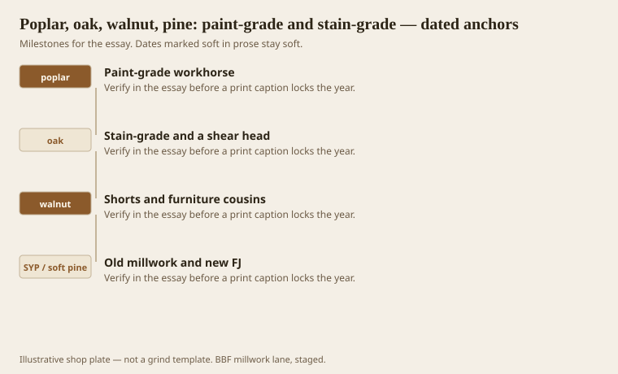
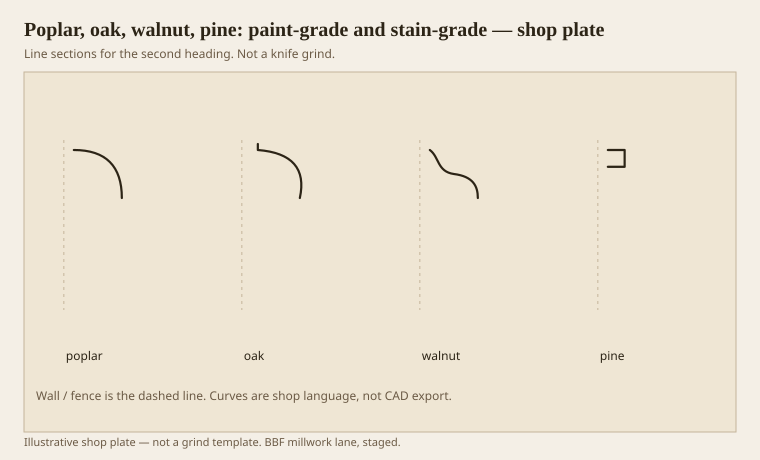

**Disclaimer.** Educational history and shop practice for the BBF millwork lane. Not a construction specification, not a bid, and not architectural or engineering advice. A measured opening and the local code beat a magazine essay.

Species is a knife conversation that pretends to be an aesthetic. Poplar: paint-grade workhorse, takes a quirk, green streaks that primer hides, moves like a hardwood. Red oak: stain-grade default, rays, tearout, a shear head if you have one. White oak: tighter, sometimes friendlier, still a hardwood. Walnut: furniture cousin, shorts, expensive footage, gorgeous if you do not burn the quirk. Pine: the mill-town default, old “Arkansas soft pine” as a mild interior, new SYP as resin and dent and a knife-gummer if it is dirty.

The Bradley postcard sold mild-textured oak and soft pine in the same breath. We still buy that split. We do not stain poplar and call it walnut. We do not paint walnut unless the owner has a reason and a wallet.

## What the belt actually grew

<!-- graphics-pack:v1 -->

*Figure 1. Four species, four tickets. The belt grew oak and pine; we import the rest.*

Poplar is an Appalachian and bottomland gift that did not need to grow in the courthouse square to be our paint-grade. We buy it. Oak did grow here. Walnut is a fence-row and furniture-room wood. Pine built the town.

FPL numbers for shrinkage and hardness belong on a clipboard when the designer wants a 10-inch solid walnut base in a new slab building. Walnut will move. The slab will wet. The base will look like a banana. Paint-grade poplar two-piece will not make the magazine. It will stay on the wall.

Figure 1 is a buy list, not a forest inventory. If a caption needs a county species map, `[VERIFY]` with a forester. This is a shop list.

## Four species, one cyma

<!-- graphics-pack:v1 -->

*Figure 2. The same wave in four woods. The knife does not get to pretend they are one.*

Figure 2 is why we test in the job species. A poplar cyma can look fair and still fuzz in oak. A pine cyma can gum. A walnut cyma can burn at the hollow. One grind, four personalities.

Stain-grade wants the mill marks gone and the sanding scratches going the right way. Paint-grade wants the quirk alive and the primer even. Do not sand a paint-grade quirk as if you were staining oak. You will pay for a line and then erase it.

Mixed species in one room — oak doors, poplar casing, pine base — is a mill-town habit that can look fine under paint and foolish under stain. If the room is stained, pick one wood or pick a story (oak doors as furniture, painted trim as architecture). Stories need to be written on the ticket, not invented at punch list.

Healthcare often wants a finish, not a species. The film is the product. Under the film we still pick a wood that will not swell at the mop. Species remains a maintenance choice.

A last prejudice I will own: I would rather run poplar Greek Revival than oak ranch clamshell. The first is a member. The second is a dent. Prejudice is not a spec. The spec wins. When the spec is silent, I pick the wood that keeps the line.

## Mixed woods under one film

A room can mix poplar casing and oak doors under paint and look intended. The same mix under stain looks like a salvage yard. If the designer wants “all hardwood” and then picks four species, ask whether the film is paint. Paint is how mill towns mixed cars and still made a hall.

SYP in a painted interior will still telegraph resin if the kiln was kind and the weather is hot. Seal the knots. Or do not use SYP for a parlor casing. Old soft pine is a different stick. The postcard knew the difference. So should the buy list.

Walnut shorts are furniture. If you have enough shorts to make a mantel, good. If you are trying to run 200 feet of walnut base, you are in a different business than this county usually priced. Price it like a different business. Do not subsidize it with poplar hours.
