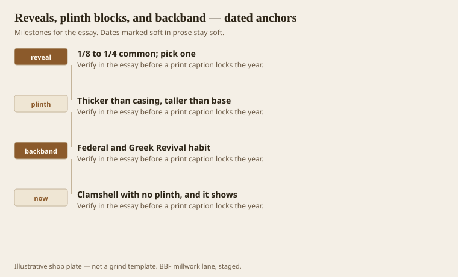
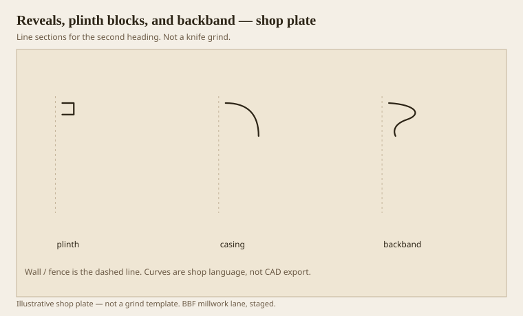

**Disclaimer.** Educational history and shop practice for the BBF millwork lane. Not a construction specification, not a bid, and not architectural or engineering advice. A measured opening and the local code beat a magazine essay.

Three cheap decisions make a door look expensive. A steady reveal. A plinth that is thicker than the casing and taller than the base. A backband that is a second member, not a caulk fillet. None of them requires a Greek Revival conversion. All of them require a story pole and a shop that will not let the reveal wander.

A reveal is the dark step from jamb to casing. 1/8 is tight and fussy. 1/4 is easy and a little country. 3/16 is the neighborhood we live in unless the drawing says otherwise. Pick one. Write it. Measure it. The eye will forgive a shy knife. It will not forgive a reveal that grows down the hinge side.

## The lines a room reads first

<!-- graphics-pack:v1 -->

<figure class="millwork-figure">

<figcaption>Figure 1. 1/8 to 1/4 common; pick one through Clamshell with no plinth, and it shows — see “The lines a room reads first.”</figcaption>
</figure>

Plinths exist so the base can die into a block instead of into a thin moulding. If the plinth is thinner than the base, you have a backward step. If it is shorter than the base is tall, you have a base that climbs the block. Both look like mistakes even when the knife is perfect.

Backband is Federal and Greek Revival habit: a thin inner architrave plus an outer stick. We use it to fatten a stock casing without grinding a new 5-inch monster. It is a second knife, or a stock ogee we already own. It is not paintable caulk.

Figure 1’s last hook is the clamshell with no plinth. We still install those. We do not call them traditional packages. We call them ranch doors, and we try to keep the reveal honest.

## Thin casing, then a backband

<!-- graphics-pack:v1 -->

<figure class="millwork-figure">

<figcaption>Figure 2. Profile plate for “Thin casing, then a backband.” Line sections, not a grind.</figcaption>
</figure>

Figure 2 is the door bottom. The plinth is a block. The casing lands on it. The backband lands on the casing. The reveal is under the whole stack at the jamb. If any of those levels is inverted, the door mumbles.

On the moulder, plinths are each-parts — short, thick, often a simple ovolo or a square. CNC or a chop saw and a small head. Do not run 16-foot plinth stock and then invent the height on site. Height is a drawing.

Windows get stools and aprons instead of plinths. The stool is a little weather-table even inside. A tiny drip on the nosing keeps mop water from sitting. Healthcare windows want that more than parlors do. The apron is a small bedmould under the stool. Same three-job thinking, smaller hat.

A wandering reveal is usually a jamb that was not flush, or a casing that was sprung, or a carpenter who set the first one by eye. Set the first with a gauge. I have used a scrap with a 3/16 lip for twenty years. It is not clever. It is how halls stay sober.

These three decisions are the cheapest architecture in the building. They are also the first things a person sees when they walk through a hole. Spend the eighths here. Save the carving for a mantel that can take it.

## Gauges, not eyes

A 3/16 gauge is a scrap with a lip. I have used the same idea on more doors than I can count. Eyes drift. Gauges do not, unless you grab the 1/4 by mistake. Mark the gauges. Keep them in the door kit with the plinth heights.

Backband returns at a window or a cabinet need a little miter that a lot of people caulk. Cut the return. A caulked backband return is a yellowing third species in a year. The eighths we saved on the reveal should not be spent on a lazy return.

If the jamb is not flush to the wall, the reveal will lie or the casing will rock. Fix the wall or the jamb first. Millwork is not a way to hide a unit that was hung in a hurry, except when it is, and then we should write “scribe and hope” on the ticket so we remember why the reveal wandered.
