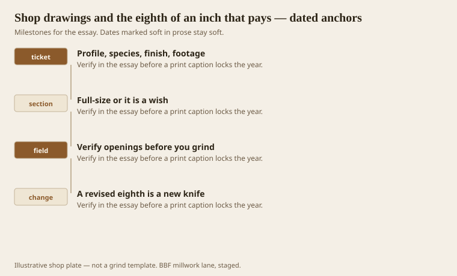
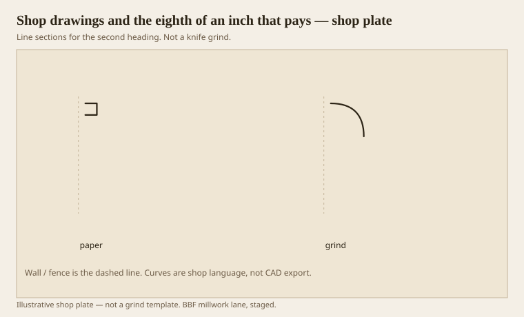

**Disclaimer.** Educational history and shop practice for the BBF millwork lane. Not a construction specification, not a bid, and not architectural or engineering advice. A measured opening and the local code beat a magazine essay.

A shop drawing is a contract that happens to be a picture. Profile, species, finish, footage, machine, spring, reveal. If any of those is a wish, the knife will make it a cost. AWI wants drawings for a reason. So does a shop that has ground a 4-inch ogee to a 3-1/2 opening because someone trusted a PDF dimension from last Tuesday.

Eighths are not decoration. A 3/8 quirk and a 1/4 quirk are different members. A 5-1/2 cornice and a 6-inch cornice are different hats in an 8-foot room. If the architect says “about 6,” we write 6-0 or 5-8 and send it back. About is how you grind twice.

## The paper that keeps a knife honest

<!-- graphics-pack:v1 -->

*Figure 1. What a ticket must name, a section you can grind, a field check, and a revised eighth as a new knife.*

Field verify openings before you grind a custom casing that has to wrap a specific jamb. Jambs lie. Drywall lies. The drawing from the architect is a hope about a wall that has since been floated. A tape is cheaper than a knife.

Design-to-spec in this lane — the old hourly sentence — is the drawing as a product. You are not only selling sticks. You are selling a section that can be built. If the client will not pay for the section, they are buying stock, and we should say so.

Figure 1’s last hook is the change order. A revised eighth is a new grind if the knife is already cut. People think steel is clay. Steel is a decision. Date the decision.

## A section that can be ground

<!-- graphics-pack:v1 -->

*Figure 2. Paper against grind. If they disagree, stop before the 400 feet.*

Figure 2 is the hold point. Full-size the section. Overlay the knife plot. If they disagree, stop. I have seen shops “fair it in” and then meet a carpenter who coped to the drawing. The cope and the stick then argue in public.

CNC parts need the same honesty in a different language: tool diameter, inside radius the bit cannot cut, a fillet the designer drew at 0.01. Tell the designer the bit’s radius. Eighths again, just in a circle.

Dimensions on a shop drawing should be the ones a person can check with a tape on the finished stick. Overall height, projection, spring flats, reveal. Not a cloud of aligned dimensions that only the CAD jockey can parse. If the installer cannot find the 3/16, it does not exist.

Healthcare specs add finish system, edge radii, and sometimes a ban on certain hollows. Those belong on the same sheet as the ogee, not in an email. Emails die. Sheets get taped to the moulder.

The eighth that pays is the eighth you wrote down. The eighth that costs is the one you assumed. Assume nothing that a knife will have to love. Knives do not love. They repeat.

## What a tape can check

If an installer cannot find a dimension with a tape on the finished stick, the dimension was for the CAD jockey. Overall height, projection from the wall, spring flats, reveal, plinth height. Those are tape numbers. A cloud of aligned paper-space dimensions is a drawing that will not be read on a ladder.

Revision clouds should say what changed in eighths, not “updated per client.” The grind shop needs a number. The front office needs a date. The site needs both on one sheet that can take a coffee stain.

We keep a print at the moulder, not only a screen. Screens pinch radii. Prints, even cheap ones, keep a quirk from becoming a rumor between shifts. The eighth that pays is the eighth that two shifts can see.
