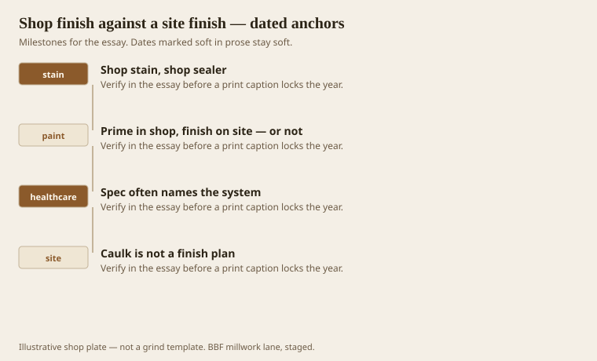
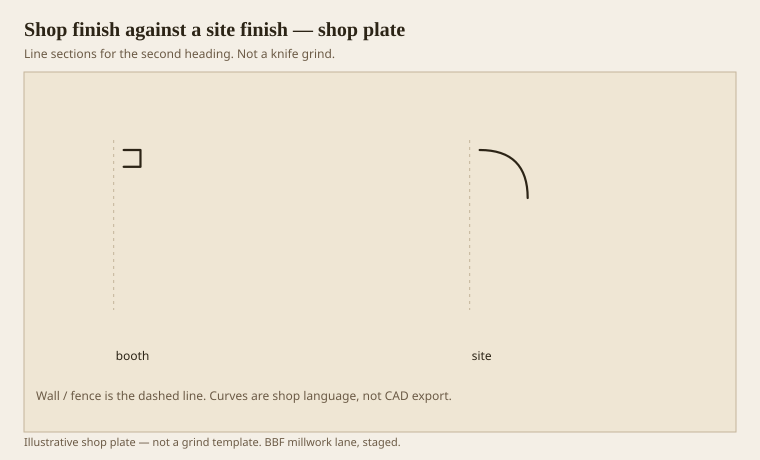

**Disclaimer.** Educational history and shop practice for the BBF millwork lane. Not a construction specification, not a bid, and not architectural or engineering advice. A measured opening and the local code beat a magazine essay.

A booth film and a ladder film are not the same product. Conversion varnish, catalyzed lacquer, a shop stain with a sealer — those want dust control and a gun. Site paint can be honest on paint-grade if the joints are filled and the copes exist. Site stain on raw oak crown is how you get lap marks in a hall that will be photographed at 4 p.m.

AWI finishing systems are a menu. Healthcare specs pick from a smaller menu and then add wipe tests. Read them. A beautiful shop finish that dies at the first alcohol wipe is a failed beautiful finish.

Prefinish long runs. Leave a touch-up kit that is the actual system, not a hardware-store cousin. Cut ends and copes need sealer. People forget. The joint reminds them, in a darker or lighter patch, for years.

## Where the dust is allowed to live

<!-- graphics-pack:v1 -->

<figure class="millwork-figure">

<figcaption>Figure 1. Shop stain, shop sealer through Caulk is not a finish plan — see “Where the dust is allowed to live.”</figcaption>
</figure>

Dust in a booth is a failure of process. Dust on a site is weather. You cannot run a 16-foot stain-grade walnut rail in a hotel lobby with the drywallers still sanding and then blame the wood. Sequence is a finish spec.

Paint-grade FJ can be shop-primed and site-finished. That is a normal, good path. Do not call the primer the finish. Primer is a working coat. It scuffs. It wants a topcoat after the nails.

Figure 1’s last hook is caulk. Painters will caulk a bad cope and then paint the caulk. The caulk then becomes a third species that yellows. Cope first. Caulk a hairline if the wall demands it. Do not caulk a profile.

## Booth film against a site film

<!-- graphics-pack:v1 -->

<figure class="millwork-figure">

<figcaption>Figure 2. Profile plate for “Booth film against a site film.” Line sections, not a grind.</figcaption>
</figure>

Figure 2 is why “match this fan deck” fails. The name is not the build. Sheen, film thickness, and the way a quirk holds paint are the build. A shop sample and a site wall can share a name and still fight at the door.

On stain-grade, sand through a quirk and you have a blonde line. On paint-grade, fill a quirk and you have no member. Different rooms, same rule: the line is the design. Finish is how the line lives.

Hospitality luggage will scuff a base. A repairable film is a feature. An irreplaceable piano finish on a corridor base is a vanity. Vanity belongs on a reception desk that can be refinished as an each-part.

We shop-finish casework and we site-finish a lot of standing trim. That split is not a philosophy. It is what fits through a door and what has to be cut to a crooked wall. Write the split on the ticket so the GC does not schedule the painter ahead of the copes. Copes ahead of paint. Always. The orders can wait. The painter cannot, once the lift is rented.

## Touch-up is a system, not a bottle

A hardware-store bottle that is “close” will be a patch in a year. The touch-up kit should be the stain, the sealer, and the topcoat from the same batch, labeled with the job and the date. If the system is conversion varnish, do not leave a can of oil poly “in case.” In case is how a desk gets two sheens.

Prefinished sticks still need their cut ends sealed. A stained oak crown with raw copes will drink winter air and show a blonde line. Seal the cope. It is a five-minute habit that saves a Saturday.

Sequence with the GC: copes and nails before the last coat on paint-grade, or accept that the last coat is a site coat. Shop-finish that gets cut and then ignored is a wasted booth. Say which world you are in. Booth and ladder can share a color name. They cannot share a schedule that pretends they are the same hour.
