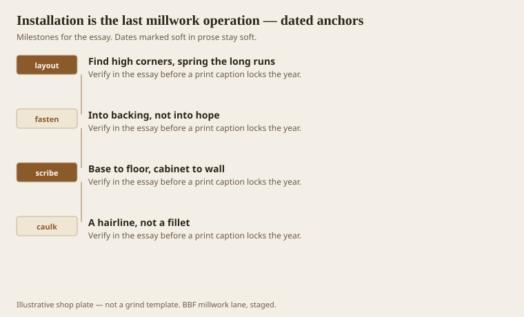
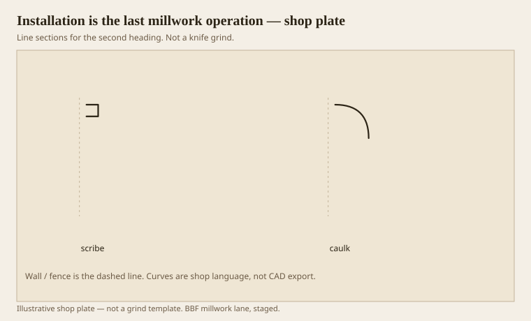

**Disclaimer.** Educational history and shop practice for the BBF millwork lane. Not a construction specification, not a bid, and not architectural or engineering advice. A measured opening and the local code beat a magazine essay.

The last millwork operation happens in someone else’s building. A perfect grind will die in a bad scribe. A shy grind will live if the carpenter is good. We try to be both shops. We do not always get to be the carpenter. We still write as if the wall were our problem, because it is.

Find high corners. Spring long runs so the middle sits. Nail into backing, not into hope. Scribe base to floor and cabinets to walls. Caulk a hairline, not a fillet. Leave extra length on stain-grade because a short stain-grade stick is a different tree.

## The wall was never straight

<!-- graphics-pack:v1 -->

*Figure 1. Layout, fasteners, scribes, and caulk as a confession instead of a member.*

A story pole is older than a laser and still better for a rail height. A laser is better for a long hall that wants a waterline. Use both if the room is a hotel. Use neither if you are guessing from the floor. Floors lie.

Backing is a GC problem that becomes our problem at the first hollow nail. If the drawing called for blocking at 32 and 84, ask whether it exists before you send the sticks. Asking is cheaper than a base that drums.

Figure 1 is a sequence. People skip to caulk. Caulk is the last line, not the first.

## Nails, glue, and a confession of caulk

<!-- graphics-pack:v1 -->

*Figure 2. A scribe thought and a caulk thought. One follows the wall. The other hides from it.*

Figure 2 is the moral. Scribe is millwork. Caulk is a confession. Confessions should be quiet. A 3/8 caulk fillet is a shout.

Glue at copes on paint-grade is a kindness. Glue on stain-grade can be a stain-stop if it smears. Use it like you mean it and wipe it like you are afraid.

Nails in flats, not in bellies. We said it at the fillet essay. It is still true on the ladder. A pimple of putty on a cyma will catch raking light at 4 p.m. forever.

Healthcare install is armor: more fasteners, more adhesive, fewer proud heads. Hospitality install is luggage: the first 8 inches of wall are a war. Both still want a cope that follows the corner. A miter that opens in a corridor is a dirt line and a punch list.

If we shop-cope, we cope long. If we site-cope, we send extras. Either way, installation is not “the carpenter’s problem” in a shop that claims to sell millwork. Millwork is not done when it leaves the tunnel. It is done when the shadow sits on a wall that was never straight. The tunnel is the easy part. The wall is the job.

## Blocking, drums, and the first hollow nail

A base that drums is a blocking problem advertised as a millwork problem. Ask for the blocking before the sticks leave the shop, or send a furring plan. A hollow nail in a healthcare corridor is also a maintenance problem: the stick loosens, the mop lifts it, the film cracks.

Long runs want a dry-fit. Dry-fit is not a luxury. It is how you find the 3/8 step at a door before you glue a cap miter. Two people and a pair of sawhorses beat a hero on a ladder with 16 feet of oak.

If the site is not ready — wet slab, no HVAC, drywall still shedding — say no or change the material. Installation is the last millwork operation, not the first time the building meets the weather. We can store sticks. We cannot store a reputation after a summer hump.

A punch list that says “caulk and touch-up” is a confession that the last operation was rushed. Walk the raking light before you leave. If a cope is open, recut it. If a reveal wandered, say so while the saw is still on the site. The last millwork operation includes the last look. Looking is cheaper than a second trip.
