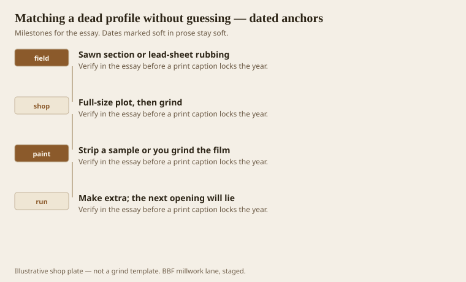
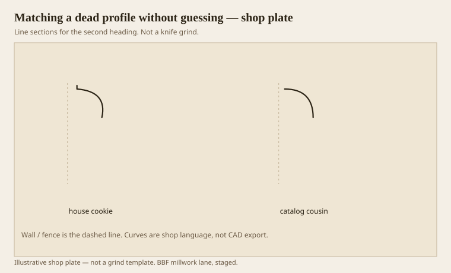

**Disclaimer.** Educational history and shop practice for the BBF millwork lane. Not a construction specification, not a bid, and not architectural or engineering advice. A measured opening and the local code beat a magazine essay.

The house already voted. Your job is to read the ballot. A catalog cousin that is “close” is a different century. A phone photo at noon is a lie about quirks. A lead-sheet rubbing or a sawn cookie is a section. Grind to the section.

Paint is part of the section if you do not strip a sample. I have ground a fat ovolo that was three coats of enamel on a shy ovolo. The new stick looked right until someone stripped the old room. Then we had two rooms.

NPS and the rehab briefs say replace in kind. `[VERIFY]` the brief that applies to the job if it is a listed building. In kind means section and material, not vibe.

## A cookie is better than a memory

<!-- graphics-pack:v1 -->

*Figure 1. A sawn section, a full-size plot, a stripped sample, and extras because the next opening will lie.*

Take the cookie from a scrap, a closet, a piece that is coming out anyway. Do not vandalize a parlor for a souvenir. If you cannot saw, rub. If you cannot rub, scribe with a profile gauge and then distrust the gauge — they flex.

Full-size the plot. Overlay the knife. If the Greek quirk is 3/32 on the house and 1/8 on your favorite grind, it is not a match. Eighths again.

Figure 1’s last hook is extras. The next opening is always a little different. Historic walls wander. A match job without extras is a second mobilization.

## Catalog cousin against the house section

<!-- graphics-pack:v1 -->

*Figure 2. The house cookie beside the cousin the yard wanted to sell. They are not friends.*

Figure 2 is the sales fight. The cousin is cheaper. The cousin is in stock. The cousin will make the new hall look like 1998 next to an 1840 parlor. Sometimes the owner wants that — a clean new wing. Write it. Do not call it a match.

Species: match the wood if the room is stain-grade. Match the paint system if it is paint-grade. A poplar match to pine, painted, is often correct. An oak match to pine, stained, is a different house.

On the moulder, a match grind is a one-job knife. Price the grind as a line, not as a surprise. If the footage is short, CNC or a shaper may beat a moulder setup. The cookie still rules.

Dating the house with the rest of this pack helps you know what you should be seeing. If the cookie is a Roman quarter-round in an 1835 house, maybe the room was Revival-ized. Match the cookie, not the plaque. The plaque can be wrong. The stick on the wall is the document.

Guessing is how millwork becomes fiction. We have enough fiction in catalogs. The dead profile is a fact. Cut the fact.

## Paint layers and the false fat section

Three coats of enamel can turn a shy ovolo into a fat one. If you cookie through the film, you are matching a painter, not a joiner. Strip a closet piece or a scrap. Then cookie. Then grind. The parlor can keep its film until the new sticks are ready.

A profile gauge flexes. Lead sheet less so. A sawn cookie least so. Use the most honest tool you can steal without hurting the room. Photograph the cookie with a scale. Scales in photos keep arguments from becoming memories.

If the house has two centuries in one hall — 1840 quirks and 1928 quarter-rounds — do not average. Match left of the stair to the left cookie and right to the right. Averaging is a third century that never existed. Plaques lie. Sticks on the wall do not, once you get the paint off a sample.

A short match run still pays for a grind. Say that on the first call. Owners who want “just a few feet” of a dead profile are asking for a knife, not a remnant from the rack. The remnant is almost never the cookie. The cookie is the job.
