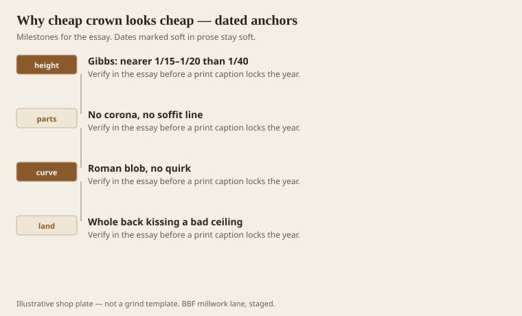
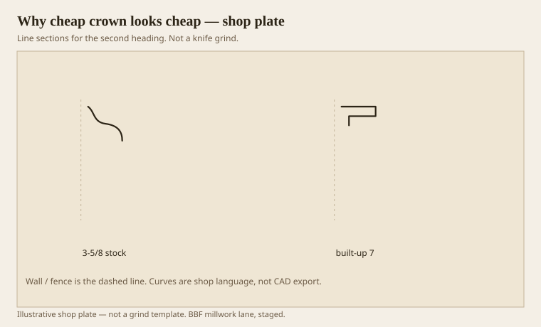

**Disclaimer.** Educational history and shop practice for the BBF millwork lane. Not a construction specification, not a bid, and not architectural or engineering advice. A measured opening and the local code beat a magazine essay.

Cheap crown looks cheap because it failed four tests, not because it failed a price. Height as a fraction of the room. Three jobs, or at least a soffit. A curve that still makes a line. A landing that kisses an edge, not a wavy field. A $12 custom stick can fail all four. A $1.80 stock stick can pass two and look richer than the custom. Price is not the member.

Chambers wanted a simple interior cornice between 1/15 and 1/20. Gibbs’s tables sit in the same neighborhood depending on the invented order. A 3-5/8 in a 10-foot room is about 1/33. That is the first failure. The second is no corona. The third is a Roman blob with no quirk and no fillet. The fourth is a back that slaps the whole ceiling.

## Four ways a stick loses the argument

<!-- graphics-pack:v1 -->

<figure class="millwork-figure">

<figcaption>Figure 1. Gibbs: nearer 1/15–1/20 than 1/40 through Whole back kissing a bad ceiling — see “Four ways a stick loses the argument.”</figcaption>
</figure>

You can fix height with a built-up without becoming a palace. You can add a ripped corona to a stock cyma. You can grind a small quirk into a blob. You can land on an edge. None of that is a marble hall. It is the grammar.

Dentils will not fix a failed fraction. Gold paint will not. A “decorator profile” with more wiggles will not. Wiggles on a timid hat are a nervous hat.

Figure 1 is a checklist we use on the sample wall. If two tests fail, we say so before we order 300 feet.

## Stock 3-5/8 against a built-up 7

<!-- graphics-pack:v1 -->

<figure class="millwork-figure">

<figcaption>Figure 2. Profile plate for “Stock 3-5/8 against a built-up 7.” Line sections, not a grind.</figcaption>
</figure>

Figure 2 is the remodel picture from the ranch essay, said again because it is the living problem. Left, 3-5/8 sprung. Right, about 7 inches of three jobs. In a 10-foot room the right one is near Chambers’s ceiling. In an 8-foot room, thin it. Do not use the 7 as a religion. Use the tests.

On the moulder, a cheap look is sometimes a cheap grind: fuzzy hollows, a land that waves, a back that is not flat. That is our fault, not the yard’s. We can make expensive sticks look cheap. We do, when we rush Monday.

I am not against stock. I am against unnamed stock. Name the failures and the owner can choose them. Chosen cheap is a budget. Unnamed cheap is a surprise in raking light. Surprises in raking light become our problem at the punch list.

The word cheap is a feeling. The four tests are facts. Argue facts. Then cut. If the owner still wants the 2-1/4, install it like you mean it: edge landing, honest cope, no caulk fillet. Even a shy hat can sit straight. Sitting straight is the last dignity a small crown has.

## Chosen shy versus accidental shy

A 4-3/4-inch three-part hat in an 8-foot room can pass Chambers’s neighborhood and still be modest. A 2-1/4 sprung cove in the same room fails height, parts, and usually landing. Both can be “small.” Only one is chosen.

If the owner wants small, we still give them a soffit and an edge landing. That is dignity, not luxury. Dignity is cheap in lumber and expensive in pride: you have to admit the stick is small and then treat it like a member anyway.

A custom grind that fails the four tests is the most expensive cheap look. I would rather sell stock that we then build up than sell a 7-inch blob with no corona. Blobs at any price are blobs. Tests first. Steel second.
