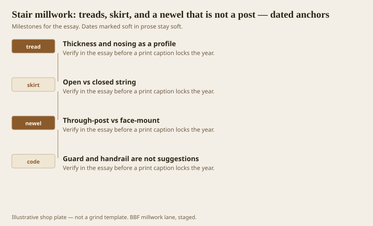
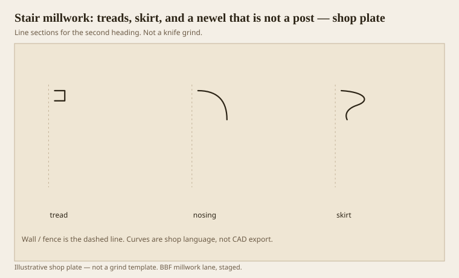

**Disclaimer.** Educational history and shop practice for the BBF millwork lane. Not a construction specification, not a bid, and not architectural or engineering advice. A measured opening and the local code beat a magazine essay.

A stair is millwork that people put their weight on. That sentence should scare a trim shop into borrowing a stair shop’s habits. Tread thickness, nosing profile, skirt (open or closed string), a newel that is a post through the floor or a face-mount that will loosen if you treat it like a box newel from a catalog. Guard and handrail are not suggestions. `[VERIFY]` the IRC or the local book for rise, run, nosing, graspable rail. This essay is not a code review. It is a machine and grammar review.

Nosing is a profile. It is often an ovolo. It is sometimes a more serious echinus. It is a member people feel with a sock. Feel is the test.

## Parts that work like furniture and like a bridge

<!-- graphics-pack:v1 -->

*Figure 1. Nosing as a profile, open vs closed string, through-post vs face-mount, and a code that is not a style.*

Treads are each-parts that want a species and a thickness, not a WM number. Oak is the American default because it dents less than pine and stains like the old mill-town floors. Pine treads are a historic match and a dent farm. Say so.

Skirts hide the end grain of treads on a closed string, or follow the pitch as an open decorative. A skirt profile is often a small ogee or a flat with a bead. It has to miter or cope along a pitch. That is not a hallway cope. It is a compound that carpenters earn.

Figure 1’s last hook is the code. Style can survive a graspable rail if you design the rail as a rail, not as a piece of crown on edge. Crown on edge is how people slide their hands onto a knife.

## Skirt, nosing, and a newel block

<!-- graphics-pack:v1 -->

*Figure 2. Three stair thoughts: a tread flat, a nosing curve, a skirt member. The newel is the each-part.*

Figure 2 is the sticker’s share. Nosing can be a moulder job on the tread blank or a separate nosing stuck on. Separate nosings are how you repair a dent. Through-newels are furniture and framing. CNC can flute a newel. A moulder can run a newel-cap mould. Neither machine will save a newel that is screwed to a stringer with hope.

Healthcare stairs (yes, they exist, even when elevators do the work) want nosings that a shoe can read, often with a contrast strip. Hospitality stairs want the same plus luggage. A proud bolection on a tread end is a trip. Do not.

Site fit is the last operation again. Stairs are never the drawing. The drawing is a hope about a well. Measure the well after the framer is done lying. Then cut treads. Then argue about the skirt.

A stair is not a place to practice a new Greek cliff. It is a place to use the eight members at a scale a hand and a foot understand. Support where you step. Cover where you hide a joint. Bind where a rail meets a post. Separate so the nosing is a line, not a blob. The grammar still works when the grammar has to hold a body.

## Measure the well after the framer is done

A stair drawing is a hope about a hole. The hole changes. Measure rise, run, well, and headroom after the framer has finished lying, then cut treads. Then cut skirts. Then argue about the newel. The other order is how you recut oak.

Handrail height and graspable profile are code before they are style. A rail that is a piece of crown on edge will cut a hand and fail a grip. Use a rail knife or a rail from a stair catalog, then dress it with a fillet if you must. Dressing is millwork. Inventing a grip from a cornice is vanity.

Open risers, glass, and steel strings are other shops. If we only supply treads and a nosing, we are a vendor, not a stair shop. Say so. The grammar of nosing still applies. The liability does not have to.
