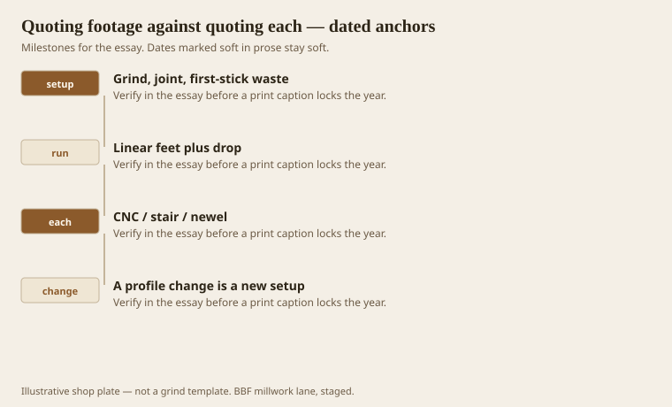
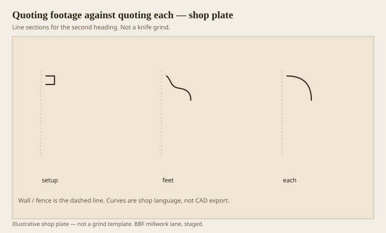

**Disclaimer.** Educational history and shop practice for the BBF millwork lane. Not a construction specification, not a bid, and not architectural or engineering advice. A measured opening and the local code beat a magazine essay.

The first board foot you sell is the setup. Grind, joint, first-stick waste, the hour you will not get back if the run is 20 feet. After that you sell feet, plus drop, plus the extras a crooked house will eat. CNC is the other religion: program, fixture, first-part waste, then each. A newel is each. A 400-foot base is feet. A radius head is each. A chair rail is feet. If those share one unit price, you have invented a third machine called hope.

This lane has always split the ticket: linear millwork, and the each-parts that bump into people. Design-to-spec is an hourly line when the drawing is the product. A planer mill, when the count is real, is a footage line with a different overhead. CNC sits on the each side. The front office’s job is to keep those sentences from marrying.

## Setup is the first board foot

<!-- graphics-pack:v1 -->

<figure class="millwork-figure">

<figcaption>Figure 1. Grind, joint, first-stick waste through A profile change is a new setup — see “Setup is the first board foot.”</figcaption>
</figure>

A profile change is a new setup. Clients think a “slightly taller ogee” is a conversation. It is a grind. Date it. Price it. If they want to see two samples, price two grinds or grind one and mock the other in poplar with a router and call it a sketch.

Waste: first stick, copes, defects, the 16-foot that had a shake at 12. Estimators who use 5 percent on stain-grade oak in July are romantics. Use a number that has met August.

Figure 1 is the invoice spine. If a line cannot be mapped to one of those four hooks, it is a fog. Fog is how shops die.

## A ticket that can be built

<!-- graphics-pack:v1 -->

<figure class="millwork-figure">

<figcaption>Figure 2. Profile plate for “A ticket that can be built.” Line sections, not a grind.</figcaption>
</figure>

Figure 2 is the test I give a new estimate. Every item goes in a box. Setup. Feet. Each. A built-up crown is setup times three plus feet times three, or setup once if we already own the knives — write which. A stair newel is each. A nosing might be feet if we run it on blanks, or each if we apply it. Pick.

Lead time on a custom knife is a schedule item. It is not “soon.” Soon is how a hotel opening eats a weekend. Put a date.

Healthcare packages look like one number and are a hundred lines. Split them or you will fund the desks with the corridor base and then wonder why the desks are late. Hospitality is the same with a nicer fabric.

I will end the pack where a shop actually lives: on a page that can be built. History was for the grammar. Shop practice was for the weather and the tunnel. Quoting is how both survive contact with a calendar. If the calendar wins every time, you will grind fewer Greek quirks and more 2-1/4 coves. The coves are legal. They should be chosen, not surrendered to. A ticket that can be built is how you still get to choose.

The eight members, the three-part hat, the cookie from the house, the moisture number, the machine name — they all fit on a ticket if you write small and mean it. Write them. Then cut. Then install on a wall that was never straight. That is millwork. The rest is a catalog.

## Two numbers that keep a shop alive

Overhead on a moulder and overhead on a CNC are not the same percentage, even if the accountant wishes they were. A week of footage with one grind can carry a shop. A week of each-parts with five programs can look busy and still lose. Write the machine hours, not only the material.

Change orders that “just add a little more of the same” are footage if the setup is still hot. They are setup plus footage if the knives are already back in the cabinet. Ask when the change arrives. When is a price.

I will not end on a slogan. I will end on a habit: every line gets a box — setup, feet, or each — and a date. History and shop practice only matter if they survive that page. The page is the last millwork drawing. Draw it like you mean the wall.
