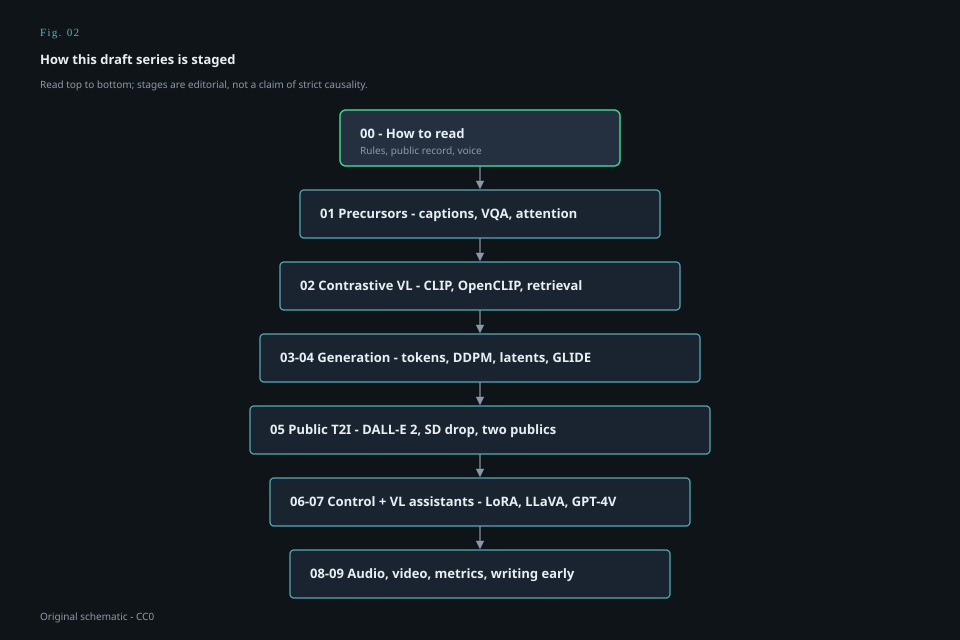

# How to read this series

<figure class="mmh-figure mmh-figure--column" itemprop="image" itemscope itemtype="https://schema.org/ImageObject">
  
  <figcaption itemprop="caption"><strong>Fig. 2.</strong> The staged folders in this series — start at 00, then walk 01–09 or jump via the README index.</figcaption>
</figure>

I am writing these as drafts a careful person could hand to another careful person, not as a textbook and not as a press kit.

The subject is public multimodal AI — the stretch of work where pictures, words, and later sound and video stopped living in separate departments. The hinge years most people mean are 2021 and 2022. CLIP and DALL·E show up on the same January morning. Diffusion, which had been a slow paper, becomes a look you can feel. A year later the assistant learns to look at an upload. That is the spine. Everything else is rib.

Public, here, is a discipline. If I cannot point at a paper, a model card, a license, an official blog, or a widely reported launch, I do not get to sound sure. Vendor blog posts are primary sources for what a lab *said*. They are not laboratory notebooks. arXiv timestamps are public. Parameter counts that never left a keynote slide are rumors until a paper or card repeats them.

I will use “we” the way a field uses it — the people who read the papers and used the demos — not the way a company uses it. I was not in those training runs. Neither were you. That is the point of a public history: the interesting part is what escaped the building.

A few reading habits will save us both time.

**Dates are doors, not trophies.** January 5, 2021 is a real door. So is August 22, 2022. So is September 25, 2023. I will name those. I will not pretend a CVPR oral is the same kind of public as a weights file you could `wget` before dinner.

**Numbers are claims unless they are measurements you can rerun.** “400 million pairs” is what CLIP’s public materials said. I will repeat the headline and I will not invent the scrape. FID scores are measurements with a known vice: they flatter a certain kind of picture. Human preference studies are measurements with a different vice: they depend on who sat in the chair.

**Architecture is allowed. Recipe is not.** I can say CLIP is two encoders and a contrastive loss, because the paper says that. I cannot tell you the cleaning pipeline that did not ship. I can say Stable Diffusion denoises in a latent space trained by an autoencoder, because that is the LDM paper. I cannot reconstruct a private data mix.

**Products are not proofs, and proofs are not products.** Midjourney changed what “AI art” looked like in public without publishing a methods paper that a historian can footnote like Flamingo. Flamingo published a methods paper without handing the public a chatbot. Both facts belong. Collapsing them into one story is how this history gets stupid.

**I will mark opinion.** If I say classifier-free guidance is the quiet technical hinge of the pretty-picture year, that is a reading. If I say OpenAI posted the CLIP blog on January 5, 2021, that is a fact. Keep them in separate pockets.

**This is staged.** Stage 00 is the handshake. Stages 01–03 are the run-up and the discrete-token generation line. Stage 04 is the diffusion mechanism, which is older than the hype and easier to get wrong. Stage 05 is the year the floor moved. Stage 06 is what people did once they could hold the weights. Stage 07 is the assistant that looks. Stage 08 leaves the still image. Stage 09 is the hangover: metrics, unified-model aesthetics, and the honest problem that we are writing this too early.

**Draft means draft.** Sentences will get sharper. A couple of dates may move by a day if I find a better primary. No draft in this folder is a filing, a claim of invention, or a substitute for the paper it cites.

If you want a single prejudice up front: I care more about the joint — the place two modalities are forced to share a space or a loss — than about any one pretty sample. Pretty samples are how the public entered the room. The joint is why the room existed.

Read the next draft for the word itself. “Multimodal” is older than the boom. The boom just made it sound like a feature list.
