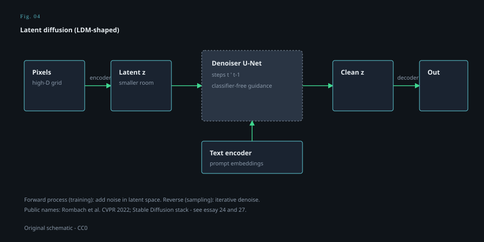

# Latent diffusion

<figure class="mmh-figure mmh-figure--column" itemprop="image" itemscope itemtype="https://schema.org/ImageObject">
  
  <figcaption itemprop="caption"><strong>Fig. 4.</strong> Denoise in a smaller latent room, then decode — the LDM-shaped loop behind the public Stable Diffusion stack.</figcaption>
</figure>

Pixel-space diffusion is hungry. A 512-pixel picture is a lot of numbers to ruin and repair, and most of those numbers are, to a human, texture. The latent diffusion paper — Rombach, Blattmann, Lorenz, Esser, Ommer, arXiv late 2021, CVPR 2022 — is a public argument that you should **throw away the texture for the expensive conversation**, then put the texture back with a decoder that already knows how to paint.

The recipe, in public:

1. Train an autoencoder that compresses an image into a smaller spatial grid. Some versions snap to a codebook (VQ). Some use a continuous latent with a little KL pressure. The paper cares about this distinction. So should you. Continuous latents are the ones that made the later popular models feel smooth.
2. Train a diffusion model **on the grid**, not on the pixels. The UNet is cheaper. The clock is cheaper. Attention is cheaper.
3. Condition the UNet with **cross-attention** so a token sequence — a sentence — can be queried by the picture-in-progress.
4. Decode.

That is the object later called LDM. It is also, with a particular training run and a particular release decision, the object later called Stable Diffusion. I am keeping those names on separate hooks until draft 27. The paper is a method. The August 2022 event is a distribution decision.

Continuity of authors with VQGAN is real and easy to over-read. Same wider Heidelberg / CompVis world, overlapping names, a year later. They had already taught a transformer to write codebook indices. Now they teach a denoiser to walk in a compressed space. The shared instinct is **do not generate at full pixel resolution if a first stage can give you a better alphabet**. The alphabet changed. Discrete indices to (often) continuous latents. Transformer prior to diffusion prior. If you say “it was all VQGAN,” you erase the change that made CFG-and-a-UNet the folk method.

Cross-attention as the multimodal joint is the part I want in bold in a notebook, not in a browser. The sentence is not a class integer. It is a sequence of keys and values. The UNet’s features ask questions. This is why word order *can* matter, why “red cube on blue sphere” is not the same query as “blue cube on red sphere,” and why it still sometimes is, if the model is lazy or the guidance is fried. The joint is in the layer, at every step of the clock, in a cheap space.

They release pretrained autoencoders and diffusion models on GitHub. That, again, is part of the object. A CVPR paper with a repo is a different historical force than a CVPR paper with a video. People forked the repo before the brand existed.

Limitations the paper is allowed to have, and does: a latent space can hide text, can smear faces at the edge of its reconstruction budget, can decide that a watermark is texture (keep) or structure (drop) in ways you only learn by looking. Downstream “this model can’t spell” discourse is sometimes a transformer-text-encoder problem and sometimes a **first-stage** problem. Two rooms. One complaint.

Why this belongs as the last mechanics draft, not the first product draft: because once you understand the smaller room, the 2022 explosion is less mystical. Consumer GPUs did not suddenly get smarter. The expensive walk got shorter. A 2020 idea (DDPM) plus a 2021 knob (CFG) plus a 2021/2022 room (latents) plus a 2021 critic (CLIP, often as the text encoder or as an evaluator) is a stack you can name. Naming the stack is the opposite of a creation myth.

Stage 05 is what happened when that stack met waitlists, a research preview called DALL·E 2, a Google paper that would not give you the weights, a Discord with a look, and a public release on August 22. The mechanics will stay in the room. The room will get crowded.
