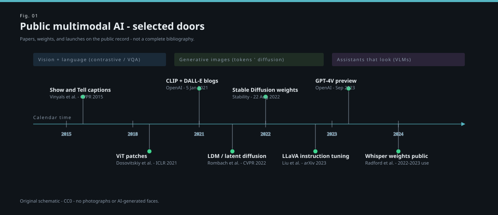

# The Stable Diffusion weights drop

<figure class="mmh-figure mmh-figure--spread" itemprop="image" itemscope itemtype="https://schema.org/ImageObject">
  
  <figcaption itemprop="caption"><strong>Fig. 1.</strong> The August 2022 door on a longer public timeline — researcher release 10 Aug, public weights 22 Aug.</figcaption>
</figure>

On August 10, 2022, Stability AI wrote that they were releasing Stable Diffusion to researchers, with Hugging Face as a weights host, and that a public release was coming. On August 22, they wrote that the public release was here. Those two dates are the floor moving.

I want the credits to stay crowded. The public announcements name CompVis (the LMU / Heidelberg lineage of the LDM paper), Runway (Patrick Esser’s name shows up in the telling), Stability, and help from communities around Eleuther AI and LAION. Katherine Crowson’s conditional-diffusion work is thanked in that first announcement as part of the insight pile, next to DALL·E 2 and Imagen. This was not a lone inventor story on the day it happened. Later marketing sometimes thinned the room. A draft history should thicken it again.

What dropped, technically, was a **latent text-to-image diffusion model** you could run on a consumer GPU if your consumer GPU was not a joke: a frozen autoencoder, a UNet that hears a CLIP text encoder via cross-attention, CFG at sample time, a checkpoint file. What dropped, socially, was the end of “you had to know someone.” No waitlist as the main path. A license — CreativeML OpenRAIL-M — that tried to be a use-restricted open weight, which is a legal and cultural object of its own. People argued whether that is open. I will not close the argument. I will say the file was gettable.

I remember the feeling as a public feeling, not a private memoir: the screenshots changed. Before August, the pictures you saw were the pictures a lab or a Discord with capacity chose to show. After August, the pictures you saw included the pictures a teenager with a 3080 chose to show, and the pictures a person fine-tuning on their dead dog chose not to show. The mean sample got worse. The tail of *use* got longer. That is what a floor moving looks like.

The LDM paper had already released models. This was a particular training run, at a particular resolution, on a particular (LAION-related) pair diet, with a particular branding. I will not invent the exact data mix. The public model cards and later writeups give you a diet in outline: LAION, filters, aesthetically scored subsets in later versions. Outline is not a recipe. Outline is what we are allowed.

Why this event outran Imagen and DALL·E 2 in *practice*, even when those looked prettier in a press kit:

Because **forkability** is a kind of quality. People could attach ControlNet (later). They could attach LoRAs. They could swap samplers. They could build Automatic1111 and ComfyUI and a hundred worse UIs. A closed model can be a better artist. An open checkpoint can be a better city. 2022–2023 was a city.

There was immediate harm, because of course there was. The same gettable file could be asked for nonconsensual intimate imagery, for the faces of private people, for slurs made pretty. The OpenRAIL-M text tries to forbid some of that. A license is not a lock. The later political story — deepfakes, “style theft,” scraping lawsuits — is downstream of gettable. GLIDE’s filtered release was an attempt to not go here. The weights drop went here. A history that only celebrates democratization is a press release. A history that only narrates harm is a sermon. The public event is both.

I want one more crowded sentence. The reason a 3080 could do this is draft 24. The reason the pictures punched is draft 21. The reason the prompt did anything is drafts 10 and 23. The reason the pairs existed in the open is draft 14 and 31. August 22 is not a miracle Monday. It is a stack becoming a file.

After this, “text-to-image” is no longer a paper category. It is a **verb people had**. The next draft is the other verb, which never really gave you a file: Midjourney, taste as a product, Discord as the IDE.
