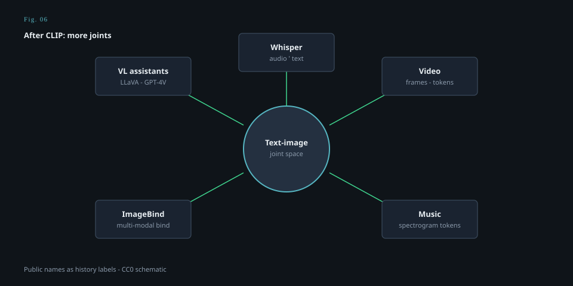

# ImageBind and joint spaces after CLIP

<figure class="mmh-figure mmh-figure--column" itemprop="image" itemscope itemtype="https://schema.org/ImageObject">
  
  <figcaption itemprop="caption"><strong>Fig. 6.</strong> After CLIP’s two-door space, public work fanned into speech, video, music, broader binding, and assistants that look.</figcaption>
</figure>

CLIP’s space has two doors. Image. Text. The whole trick is that a third thing can only enter if you *make it look like one of the two* — a spectrogram as an image, a video as a bag of frames, a depth map as a picture. ImageBind (Girdhar et al., Meta, 2023) is a public attempt to cut more doors into the same kind of room.

The public idea is almost a pun on the name. If you bind every modality to **images** as the hub — audio to image, depth to image, thermal to image, IMU to image, and the image already bound to text via a CLIP-like pair — then the non-image modalities inherit a path to language *without* paired audio-text for everything. The image is a translator. The space becomes a little United Nations with one official language: pixels.

I like the honesty of a hub. It admits that we do not have a web of paired everything. We have a lot of paired *image–X*, because cameras are cheap and because the web is visual. Using the camera as diplomacy is a data fact, not a philosophical victory. If your audio never appears with a picture, you are not in this commons. The leftover channel, again, decides who gets a vector.

What you can do, in the paper’s demos: retrieve across senses. Generate with a condition that is not a sentence (an audio as a handle). Cluster things that “feel” similar across sensors. I put *feel* in quotes because cosine similarity is not a feeling. It is a leftover of a loss. The demos are still a historical widening: **CLIP’s job, more doors**.

Limits I will not sand off. A single space will crush distinctions that a specialist space would keep. Audio that is speech and audio that is music may not want the same neighbors. IMU is not a picture no matter how you bind it. The hub can smuggle visual priors into a hearing problem — banana-yellow for ears. And the image encoder you start from (often a CLIP) brings WIT-silence and LAION-circularity with it. Binding more senses to a skewed hub skews more senses.

Why this draft closes stage 08: because it is the contrastive school’s answer to Gemini’s native-everything slogan. You do not have to train one giant sequence model on every sense from scratch. You can **align** senses into a space and reuse the 2021 joint. Alignment versus native mixture is the 2023–2025 argument in a coat. Both will keep publishing. Both can be true for different products. A retrieval system wants a space. A chat system wants a speaker. ImageBind is a space.

Later names (LanguageBind and the bind-family) flip the hub: maybe language is the better diplomat, because sentences are how we already name everything. That flip is DeViSE’s old hope at a new scale. I will not tour the family. I will say the argument is live: **which modality is allowed to be the origin of meaning?** CLIP said: neither, the pair. ImageBind said: the image, as a practical hub. LanguageBind said: the sentence. A native multimodal LLM says: the training mix, don’t ask for a hub. Four answers. One decade.

A human close for the beyond-stills stage. We did not, in public, get a unified sensorium. We got a transcriber, a few video generators, a few music demos, and a paper that adds doors to a room we already lived in. That is enough to break the habit of writing multimodal as a synonym for “pretty JPEG plus words.” The leftover channels have names now. Stage 09 is the hangover: how we scored the pretty JPEGs, a 2022 model that wanted every action to be a token, and the problem of writing this too early.
