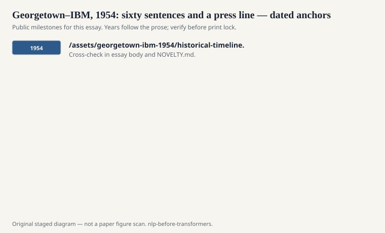
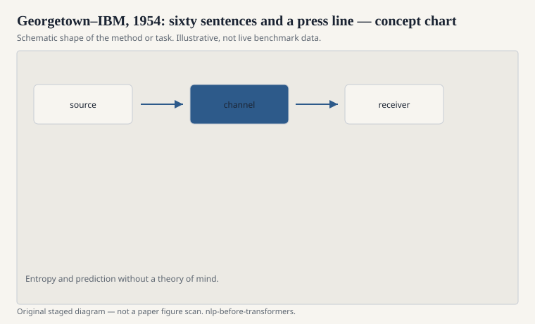

# Georgetown–IBM, 1954: sixty sentences and a press line

On 7 January 1954, IBM and Georgetown University ran a public
machine-translation demonstration in New York. Russian sentences
went in. English sentences came out. The machine was an IBM 701.
The vocabulary was tiny. The press was not.

<!-- graphics-pack:nlp-bt-v1 -->

<figure class="nlp-bt-figure">

<figcaption>Figure 1. Dated public anchors for this piece. Years follow the essay; verify against the prose before print.</figcaption>
</figure>

<!-- graphics-pack:nlp-bt-v1 -->

<figure class="nlp-bt-figure">

<figcaption>Figure 2. Schematic of the method or task — editorial diagram, not live scores.</figcaption>
</figure>

<!-- graphics-pack:nlp-bt-v1 -->

<figure class="nlp-bt-figure nlp-bt-figure--archival">

<figcaption>Figure 3. IBM 701 electronic data processing machine frame, archival photograph. License: Public domain (U.S. federal work or expired copyright; verify on Commons)</figcaption>
</figure>

The usual retelling says they translated sixty sentences about
organic chemistry and a handful of everyday statements, using a
carefully prepared lexicon and a small set of grammatical rules.
Leon Dostert at Georgetown and Peter Sheridan at IBM are the names
that stick. The system was not "reading." It was looking up and
reordering. That is not an insult. Lookup-and-reorder is how a
lot of useful software still starts.

What the demo sold was a timeline. Newspapers wrote as if
automatic translation of anything into anything was a few years
off. Cold War funding likes a few-years-off story. The Air Force
and later civilian agencies put money into MT because a Russian
journal you cannot read is a strategic nuisance. The 1954 event
gave that anxiety a photograph.

I have never seen a primary source that makes the sixty-sentence
set look like an open challenge. The input was chosen. The
dictionary was built for the input. The rules were written for the
constructions they expected to see. A modern reader wants to call
that cheating. A 1954 engineer would have called it scoping the
problem so the machine would finish before the reporters left.

The scar is not that they scoped it. The scar is that the public
story did not keep the scope in the frame. When a demo is
remembered as "the computer translates Russian," every later
failure looks like incompetence instead of a category error.
ALPAC, twelve years later, would be the official correction. The
correction was brutal because the original promise had been
allowed to roam.

Still, 1954 is not a joke. It forced a list of problems that
the next three decades actually worked: word order, morphology,
homographs, the fact that a dictionary entry is not a meaning.
Rule-based MT shops in the US, USSR, France, and Japan spent
careers on those problems. Some of them shipped useful systems
for narrow domains — weather, technical manuals — which is what
a scoped demo should have implied in the first place.

If you write about this day, keep the press clipping and the
lexicon in the same paragraph. The clipping is why the money
moved. The lexicon is what the machine actually knew. Confusing
the two is how a field learns to hate its own history.
