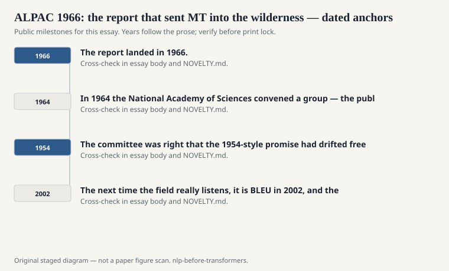
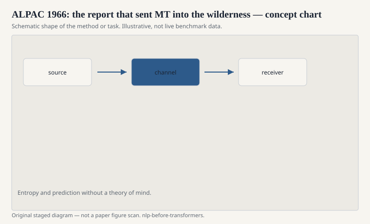

# ALPAC 1966: the report that sent MT into the wilderness

The Automatic Language Processing Advisory Committee did not
set out to become a ghost story. In 1964 the National Academy
of Sciences convened a group — the public record names John R.
Pierce of Bell Labs as chair — to tell the US government whether
machine translation and computational linguistics were worth the
next round of checks. The report landed in 1966. The short
version that circulated in labs: not yet, and stop pretending.

<!-- graphics-pack:nlp-bt-v1 -->

<figure class="nlp-bt-figure">

<figcaption>Figure 1. Dated public anchors for this piece. Years follow the essay; verify against the prose before print.</figcaption>
</figure>

<!-- graphics-pack:nlp-bt-v1 -->

<figure class="nlp-bt-figure">

<figcaption>Figure 2. Schematic of the method or task — editorial diagram, not live scores.</figcaption>
</figure>

<!-- graphics-pack:nlp-bt-v1 -->

<figure class="nlp-bt-figure nlp-bt-figure--archival">

<figcaption>Figure 3. Teletype keyboard hardware — stand-in plate for 1960s machine-translation policy era (not the ALPAC PDF). License: Public domain or CC-BY-SA (verify on Commons file page)</figcaption>
</figure>

ALPAC looked at cost, quality, and the existence of a cheaper
human pipeline. Post-edited machine output, they argued, was not
beating a competent translator plus a decent process. Russian
scientific text could be handled by people. Fully automatic
high-quality translation was not around the corner. Some of the
supporting work in computational linguistics was worth keeping.
The grand MT programs were not.

I have sympathy for both sides of the bruise. The committee was
right that the 1954-style promise had drifted free of evidence.
Researchers were right that a funding cliff is a blunt instrument.
You can kill a bad timeline and a good research program with the
same sentence if the sentence is "we recommend against further
support."

What followed in the United States is the part textbooks flatten.
MT did not vanish. It got quieter, more European and Japanese in
its public victories, more domain-specific when it survived in
North America. Systran kept working. Later, statistical MT would
grow up in speech labs that had never needed ALPAC's permission
to count. But for a generation of American graduate students,
"machine translation" was a thing you did not put in a proposal
unless you enjoyed rejection.

The report is more interesting than the legend. It is not
anti-computer. It is anti-unmeasured claim. It asks what the
output is for, who fixes it, and what a page costs. Those are
product questions. 1960s MT had been answering them with
optimism and a dictionary.

There is a habit now of treating ALPAC as the original sin of
underfunding AI. That is too tidy. Plenty of AI winters have
more than one parent: overclaim, thin evaluation, a sponsor who
wanted a deliverable that research could not honestly sign.
ALPAC is a clean copy of that pattern, dated and paginated.

If you are telling the pre-transformer story, ALPAC is the first
time the field is told that a fluent demo is not a metric. The
next time the field really listens, it is BLEU in 2002, and the
listening is not entirely healthy either. But the 1966 lesson
still holds. A translation system is a cost structure with a
quality distribution. If you cannot show both, you are asking
for a committee.
