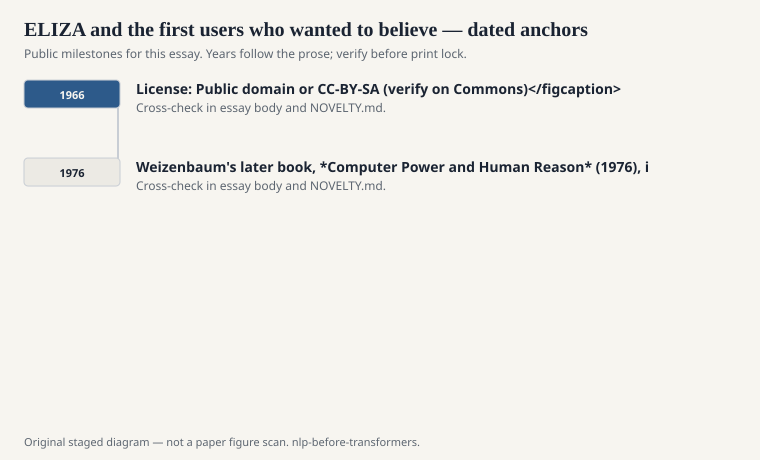
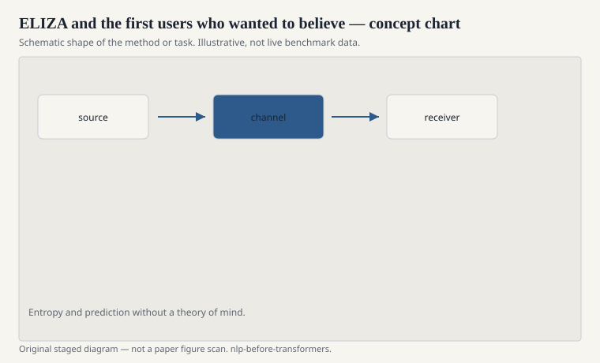

# ELIZA and the first users who wanted to believe

Joseph Weizenbaum wrote ELIZA at MIT in the mid-1960s. The
famous script, DOCTOR, played a Rogerian psychotherapist. It
looked for a keyword, applied a transformation rule, and bounced
your sentence back with a pronoun swap. "I am unhappy" became
something like "How long have you been unhappy?" The program
did not know what unhappy was. It knew a pattern.

<!-- graphics-pack:nlp-bt-v1 -->

<figure class="nlp-bt-figure">

<figcaption>Figure 1. Dated public anchors for this piece. Years follow the essay; verify against the prose before print.</figcaption>
</figure>

<!-- graphics-pack:nlp-bt-v1 -->

<figure class="nlp-bt-figure">

<figcaption>Figure 2. Schematic of the method or task — editorial diagram, not live scores.</figcaption>
</figure>

<!-- graphics-pack:nlp-bt-v1 -->

<figure class="nlp-bt-figure nlp-bt-figure--archival">

<figcaption>Figure 3. Teletype keyboard — hardware context for ELIZA-era dialogue systems. License: Public domain or CC-BY-SA (verify on Commons)</figcaption>
</figure>

Weizenbaum published the account in 1966 in the *Communications
of the ACM*. He was already uneasy. Secretaries and colleagues
wanted time alone with the teletype. Some of them asked him to
leave the room. He had built a mirror that talked, and people
treated the mirror as a listener.

The later phrase "ELIZA effect" is doing real work. It names
the human contribution to the illusion. The model is thin. The
user fills it. That is not a 1966 curiosity. Every chat product
since then has lived on some version of the same surplus. A
fluent reply is not evidence of a world model. It is evidence
that English has a lot of reusable frames.

DOCTOR's trick is easy to underestimate if you have only seen
parodies. Keyword rules plus a fallback ("Please go on") will
carry a short conversation if the human is cooperating. The
cooperation is the uncredited author. Weizenbaum kept saying
that. A surprising number of retellings skip it and call ELIZA
the first chatbot, as if the category were a technical
milestone instead of a social one.

I care about ELIZA in this series because it sits next to
ALPAC in the same year and teaches the opposite lesson about
evaluation. ALPAC said: measure the output against a job.
ELIZA said: the user will forgive a lot if the genre is
confession. Those two facts have been fighting inside language
products ever since.

Weizenbaum's later book, *Computer Power and Human Reason*
(1976), is harsher than the CACM paper. He had watched
decision-makers reach for programs they did not understand. He
did not think a therapist-shaped script was cute anymore. You
do not have to follow him all the way into that argument to
owe him the observation. A pattern matcher with a good bedside
manner is a different object than a system that knows anything.

If you rebuild DOCTOR in an afternoon — and you can; the rules
are public and small — do it once with a stranger typing and
once with yourself. The stranger version is the historical
artifact. The yourself version is just a mirror you already
trust.
