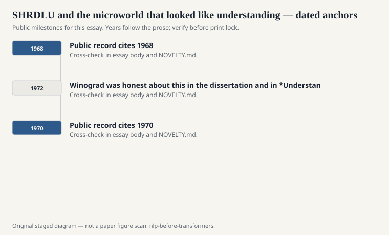
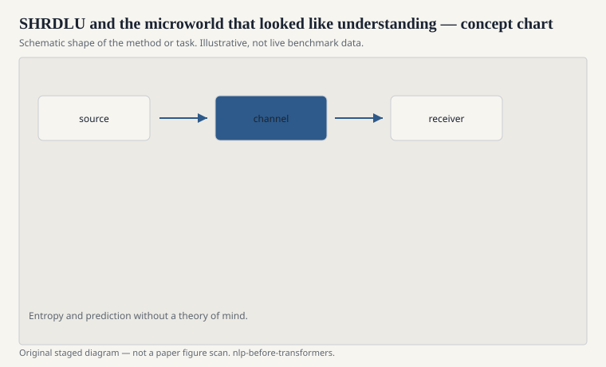

# SHRDLU and the microworld that looked like understanding

Terry Winograd's SHRDLU (roughly 1968–1972, MIT) lived in a
world of blocks. You typed English. The program stacked, moved,
and named things on a simulated table. "Pick up a big red block."
It did, or it told you why it could not. It remembered what
"it" referred to. For a few minutes of transcript, it looks like
the problem of language is solved.

<!-- graphics-pack:nlp-bt-v1 -->

<figure class="nlp-bt-figure">

<figcaption>Figure 1. Dated public anchors for this piece. Years follow the essay; verify against the prose before print.</figcaption>
</figure>

<!-- graphics-pack:nlp-bt-v1 -->

<figure class="nlp-bt-figure">

<figcaption>Figure 2. Schematic of the method or task — editorial diagram, not live scores.</figcaption>
</figure>

<!-- graphics-pack:nlp-bt-v1 -->

<figure class="nlp-bt-figure nlp-bt-figure--archival">

<figcaption>Figure 3. Syntax tree diagram (Commons) used as a neutral structural sketch for microworld parsing essays. License: Public domain</figcaption>
</figure>

The trick is the table. The vocabulary is closed. The physics
are fake but consistent. Every noun has a handle in the
scene. Anaphora works because there are four objects, not four
million. Winograd was honest about this in the dissertation
and in *Understanding Natural Language* (1972). Later
advertising, including the kind labs do to themselves, was
less honest.

SHRDLU combined syntax, a planner, and a world model in one
piece of software. That combination is why people still assign
the transcripts. The parser was not a lonely grammar. It could
ask the world whether a phrase made sense. "The block that is
too small to support the pyramid" is not only a noun phrase.
It is a query.

I like the system more than I trust the lesson people extracted.
The extracted lesson was: put language on top of a knowledge
base and the rest is engineering. The 1970s and 1980s spent a
fortune on that lesson. Cyc is the maximal version. Less
maximal versions filled expert systems and military interfaces.
Some of them worked in rooms as small as the blocks world.
Almost none of them survived contact with open text.

The microworld trap is simple to state. Performance in a sealed
domain does not transfer by adding more rules. It transfers, if
it transfers at all, by changing what you count as the problem.
Statistical NLP in the 1990s quietly changed the problem: stop
requiring a complete world, start requiring a corpus and a
loss. That looks like a retreat from "understanding." It was
also how you got a part-of-speech tagger that ran on yesterday's
newspaper.

Winograd himself moved toward the human side of the loop —
design, conversation, the workplace. The later career is part
of the history. The person who built the most charming
language-and-blocks demo of the era did not spend the rest of
his life scaling the blocks.

When a modern system grounds language in tools or a simulator,
SHRDLU is an ancestor whether the citation is there or not.
The ancestor's warning is still good. A world you built to
make language easy will make language look easy. Leave the
room, and the vocabulary explodes.
