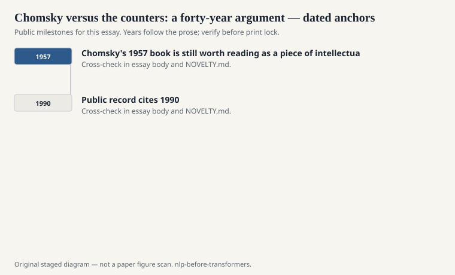
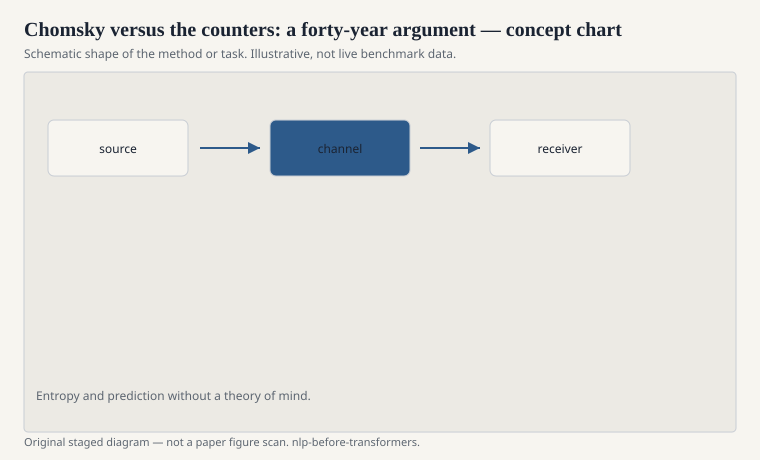

# Chomsky versus the counters: a forty-year argument

*Syntactic Structures* came out in 1957. Noam Chomsky did not
write it as a programming manual. Computational people read it
as one anyway. Phrase-structure rules, transformations, the
idea that a grammar is a compact account of an infinite set of
sentences — that looked implementable. For a while the field
tried.

<!-- graphics-pack:nlp-bt-v1 -->

<figure class="nlp-bt-figure">

<figcaption>Figure 1. Dated public anchors for this piece. Years follow the essay; verify against the prose before print.</figcaption>
</figure>

<!-- graphics-pack:nlp-bt-v1 -->

<figure class="nlp-bt-figure">

<figcaption>Figure 2. Schematic of the method or task — editorial diagram, not live scores.</figcaption>
</figure>

<!-- graphics-pack:nlp-bt-v1 -->

<figure class="nlp-bt-figure nlp-bt-figure--archival">

<figcaption>Figure 3. Public-domain syntax tree illustration. License: Public domain</figcaption>
</figure>

Chomsky's other move mattered more in the long war. He argued
that corpus frequencies were the wrong object. A native speaker
has judgments about sentences they have never seen. Some of
those sentences are vanishingly rare and still clearly
grammatical. A count over a newspaper will not find the
constraint you care about. Poverty of the stimulus, later
elaborated, said children do not see enough evidence for the
grammars they end up with. Therefore (the argument went) a lot
of the structure is not learned from data in the naive sense.

You can feel why speech engineers and later statistical NLP
people bounced off this. They had data. The data had
regularities. The regularities were useful. They did not need
a theory of competence to build a dictation system. Frederick
Jelinek's line, often repeated and sometimes polished in the
retelling, was that every time he fired a linguist, the speech
recognizer improved. Whether or not that was fair to the
linguists, it was a mission statement.

I do not referee the innateness debate here. Public NLP
history only needs the engineering consequence. For roughly
thirty years, a lot of academic computational linguistics
optimized for grammatical insight. A parallel, sometimes
scorned, community optimized for word error rate and later
BLEU. The two communities shared conferences and did not share
a loss function.

The reconciliation, such as it was, did not happen because
someone won a philosophical bout. It happened because treebanks
and feature-rich statistical parsers showed you could put
linguistic structure on a likelihood. The Penn Treebank made
syntax into something you could train. Collins and Charniak
did not stop being interested in grammar. They started being
interested in grammar that fit WSJ.

Chomsky's 1957 book is still worth reading as a piece of
intellectual engineering. The transformations are a way to
keep a grammar from drowning in special cases. That instinct —
compression, generality, a clean generative story — never
left the field. Neural sequence models just hide the story
inside matrices. The old argument is still audible if you
listen: are you modeling the language in a speaker's head, or
the language in a pile of text? Pre-transformer NLP spent most
of its working hours on the pile, and it shipped.
