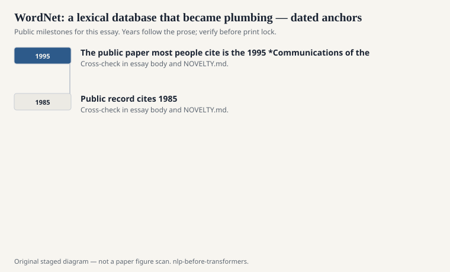
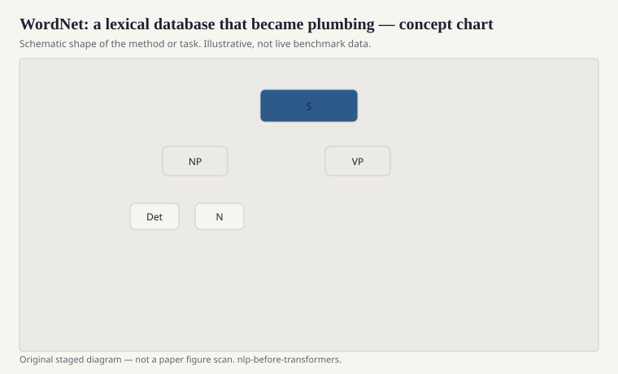

# WordNet: a lexical database that became plumbing

George Miller's group at Princeton started WordNet in the
mid-1980s. The public paper most people cite is the 1995
*Communications of the ACM* overview. The resource is older
than the paper. It grouped English words into synsets —
near-synonym sets — and hung those sets on relations:
hypernym, hyponym, meronym, antonym. A dictionary that
admitted it was a graph.

<!-- graphics-pack:nlp-bt-v1 -->

<figure class="nlp-bt-figure">

<figcaption>Figure 1. Dated public anchors for this piece. Years follow the essay; verify against the prose before print.</figcaption>
</figure>

<!-- graphics-pack:nlp-bt-v1 -->

<figure class="nlp-bt-figure">

<figcaption>Figure 2. Schematic of the method or task — editorial diagram, not live scores.</figcaption>
</figure>

<!-- graphics-pack:nlp-bt-v1 -->

<figure class="nlp-bt-figure nlp-bt-figure--archival">

<figcaption>Figure 3. WordNet lexical hierarchy screenshot for nominative discussion of the database. License: Fair use / project screenshot; verify Commons file page before commercial print</figcaption>
</figure>

I used WordNet the way a carpenter uses a stud finder. Not
as a theory of meaning. As a way to ask, in code, whether
two strings might be talking about the same kind of thing.
Lesk-style word-sense disambiguation, simple query expansion,
a cheap "is-a" check for an information-extraction pattern —
that was the daily traffic. The hierarchy was uneven. Some
regions were lovingly tended. Some were a junk drawer. It
still beat having nothing.

WordNet is infrastructure in the boring sense. It got bundled
into NLTK. It got translated and mirrored (EuroWordNet, later
Open Multilingual WordNet). Papers treated `path_similarity`
as if it were a scientific instrument. It is a walk on a
hand-built graph. The walk correlates with something humans
mean by relatedness, sometimes, in some parts of the noun
tree. That is enough for a baseline and not enough for a
worldview.

Miller came from psychology. The synset is closer to a
concept than a dictionary headword. That choice is why
WordNet felt modern next to a printed lexicon and why it
felt crude next to a distributional vector. Concepts do not
actually sit still. "Mouse" the animal and "mouse" the
device are easy. Abstract nouns are a negotiation.

There is a style of 2000s paper that evaluates a new
embedding by how well it reconstructs WordNet relations.
I understand the urge. You need a public yardstick. But
fitting WordNet is not the same as learning language. It
is fitting a particular Princeton-shaped picture of English
nouns, built by people, with budget and taste.

The other public fact is multilingual gravity. Once English
WordNet existed, people wanted one for their language.
EuroWordNet and later Open Multilingual WordNet are not
side projects. They are the admission that a graph of
synsets is a kind of infrastructure you can translate,
badly, and still use. Alignment across WordNets is its
own research sport, with the usual politics of whose
concept is the hub.

The pre-transformer lesson is about resources that outlive
theories. WordNet survived the statistical turn because it
was a file you could open. It survived the early neural
turn because it was still a file you could open. When a
field has a shared, slightly wrong graph of words, the
graph becomes part of the language the field speaks. You
can replace the graph with a vector space. You will still
evaluate the space against the graph, which is how the
dead keep the living honest.
