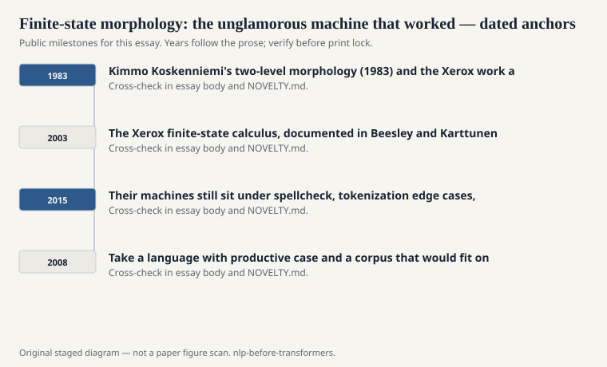
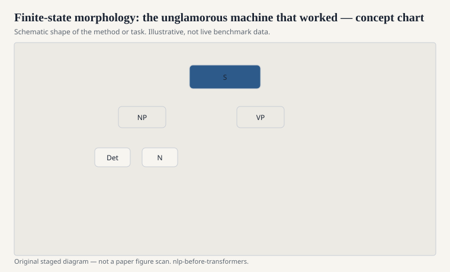

# Finite-state morphology: the unglamorous machine that worked

If you only read ACL anthologies from the neural years, you
could miss the fact that a huge amount of language is
morphology, and that morphology is a finite-state problem
for a startling range of languages. Kimmo Koskenniemi's
two-level morphology (1983) and the Xerox work associated
with Lauri Karttunen, Ronald Kaplan, and later Kenneth
Beesley gave that fact a toolkit.

<!-- graphics-pack:nlp-bt-v1 -->

<figure class="nlp-bt-figure">

<figcaption>Figure 1. Dated public anchors for this piece. Years follow the essay; verify against the prose before print.</figcaption>
</figure>

<!-- graphics-pack:nlp-bt-v1 -->

<figure class="nlp-bt-figure">

<figcaption>Figure 2. Schematic of the method or task — editorial diagram, not live scores.</figcaption>
</figure>

<!-- graphics-pack:nlp-bt-v1 -->

<figure class="nlp-bt-figure nlp-bt-figure--archival">

<figcaption>Figure 3. Finite-state machine state diagram with transitions. License: CC BY-SA (verify on Commons)</figcaption>
</figure>

Two-level rules say: here is a lexical form, here is a
surface form, here are constraints that must hold between
them. The constraints compile into finite-state transducers.
Composition is not a metaphor. You literally compose
machines. The result analyzes and generates. That last
sentence is the part people forget. A lot of later NLP
could tag. It could not reliably say "give me the
inessive plural of this Finnish noun" without a table.

I like this corner of the history because it is one of the
few times the field shipped something that looked like
computer science and also looked like respect for languages
that are not English. English morphology is a thin sport.
Turkish, Finnish, Arabic, Hungarian — you either face the
morphemes or you pretend a word is an atom and pay for it
in sparsity.

The Xerox finite-state calculus, documented in Beesley and
Karttunen's *Finite State Morphology* (2003), was industrial
in the old sense: tools, compilers, a practice. Hunspell
and other open spellcheckers inherited a cheaper slice of
the same idea. Speech lexicons used FSTs because a
pronunciation dictionary is a relation, and relations
compose.

Did neural seq2seq later learn some of this from bits?
Sometimes, on some languages, with enough data. That does
not retire the older point. If your language has productive
morphology and your corpus is small, a hand-compiled
transducer is not nostalgia. It is the reason your search
engine can stem.

The human-voice version of the lesson: not every problem
wanted a feature vector. Some problems wanted an algebra.
The people who built that algebra did not get the same
citation heat as Word2Vec. Their machines still sit under
spellcheck, tokenization edge cases, and every serious
morphological analyzer that did not start from scratch in
2015.

I will name the practical test. Take a language with
productive case and a corpus that would fit on a USB
stick from 2008. Train a word-level tagger and watch the
unknown-word rate. Then put a transducer in front and
watch the rate fall. That drop is why this draft exists.
Neural models later learned some of the same regularities
from more data. They did not make the algebra false on
Tuesday afternoon when the data is small and the
language is not English.
