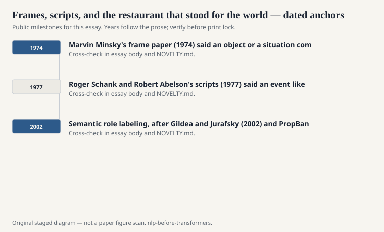
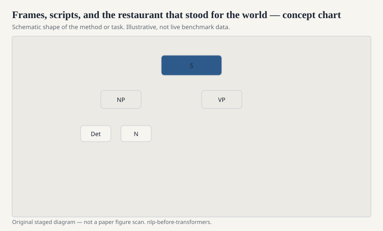

# Frames, scripts, and the restaurant that stood for the world

Two 1970s ideas tried to put common sense into a form a
program could hold. Marvin Minsky's frame paper (1974)
said an object or a situation comes with slots and
defaults. Roger Schank and Robert Abelson's scripts
(1977) said an event like eating in a restaurant is a
stereotyped sequence: enter, sit, order, eat, pay,
leave. Charles Fillmore's case frames and later FrameNet
were a linguistic cousin: verbs come with roles.

<!-- graphics-pack:nlp-bt-v1 -->

<figure class="nlp-bt-figure">

<figcaption>Figure 1. Dated public anchors for this piece. Years follow the essay; verify against the prose before print.</figcaption>
</figure>

<!-- graphics-pack:nlp-bt-v1 -->

<figure class="nlp-bt-figure">

<figcaption>Figure 2. Schematic of the method or task — editorial diagram, not live scores.</figcaption>
</figure>

<!-- graphics-pack:nlp-bt-v1 -->

<figure class="nlp-bt-figure nlp-bt-figure--archival">

<figcaption>Figure 3. Lexical hierarchy plate standing in for script-style knowledge organization. License: See Commons file page</figcaption>
</figure>

The restaurant script is the example that escaped the
lab. It is easy to teach and easy to mock. Real
restaurants have takeout windows, skipped bills, kitchens
you can see. The script is a prior, not a documentary.
Schank's group used it to explain why "the waitress
brought the hamburger" is ordinary and "the waitress
brought the tax return" is a story.

I do not treat this as failed AI. I treat it as a bet
about where the information lives. The bet says: not in
the words, in the situation the words assume. That bet
is half right. Readers do use restaurant-shaped
expectations. The engineering problem is that the set of
scripts is not closed, and the boundaries are political.
Whose restaurant? Whose default tip?

In working NLP before transformers, frames showed up in
two usefully boring ways. Task-oriented dialogue systems
kept slot-filling frames for flights and hotels. That
is Minsky without the metaphysics: destination, date,
class. Semantic role labeling, after Gildea and Jurafsky
(2002) and PropBank, treated a verb's arguments as
roles you could annotate and then classify. That is
Fillmore with a training set.

The ambitious version — a script for every situation a
newspaper might mention — did not ship. It drowned in
authoring. Cyc tried to out-author the drowning. The
statistical turn did not refute scripts so much as refuse
to wait for them. It asked what you can do with words
and labels you already have.

When a modern assistant still says "what city are you
flying out of," that is a frame. It is okay to admit
the lineage. The 1970s mistake was believing the
restaurant could be generalized by writing more
restaurants. The useful remainder is smaller and still
true: people speak as if the listener has a form to
fill. Sometimes the form is worth building by hand.

FrameNet, which Fillmore's later Berkeley project made
public, is the linguistic continuation. A frame has
roles. A sentence evokes a frame. Annotation is slow
and argumentative. That slowness is information. If
you cannot agree on whether a sentence evokes
Commerce_buy, you have learned something about
"meaning" that a cosine will happily paper over. I
would rather have the argument than the paper.
