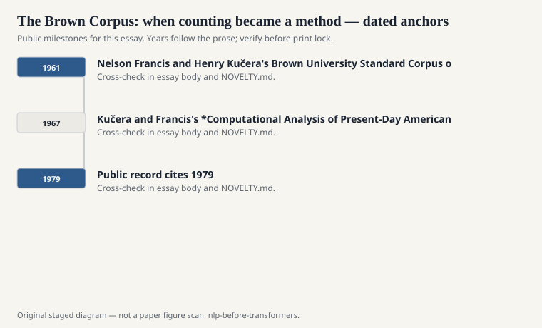
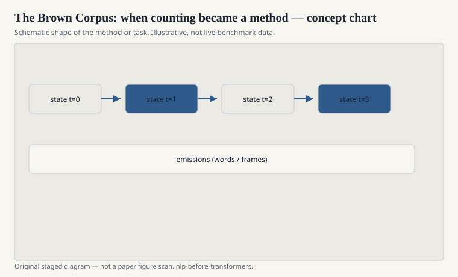

# The Brown Corpus: when counting became a method

W. Nelson Francis and Henry Kučera's Brown University
Standard Corpus of Present-Day American English (1961,
with later tagging work through the 1970s) is a million
words. That sentence used to sound large. It now sounds
like a long article. The size is not why it mattered.
The sampling frame is.

<!-- graphics-pack:nlp-bt-v1 -->

<figure class="nlp-bt-figure">

<figcaption>Figure 1. Dated public anchors for this piece. Years follow the essay; verify against the prose before print.</figcaption>
</figure>

<!-- graphics-pack:nlp-bt-v1 -->

<figure class="nlp-bt-figure">

<figcaption>Figure 2. Schematic of the method or task — editorial diagram, not live scores.</figcaption>
</figure>

<!-- graphics-pack:nlp-bt-v1 -->

<figure class="nlp-bt-figure nlp-bt-figure--archival">

<figcaption>Figure 3. Structural tree diagram as visual shorthand for tagged corpora essays. License: Public domain</figcaption>
</figure>

They took English printed in 1961, in the United States,
and sliced it into genres: news, fiction, learned,
religion, and the rest of a list people still recognize.
Each slice had a budget of samples. You could finally
say "this construction is common in press reportage and
rare in fiction" without waving at a shelf. Frequency
became a public object.

I have sat with the genre labels long enough to feel
their politics. "Present-Day American English" was a
particular present and a particular America. The corpus
is not the language. It is a designed sample. Designed
samples are still better than "I have a feel for this,
I am a native speaker, trust me." A lot of mid-century
linguistics was the latter.

The tagged Brown Corpus became a training set before
people used the words "training set." Church's
statistical tagger, early HMM work, and a thousand
student projects learned that `AT JJ NN` is a good
bet in English. The tagset leaked into later
conventions. When you see a Penn tag, you are looking
at a grandchild.

There is a second inheritance: the idea that a corpus
should be shared. Brown was distributed, discussed,
re-tagged, complained about. That social fact is as
important as the word count. Computational linguistics
became a field that could disagree about the same
file.

Kučera and Francis's *Computational Analysis of
Present-Day American English* (1967) is dry in the way
good instrument papers are dry. Lists. Frequencies.
A refusal to turn every number into a theory of mind.
If Shannon made prediction respectable, Brown made
counting shareable. The statistical turn of the 1980s
and 1990s is unthinkable without that permission.

A million words will not train a modern language model.
It will still teach a person what a balanced sample
costs. Someone chose those 1961 pages. Every later
"web crawl" hides a similar choice under a more
casual name.

The tagged version also taught disagreement. Annotators
do not always match. A tagset is a treaty. Later Penn
tags are a different treaty with a family resemblance.
If you flatten every tagged corpus into "POS data,"
you lose the treaty. I would rather a student spend
an hour on the Brown manual than an hour on a
leaderboard screenshot. The manual is where the
method lives.
