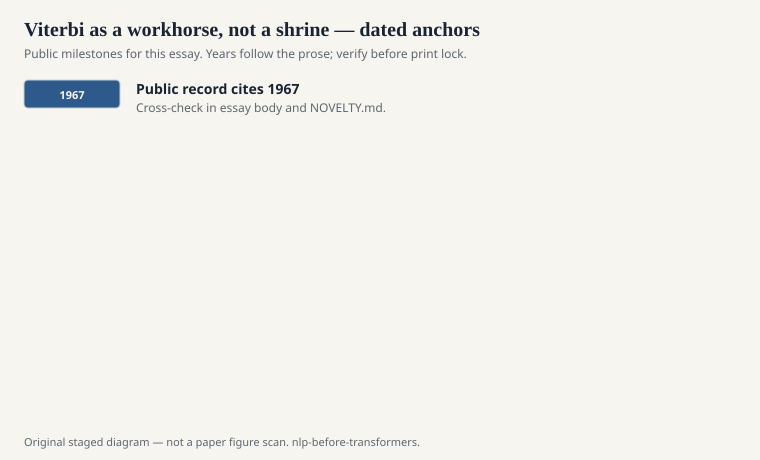
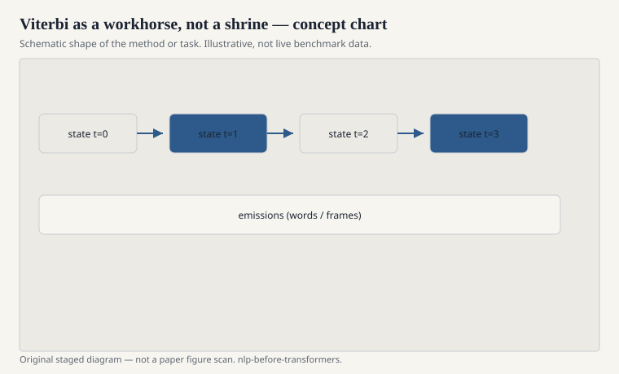

# Viterbi as a workhorse, not a shrine

Andrew Viterbi's 1967 paper was about convolutional
codes. Computational linguistics borrowed the
algorithm the way a kitchen borrows a knife: often,
without ceremony, sometimes on the wrong tomato.

<!-- graphics-pack:nlp-bt-v1 -->

<figure class="nlp-bt-figure">

<figcaption>Figure 1. Dated public anchors for this piece. Years follow the essay; verify against the prose before print.</figcaption>
</figure>

<!-- graphics-pack:nlp-bt-v1 -->

<figure class="nlp-bt-figure">

<figcaption>Figure 2. Schematic of the method or task — editorial diagram, not live scores.</figcaption>
</figure>

<!-- graphics-pack:nlp-bt-v1 -->

<figure class="nlp-bt-figure nlp-bt-figure--archival">

<figcaption>Figure 3. Profile hidden Markov model diagram. License: CC BY-SA or PD (verify on Commons)</figcaption>
</figure>

The NLP version is easy to say and easy to implement
wrong. You have a trellis. Time goes right. States
go up. Each node keeps the best score that could
have arrived there and a pointer to the previous
state that produced it. At the end you walk the
pointers backward. That walk is the tag sequence,
or the phone sequence, or the alignment.

I have watched students memorize the recurrence and
still ship a decoder that normalizes at the wrong
time or uses probabilities instead of logs and
underflows into silence. The workhorse nature of
Viterbi is exactly that: it is short enough to
reimplement, and reimplementation is where the bugs
live.

Why not enumerate paths? Because the path count is
exponential in sentence length. Why not greedy?
Because a locally pretty tag can ruin the next
three. Viterbi is the compromise the 1970s could
afford: exact best path under a Markov assumption,
linear in the length once the state set is fixed,
quadratic in the state set if you are naive about
transitions.

The Markov assumption is the bill. If your true
model has long-range features, Viterbi is exact for
the wrong model. CRFs with a chain structure still
get a Viterbi-like decode. Models with loopy
dependencies do not. People then reach for beam
search and pretend they did not leave the church.

Beam search is the practical sibling. Speech
recognizers could not keep every state alive. They
kept a beam. Neural seq2seq, later, kept a beam too,
for a different reason: the state was a vector, not
a tag, and the vocabulary was the state set in
disguise. The pointer-walking intuition survived.
The guarantees did not.

I do not think Viterbi needs another pedagogical
animation. I think it needs to be remembered as
operations research that wandered into language.
Best path. Additive costs. A trellis. When a 1990s
tagger was fast enough to run on a newswire dump
overnight, that was Viterbi plus log-add plus a
machine that did not swap itself to death.

One more operational scar: people confuse "best path"
with "only path." The trellis holds more. Posterior
decoding, n-best lists, confusion networks in speech
— those are ways of not throwing the trellis away
after the pointer walk. If your system only ever
emits one tag sequence and never looks at the
second-best, you are using half the workhorse. The
other half is how you admit uncertainty without
writing a poem about it.
