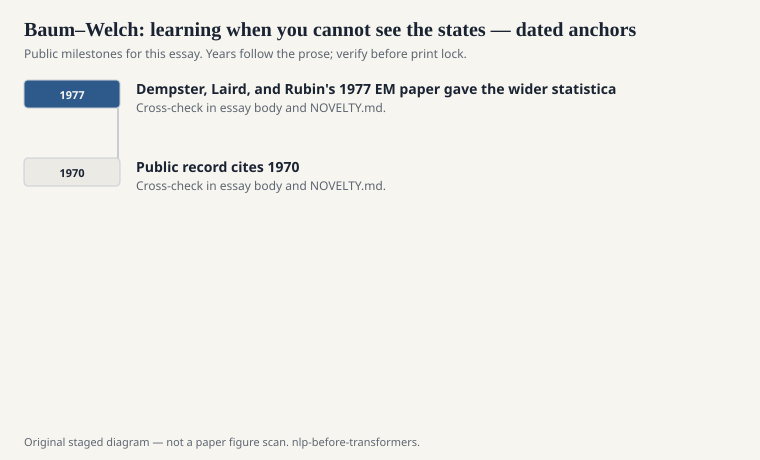
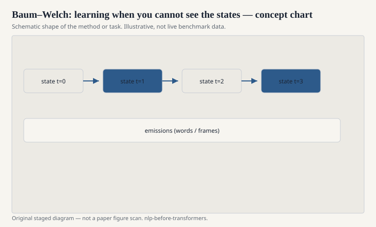

# Baum–Welch: learning when you cannot see the states

Supervised tagging is counting. You have words and
gold tags, you tally transitions and emissions, you
smooth, you decode. Life is kind. Speech and some
unsupervised NLP problems are not kind. You hear
the frames. You do not hear the phone sequence. You
need a way to guess the hidden path and update the
parameters anyway.

<!-- graphics-pack:nlp-bt-v1 -->

<figure class="nlp-bt-figure">

<figcaption>Figure 1. Dated public anchors for this piece. Years follow the essay; verify against the prose before print.</figcaption>
</figure>

<!-- graphics-pack:nlp-bt-v1 -->

<figure class="nlp-bt-figure">

<figcaption>Figure 2. Schematic of the method or task — editorial diagram, not live scores.</figcaption>
</figure>

<!-- graphics-pack:nlp-bt-v1 -->

<figure class="nlp-bt-figure nlp-bt-figure--archival">

<figcaption>Figure 3. Profile hidden Markov model diagram. License: CC BY-SA or PD (verify on Commons)</figcaption>
</figure>

Baum–Welch is expectation-maximization for HMMs.
The E-step uses forward-backward to get soft counts:
how much of the time was I in state *i* at *t*, and
how much of the time did I go from *i* to *j*. The
M-step pretends those soft counts are observations
and renormalizes. Repeat until the likelihood stops
moving or you lose patience.

The public trail runs through Baum and colleagues in
the late 1960s and early 1970s. Rabiner's tutorial
again did the teaching. Dempster, Laird, and Rubin's
1977 EM paper gave the wider statistical name. Speech
labs did the years of making it work with Gaussian
mixtures and tying and floors so a variance could
not collapse to zero and take the training run with
it.

I have a grudging respect for Baum–Welch and a
short list of grudges. It climbs a likelihood. It
does not climb *your* likelihood if you care about
a downstream error rate. It is happy to find a
sharp, useless local maximum. Initialization is not
a footnote; it is the experiment. People who say
"we trained an unsupervised HMM" and do not say
how they started are hiding the plot.

In NLP proper, unsupervised HMMs for part of speech
became a research sport in the 2000s (think of the
line of work associated with people like Noah Smith,
Jason Eisner, and others on contrastive estimation
and better objectives). The older lesson still
applies. If the states are just indices, the model
can permute them and look equally smart. Identifiability
is a social problem: you have to decide what a state
means after the math finishes.

Forward-backward itself is worth keeping even if you
never train unsupervised. It gives you marginals.
Sometimes you want the posterior at a position, not
the single best path. A medical-adjacent example I
will not give, because this series is not clinical.
A language example: the probability that this token
is a name, even if Viterbi said it was a verb.

If Viterbi is the knife, Baum–Welch is the
whetstone you use in the dark. It works. It also
lets you believe you learned structure when you
only learned a comfortable cycle in parameter
space. Watch the alignments. Watch a held-out
likelihood. Do not watch a training-set number
and call it understanding.
