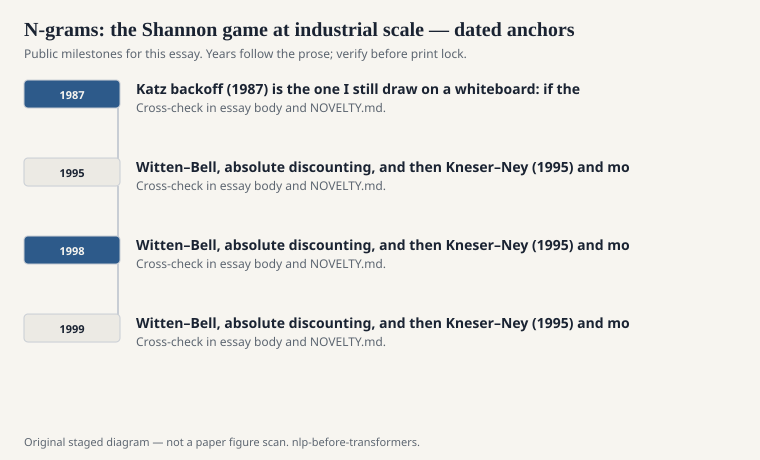
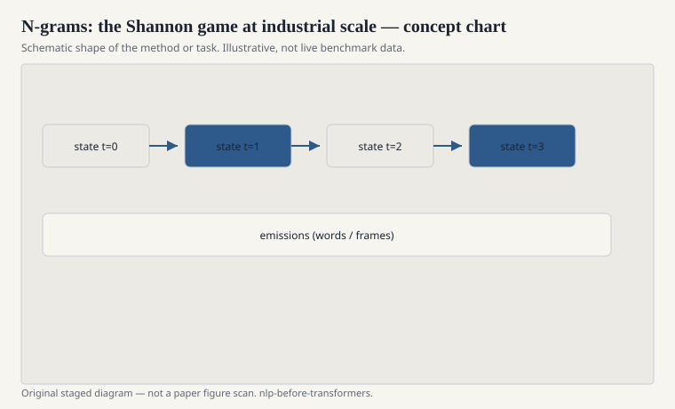

# N-grams: the Shannon game at industrial scale

An n-gram language model says the next word depends
on the last n-1 words and, for everything else,
shrugs. That shrug built dictation, translation,
spelling correction, and the first serious
speech-to-text products.

<!-- graphics-pack:nlp-bt-v1 -->

<figure class="nlp-bt-figure">

<figcaption>Figure 1. Dated public anchors for this piece. Years follow the essay; verify against the prose before print.</figcaption>
</figure>

<!-- graphics-pack:nlp-bt-v1 -->

<figure class="nlp-bt-figure">

<figcaption>Figure 2. Schematic of the method or task — editorial diagram, not live scores.</figcaption>
</figure>

<!-- graphics-pack:nlp-bt-v1 -->

<figure class="nlp-bt-figure nlp-bt-figure--archival">

<figcaption>Figure 3. Claude Shannon’s block diagram of a general communication system (Commons). License: Public domain</figcaption>
</figure>

The industrial form is a table of counts, a
smoothing recipe, and a backoff graph. Katz
backoff (1987) is the one I still draw on a
whiteboard: if the trigram was seen often enough,
use it; if not, step down and pay a tax. Witten–Bell,
absolute discounting, and then Kneser–Ney (1995)
and modified Kneser–Ney (Chen and Goodman, 1998/1999)
are the later kitchen. Chen and Goodman's technical
report is the document people actually implemented
from.

Perplexity is the scoreboard. It is an exponential
of the average negative log probability. Shannon
would have recognized the ancestor. Speech people
used it because it is cheap and because it often
moved with word error rate, not always, but often
enough to tune a model without running the decoder
every night.

I want to defend n-grams against a cartoon that
says they are stupid because they cannot handle
agreement across a long clause. Of course they
cannot. They also run on a CPU from 2004, update
from logs, and degrade gracefully when a word is
new (unknown-word buckets, character classes,
a unigram). A lot of production language
technology was "stupid" in this way and answered
the phone for a decade.

Google's 2006/2007 web n-gram release — the
famous counts over a huge crawl — made the
table itself a public object. Researchers who
could not train on the web could still look up
a phrase. That is a kind of democracy. It is
also a kind of bias: the web's genre mix becomes
your prior.

The death of the n-gram as a research king did
not happen at the transformer paper. It started
when neural language models (Bengio 2003, then
Mikolov's RNNLM, then the 2010s LSTM LMs) showed
lower perplexity with distributed representations.
Even then, n-grams stayed in the blend. Speech
systems interpolated. SMT systems interpolated.
A good interpolation is an admission that tables
and vectors fail in different places.

If you are new to this history, train a trigram
on a small corpus with add-k smoothing, then
with Kneser–Ney, then look at the same tail
word. The difference is the entire craft. The
head of the distribution is easy. The tail is
the job.
