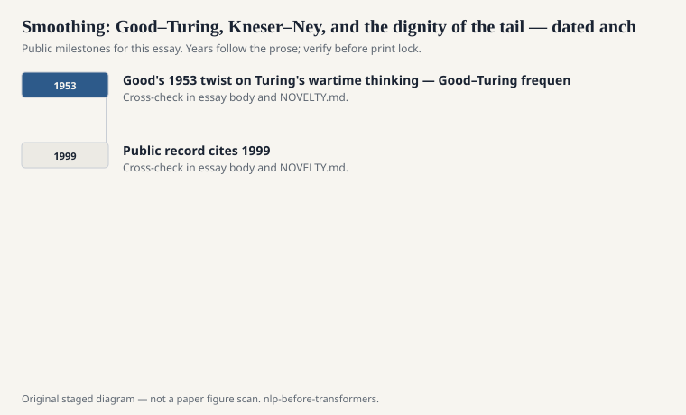
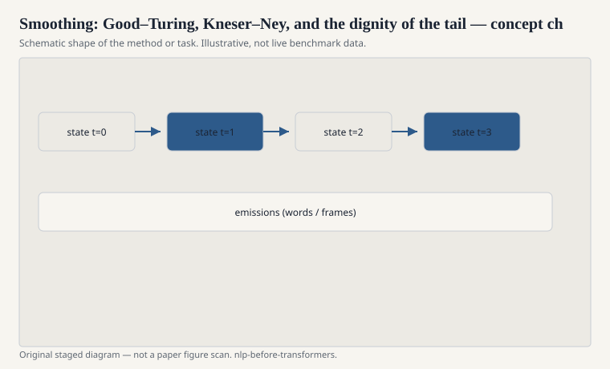

# Smoothing: Good–Turing, Kneser–Ney, and the dignity of the tail

Zipf's law is not a trivia item. It is the reason
language modeling is a tail problem. A few words
do most of the work. An endless list of words do
almost none, until the one time they do and your
model assigns them nothing.

<!-- graphics-pack:nlp-bt-v1 -->

<figure class="nlp-bt-figure">

<figcaption>Figure 1. Dated public anchors for this piece. Years follow the essay; verify against the prose before print.</figcaption>
</figure>

<!-- graphics-pack:nlp-bt-v1 -->

<figure class="nlp-bt-figure">

<figcaption>Figure 2. Schematic of the method or task — editorial diagram, not live scores.</figcaption>
</figure>

<!-- graphics-pack:nlp-bt-v1 -->

<figure class="nlp-bt-figure nlp-bt-figure--archival">

<figcaption>Figure 3. Shannon communication diagram as entropy / prediction visual. License: Public domain</figcaption>
</figure>

I. J. Good's 1953 twist on Turing's wartime
thinking — Good–Turing frequency estimation —
says the probability of things seen r times
should be adjusted using how many things were
seen r+1 times. Unseen events get a mass stolen
from the hapaxes. The idea feels like a card
trick the first time. Then you realize every
later smoother is a way to steal from the
seen and give to the unseen without wrecking
the head.

Kneser–Ney is the one I would teach if I could
only teach one. The insight is about backoff
distributions. The unigram you back off to
should not be "how common is this word." It
should be "in how many different contexts does
this word appear." "Francisco" is common and
still a terrible generic backoff after a random
verb. It is a good backoff after "San." Lower
order, in this philosophy, is about
continuation, not raw popularity.

Stanley Chen and Joshua Goodman's report at
the end of the 1990s is the engineering
document. Modified Kneser–Ney, count
binning, interpolation versus backoff — they
measured it. A lot of later "we used KN
smoothing" footnotes are a pointer to that
measurement culture.

Add-k smoothing is the pedagogical toy. It
makes every count a little less lonely. It
also smears probability into impossible
places if you are not careful with the
vocabulary. I have seen student models that
assigned more mass to garbage tokens than
to the comma. That is add-k without a
grown-up vocab policy.

Why does this still belong in a
pre-transformer series? Because neural
models did not abolish the tail. They
moved it. Rare words became rare pieces,
or rare types in a softmax, or UNK.
Subword tokenization is, among other
things, a smoothing strategy you apply
before training. The old papers are more
honest about the theft.

When someone says a language model
"generalizes," ask where the mass for the
new thing came from. Good–Turing had an
answer. It was not romantic. It was a
reallocation.

I will be concrete. You have a trigram
that never saw "of the fjord." A bad
smoother gives it nothing, or gives it
the same dust it gives "of the
asdfgh." A grown smoother backs off to
"the fjord" or to a continuation
distribution that knows "fjord" is the
kind of word that follows "the" after
geographical talk. The difference is
not a metaphor. It is a held-out
perplexity you can print. Print it.
