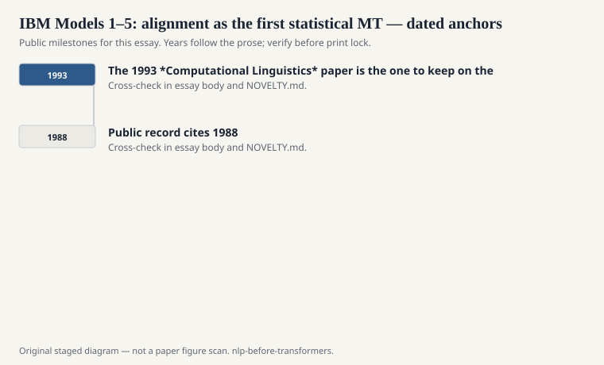
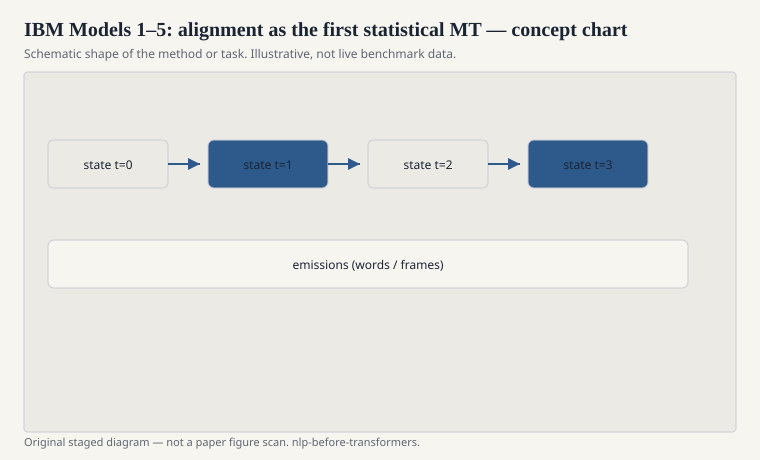

# IBM Models 1–5: alignment as the first statistical MT

The Candide project at IBM, in the late 1980s and
early 1990s, made a claim that still organizes the
field. Translation is a noisy channel. You imagine
that an English sentence generated a French
sentence (or the other way around, depending on
the writeup), and you recover the source by
inverting the process. Brown, Della Pietra, Della
Pietra, Mercer, and colleagues wrote it down as a
sequence of generative models now called IBM
Models 1 through 5. The 1993 *Computational
Linguistics* paper is the one to keep on the desk.

<!-- graphics-pack:nlp-bt-v1 -->

<figure class="nlp-bt-figure">

<figcaption>Figure 1. Dated public anchors for this piece. Years follow the essay; verify against the prose before print.</figcaption>
</figure>

<!-- graphics-pack:nlp-bt-v1 -->

<figure class="nlp-bt-figure">

<figcaption>Figure 2. Schematic of the method or task — editorial diagram, not live scores.</figcaption>
</figure>

<!-- graphics-pack:nlp-bt-v1 -->

<figure class="nlp-bt-figure nlp-bt-figure--archival">

<figcaption>Figure 3. Word alignment illustration for statistical machine translation. License: CC BY-SA (verify on Commons)</figcaption>
</figure>

Model 1 is almost a joke, and it is a useful
joke. Every target word aligns to a source word
independently, more or less uniformly at first.
EM jiggles the translation table. After enough
passes, "maison" likes "house." You can feel the
whole later industry in that table: a soft
dictionary learned from parallel text.

Models 2–5 add fertility, distortion, even a
nod at phrases and non-local jumps. They get
harder to implement and easier to overfit. A
lot of later systems kept Model 1 or 2 as an
aligner and put the real translation work
elsewhere. That is not a failure of 3–5. It is
a statement about what EM can stably learn
from the bitext you actually have.

I want to name the social shock. Rule-based MT
people had spent decades writing transfer
rules. Here was a group saying: give us the
Canadian Hansard and we will count. The
alignments were dirty. The translations were
not literary. The direction was the future.
When Och and Ney built GIZA++ and when Koehn
and others built Pharaoh and Moses, they were
standing on this noisy-channel floor.

Alignment is easy to underestimate if you only
see the pretty pictures in a slide deck. Real
alignments are many-to-one, one-to-many,
unaligned function words, and a lot of "this
is the best EM could do on a clause that was
not a translation so much as a paraphrase."
Model 1 will happily spread probability like
peanut butter. Later models concentrate it.
Neither is "the meaning."

The noisy-channel story also bundled a language
model on the output side. That is why n-grams
and MT lived in the same labs. A translation
model proposes. A language model vetoes
gibberish. Decoding is search. If that
architecture sounds like later neural MT with
a decoder language model, it should. The
matrices changed. The job description did not.

When people say statistical MT started in the
1990s, they mean this paper and its siblings.
Not a vibe. A translation table, a fertility
distribution, and the nerve to let EM be
wrong in public.
